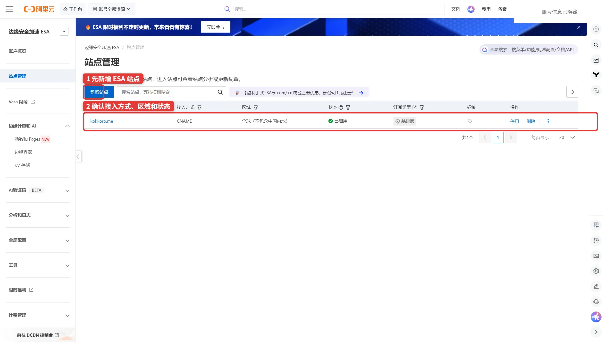
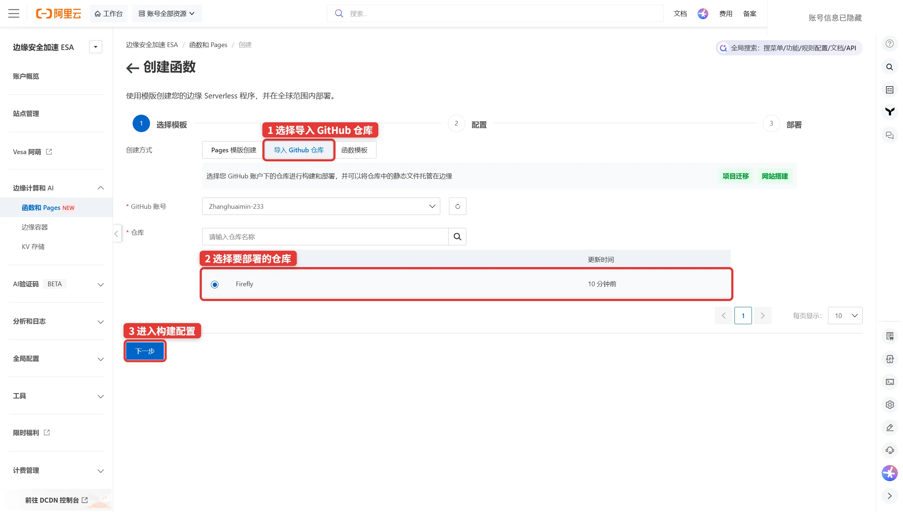
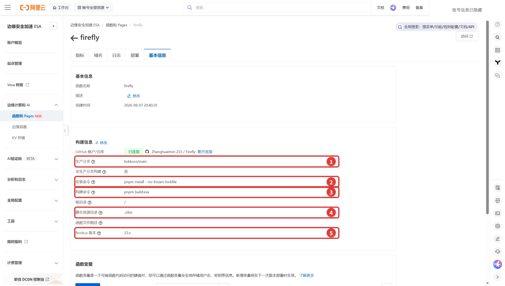
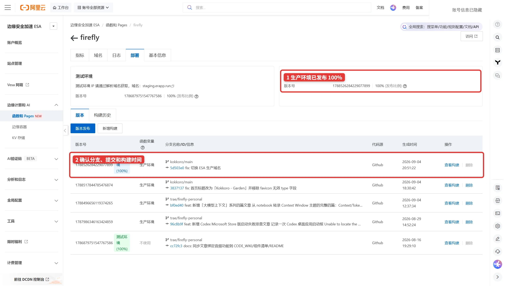
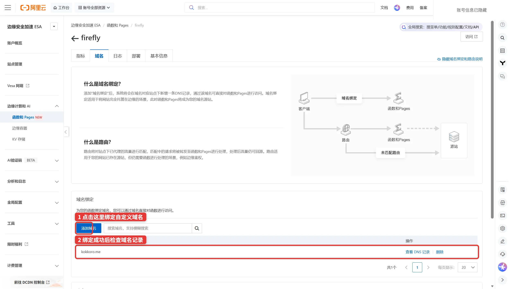
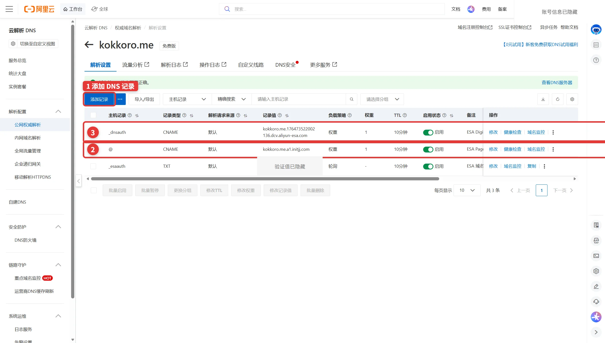
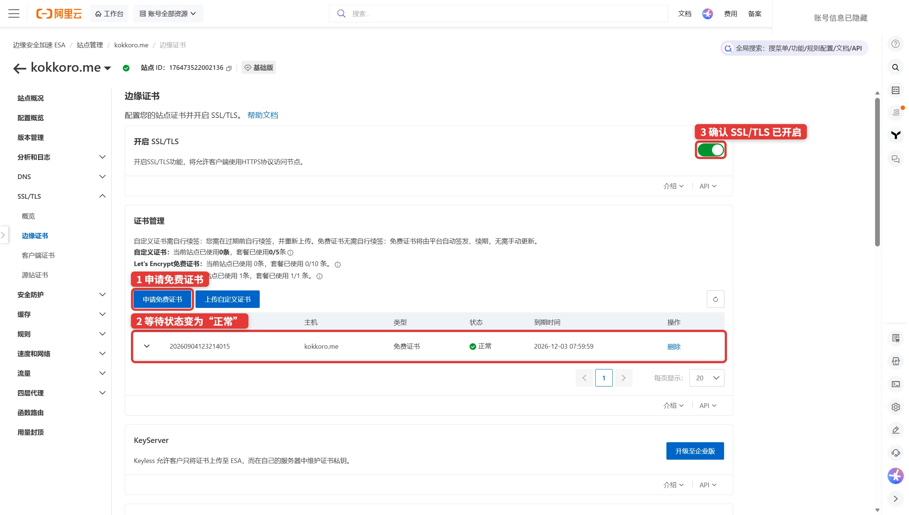
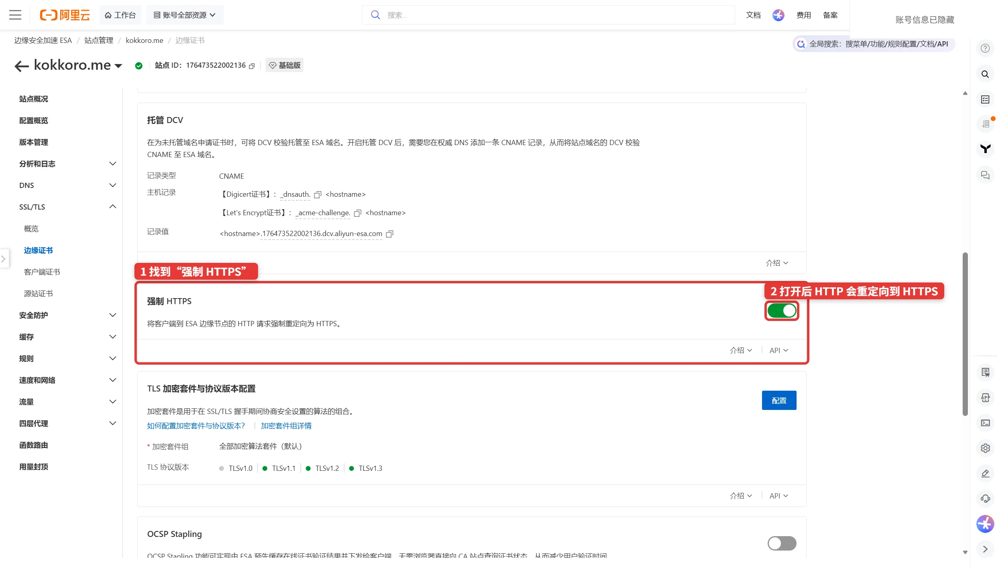
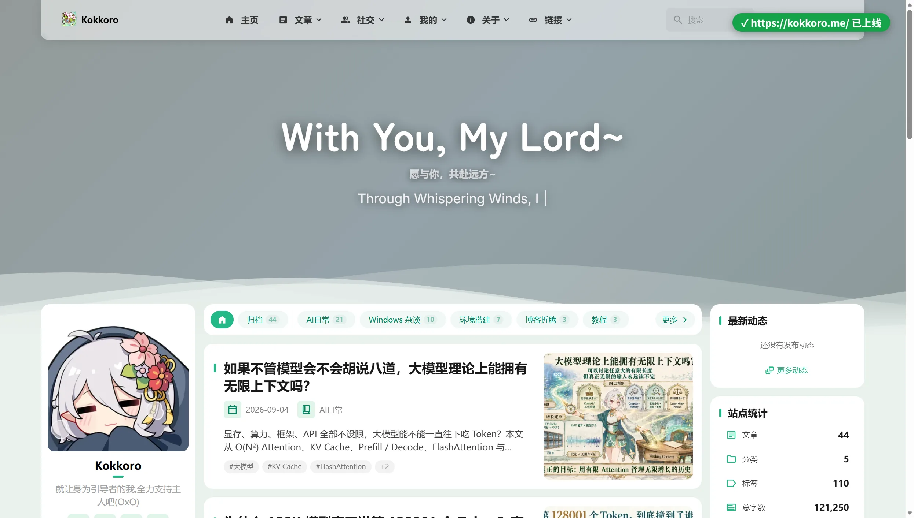

控制台明明写着“证书申请大约需要 5～10 分钟”，我却等了四十多分钟，页面上的状态还是没有动。

这种时候最容易做的事，就是继续等。可这次真正缺的不是耐心，而是一条用于证书验证的 DNS 记录：`_dnsauth` CNAME。

这是我把 Kokkoro 博客从 GitHub 仓库部署到阿里云 ESA，再绑定新域名 `kokkoro.me` 的完整记录。它不只包括“点哪里”，也会解释每一步究竟在连接什么、成功后该看什么，以及那条让我白等四十分钟的记录为什么不能删。

最终跑通的链路是：GitHub 提交触发 ESA Pages 构建，访客通过域名进入 ESA 边缘节点，再由边缘节点提供静态页面、HTTPS 证书与缓存。文章中的控制台截图来自 2026 年 9 月 4 日，界面以后可能调整，但背后的关系不会因为按钮换位置就消失。

## 先别急着点：把四样东西分清楚

第一次接触 ESA 时，我最大的困惑不是某个设置，而是控制台里“站点”“Pages 项目”“域名”和“证书”看起来像是一回事。

其实它们分工很明确：

- **域名**是访客记住的地址，例如 `kokkoro.me`。
- **DNS**决定这个地址要把访客送到哪里。
- **ESA 站点**负责接住域名流量，并提供边缘加速、安全和 TLS 能力。
- **Pages 项目**负责从 GitHub 拉代码、构建静态文件，再把产物发布出来。

把它们画成一条链，就容易理解多了：

```text
GitHub 仓库 ──> ESA Pages 构建 ──> 生产版本
                                      ↑
访客 ──> 域名 DNS ──> ESA 边缘节点 ──┘
                         │
                         ├─ 边缘证书
                         └─ 强制 HTTPS / 缓存 / 安全能力
```

这也解释了一个常见误区：**Pages 构建成功，不等于自定义域名已经可以访问；域名能解析，也不等于证书已经申请成功。** 每一段都要单独接通。

## 开始前需要准备什么

我这次手里有三样东西：

1. 一个已经购买并使用阿里云 DNS 解析的域名；
2. 一个放在 GitHub 上、能够在本地正常构建的 Astro 博客；
3. 一套明确的构建信息：生产分支、安装命令、构建命令和产物目录。

第三项很重要。ESA 不是替你猜项目怎么构建，它只是按你提供的命令执行。动手前最好先在本地完整跑一次构建，并确认 `dist` 或其他产物目录里确实出现了网站文件。

我的 Firefly 项目使用 pnpm，实际配置是：

```text
生产分支：kokkoro/main
安装命令：pnpm install --no-frozen-lockfile
构建命令：pnpm build:esa
静态产物目录：./dist
Node.js：22.x
```

这些值是这个项目的答案，不是所有博客的标准答案。Vite 常见的产物目录也是 `dist`，Next.js、Hugo 或其他框架则可能完全不同，请以本地构建结果为准。

## 第一步：在 ESA 创建站点

进入阿里云 ESA 控制台，在“站点管理”里新增站点，填写自己的根域名。

我选的是 **CNAME 接入**。它只要求我添加指定的 DNS 记录，不需要把整个域名的 NS 服务器都迁给 ESA，改动范围更小，也更适合第一次接入。由于这个域名没有中国内地备案，我选择了“全球（不包含中国内地）”。具体可选区域仍应以你自己的备案情况和控制台提示为准。



创建过程中，控制台可能要求添加一条 `_esaauth` TXT 记录来证明域名归你所有。记录值是每个站点独有的，必须从自己的控制台复制，不要照抄任何教程截图。

添加后回到站点列表刷新，确认三件事：

- 域名正确；
- 接入方式是 CNAME；
- 站点状态已经变为“已启用”。

如果站点还没有启用，就先别急着去 Pages 绑定域名。后面的页面即使能打开，也可能因为找不到可用站点而失败。

## 第二步：从 GitHub 导入 Pages 项目

接下来进入“函数和 Pages”，创建一个 Pages 项目，选择“导入 GitHub 仓库”。授权 GitHub 后，选中博客所在的仓库。



这一步只是让 ESA 找到代码。真正决定它能不能发布的，是下一页的构建配置。

## 第三步：填写构建配置

这是整条部署链里最值得慢一点的页面。



图里五处设置分别是：

1. **生产分支**：每次推送后用于生产部署的 Git 分支；
2. **安装命令**：安装项目依赖；
3. **构建命令**：生成最终静态网站；
4. **静态产物目录**：ESA 真正要发布的文件夹；
5. **Node.js 版本**：必须与项目依赖兼容。

我没有直接使用普通的 `pnpm build`，而是用了项目专门为 ESA 准备的 `pnpm build:esa`。原因是博客里有一份 40.3 MB 的 FLAC 音频，而 ESA Pages 对单个文件有限制。这个命令会先完成正常构建，再从部署产物中排除过大的 FLAC，同时保留网页实际使用的 Opus 音频；源文件本身没有被删除。

阿里云当前文档列出的 Pages 限制包括：单文件不超过 25 MB、项目文件不超过 2,000 个、压缩包不超过 1,024 MB。限制可能调整，部署含有原图、视频、无损音频的网站前，最好再看一眼[函数和 Pages 官方说明](https://help.aliyun.com/en/edge-security-acceleration/esa/user-guide/what-is-functions-and-pages/)。

如果构建失败，不要先反复重试。打开构建日志，优先确认依赖是否安装成功、Node.js 版本是否匹配，以及填入的产物目录是不是真的存在。

## 第四步：先让 Pages 生产版本发布成功

保存配置后启动第一次部署。构建完成时，生产环境应显示发布进度 100%，并能看到对应的分支、提交和构建时间。



我这次发布的是 `kokkoro/main` 分支，生产版本对应提交 `5d503e0`。以后继续向这个分支推送，Pages 会自动开始新的构建。

到这里，网站产物已经在 ESA 上了，但还只是“房子盖好了”。访客熟悉的域名仍然没有接进来。

## 第五步：给 Pages 绑定自定义域名

进入 Pages 项目的“域名”标签页，点击“绑定自定义域名”，选择刚才已经启用的 ESA 站点和要使用的域名。



绑定成功后，域名会出现在列表里。如果这里出现类似 `ActiveSiteNotExist` 的错误，先回到站点管理检查域名是否真的已经创建并启用；它通常不是 Pages 构建问题。

## 第六步：添加 DNS 记录

现在进入阿里云云解析 DNS。这个环节至少要理解三类记录，它们长得相似，作用却完全不同：

| 主机记录 | 类型 | 用途 |
| --- | --- | --- |
| `_esaauth` | TXT | 创建 ESA 站点时验证域名所有权 |
| `@` | CNAME | 把根域名的访客流量送到 ESA / Pages |
| `_dnsauth` | CNAME | 让证书机构验证域名，用于签发和自动续期 |

实际值全部以你自己控制台给出的内容为准。我的流量 CNAME 指向 `kokkoro.me.a1.initjj.com`，证书验证 CNAME 指向带有站点 ID 的 `dcv.aliyun-esa.com` 地址。



添加时有两个小坑：

- “主机记录”通常只填 `@`、`_dnsauth` 这样的前缀，不要把完整域名重复填进去；
- 同一个主机名如果已经存在冲突记录，新的 CNAME 可能无法生效，应先看清现有记录再处理。

根域名的 CNAME 决定访客能不能到达 ESA；`_dnsauth` 则决定证书能不能顺利签发。两者缺一个，最终体验都会残缺。

## 第七步：申请边缘证书

回到 ESA 的“SSL/TLS → 边缘证书”，申请免费证书，并打开 SSL/TLS。



证书签发成功后，状态会变为“正常”。阿里云的免费边缘证书适合个人站点和小型网站，会自动尝试续期，但它只部署在 ESA 边缘节点，不能下载到本地服务器。更完整的证书类型与状态说明可以看[配置边缘证书](https://help.aliyun.com/zh/edge-security-acceleration/esa/user-guide/configure-edge-certificates/)。

然后，就到了这次最值得记录的意外。

## 为什么写着 5～10 分钟，我却等了 40 分钟

最开始我已经完成了 Pages 构建、域名绑定和根域名 CNAME，证书页面也提交了申请。控制台提示通常需要 5～10 分钟，于是我等了十分钟，又等了二十分钟，最后接近四十分钟，证书仍然没有下来。

问题不在证书机构“今天比较慢”，而是 DNS 中缺少 `_dnsauth` CNAME。

这条记录叫托管 DCV（Domain Control Validation）。DigiCert 需要通过它确认 ESA 确实有权为这个域名申请和续期证书。对于 CNAME 接入的站点，阿里云官方说明要求配置 hosted DCV；记录添加成功后，还要回到控制台重新发起或继续申请，添加 DNS 并不会自动触发签发。详见[托管 DCV 官方说明](https://help.aliyun.com/zh/edge-security-acceleration/esa/user-guide/managed-dcv)。

在 PowerShell 里可以先检查两条关键记录：

```powershell
Resolve-DnsName example.com -Type CNAME
Resolve-DnsName _dnsauth.example.com -Type CNAME
```

如果结果不对，依次检查：

1. 主机记录有没有多写一次域名；
2. CNAME 目标有没有少字符或多空格；
3. 同名记录是否冲突；
4. DNS 是否已经传播到公共解析器；
5. 添加 `_dnsauth` 后，有没有回到 ESA 再次申请证书。

我补上 `_dnsauth`，确认公共 DNS 已经能解析到正确目标，再回到证书页面操作后，证书很快就签发成功了。

还有一个容易忽视的细节：**签发完成后也不要删除 `_dnsauth`。** 它不只是第一次申请时有用，后续自动续期仍然要靠它。删掉以后，今天的网站不会立刻坏，几个月后的续期却可能悄悄失败。

## 第八步：打开强制 HTTPS

证书正常之后，在同一页找到“强制 HTTPS”并打开。这样访问 `http://` 的用户会被永久重定向到 `https://`。



可以用下面两条命令验证：

```powershell
curl.exe -I http://example.com/
curl.exe -I https://example.com/
```

理想结果是：

- HTTP 返回 `301`，并在 `Location` 中指向同域名的 HTTPS 地址；
- HTTPS 返回 `200`，证书有效，页面能够正常加载。

我的站点响应头里还能看到 `Server: ESA`。缓存预热后出现 `X-Site-Cache-Status: HIT`，说明内容命中了边缘缓存；不过第一次访问未必就是 HIT，它不是判断部署是否成功的硬性条件。

至于 HSTS，我没有在刚接通时立刻打开。HSTS 会被浏览器记住，如果站点或子域名的 HTTPS 还没有全部准备好，回退会比较麻烦。先把普通 HTTPS 和跳转验证稳定，再考虑是否需要它。

## 第九步：别忘了网站自己记住的旧地址

域名能打开以后，我还发现了最后一层问题：页面虽然已经通过 `kokkoro.me` 访问，但 HTML 里的 `og:url`、RSS 和社交分享链接仍可能指向旧的 GitHub Pages 地址。

这是静态站点常见的“表面上线了，身份还没迁完”。DNS 和 ESA 只能决定请求往哪里走，无法替你修改构建时写进页面的站点地址。

Firefly 的站点地址来自 `site_url`，也可以被构建环境中的 `SITE_URL` 覆盖。我把它改成正式域名：

```ts
site_url: "https://example.com"
```

然后重新构建并发布，再检查首页源码、RSS、站点地图和分享卡片。只要这里仍残留旧域名，搜索引擎和社交平台就可能继续把旧地址当成规范链接。

最后的成品是这样的：



我还额外检查了首页的 31 张图片，没有发现加载失败；`og:url`、Twitter 分享地址和 RSS 也都切到了 `https://kokkoro.me/`。到这一步，才算真正完成了域名迁移，而不只是“浏览器里能打开”。

## 一份可以照着收尾的检查表

如果你也准备按这条路线部署，最后可以逐项确认：

- [ ] ESA 站点状态为“已启用”；
- [ ] Pages 生产环境发布进度为 100%；
- [ ] Pages 已绑定正确的自定义域名；
- [ ] 根域名 `@` CNAME 指向控制台给出的接入地址；
- [ ] `_dnsauth` CNAME 能被公共 DNS 解析，并且不会在签发后删除；
- [ ] 边缘证书状态为“正常”，SSL/TLS 已开启；
- [ ] HTTP 会 301 跳转到 HTTPS，HTTPS 返回 200；
- [ ] 页面、图片、字体等静态资源没有 404；
- [ ] `og:url`、RSS、站点地图等元数据不再残留旧域名；
- [ ] 已了解当前套餐、流量和 Pages 文件限制，避免把“暂时能用”误当成“以后不会超限”。

## ESA 对个人博客到底有没有用

对这次部署来说，我的答案是：有用。

它把 GitHub 自动构建、静态托管、边缘缓存、证书和 HTTPS 放进了一套服务里。博客不需要自己维护服务器，推送代码后可以自动发布，域名流量也直接在边缘节点处理。对于一个以静态内容为主、希望少操心服务器的个人站点，这套组合很顺手。

但它并没有让部署变成“填一个域名，其他全自动”。站点、Pages、DNS、证书仍是四套相互连接的状态，控制台也不会总把缺失的那一环说得足够直白。那四十分钟的等待，就是这份复杂度收取的一点学费。

好在理解整条链路之后，排查不再靠运气：构建失败看 Pages，域名不通看流量 CNAME，HTTPS 失败看证书和 `_dnsauth`，页面身份不对则回到项目配置。每一类问题都有自己的落点。

下一次再看到“预计 5～10 分钟”，我大概还是会先等十分钟。但第十一分钟，我会去查 DNS。

## 参考资料

- [阿里云 ESA：什么是函数和 Pages](https://help.aliyun.com/en/edge-security-acceleration/esa/user-guide/what-is-functions-and-pages/)
- [阿里云 ESA：托管 DCV](https://help.aliyun.com/zh/edge-security-acceleration/esa/user-guide/managed-dcv)
- [阿里云 ESA：配置边缘证书](https://help.aliyun.com/zh/edge-security-acceleration/esa/user-guide/configure-edge-certificates/)
