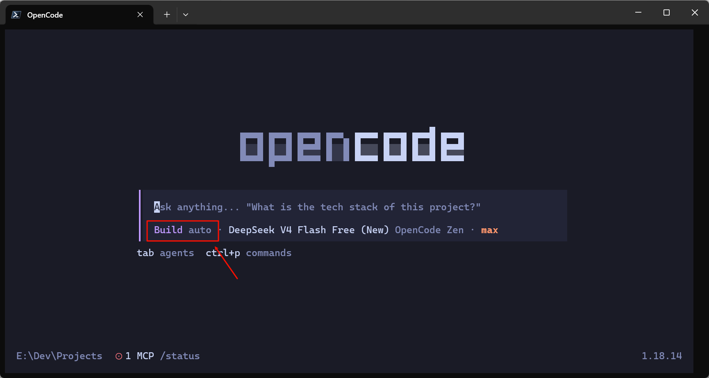

使用 Claude Code 时，用户可以通过权限模式切换进入 Auto。启用后，界面会明确显示当前处于 Auto 模式，Claude Code 可以在较少打断用户的情况下连续编辑文件、执行命令。

转到 OpenCode 后，很多人会寻找类似的功能，希望达到以下效果：

- 修改文件时不再反复点击 Yes；
    
- 执行命令时不再频繁弹出审批；
    
- 像 Claude Code 一样显示明确的 Auto 状态；
    
- 必要时仍然阻止高风险操作。
    

OpenCode 确实提供了 Auto 功能，但它与 Claude Code Auto 的实现方式并不相同。尤其需要区分：

```text
permission: allow
```

和：

```text
opencode --auto
```

这两种方法都可能实现“没有审批弹窗”，但它们不是同一种机制，界面表现也不同。

---

## 一、先看结论

OpenCode 中存在两种不同的无审批方式。

### 方式一：静态免审批

通过配置：

```json
{
  "permission": {
    "*": "allow"
  }
}
```

让操作从权限规则层面直接通过。

这种情况下：

- 操作不需要申请审批；
    
- OpenCode 不会产生审批请求；
    
- 界面不会显示 `auto` 标志；
    
- 即使没有 `auto` 标志，也可能已经完全不弹审批。
    

### 方式二：运行时自动审批

通过：

```bash
opencode --auto
```

或者在界面(ctrl+p)中选择：

```text
Enable auto-approve permissions
```

开启运行时自动审批。

这种情况下：

- 权限结果为 `ask` 的操作仍会产生审批请求；
    
- OpenCode 自动替用户批准请求；
    
- 界面会显示 `auto` 标志；
- 
    
- 明确设置为 `deny` 的操作仍然被阻止。
    

OpenCode 官方对 `--auto` 的定义是：自动批准所有没有被明确拒绝的权限请求。

因此：

```text
permission: allow
≠ 开启 Auto 状态

permission: allow
= 操作本身不需要审批
```

而：

```text
--auto
= 自动批准原本需要审批的操作
```

这是理解 OpenCode 无审批执行方式的关键。

---

## 二、Claude Code Auto 与 OpenCode Auto 有什么区别？

Claude Code 将 Auto 设计成正式的权限模式。它可以在支持的环境中通过 `Shift + Tab` 进入，也可以使用：

```bash
claude --permission-mode auto
```

Claude Code Auto 不只是简单地替用户点击确认。当前实现会使用独立的安全分类器检查即将执行的操作，判断操作是否超出用户要求、是否涉及陌生基础设施，或者是否可能受到恶意内容诱导。

OpenCode 的 `--auto` 则更直接：

```text
不是 deny
    ↓
自动批准
```

OpenCode 官方 CLI 文档对它的说明是：

```text
Auto-approve permissions that are not explicitly denied
```

也就是自动批准没有被明确设置为 `deny` 的权限。

因此，两者虽然都叫 Auto，但不能简单认为安全机制完全等价。

|对比项|Claude Code Auto|OpenCode `--auto`|
|---|---|---|
|产品定位|正式权限模式|运行时自动审批开关|
|界面状态|显示 Auto 模式|Agent 名称旁显示 `auto`|
|普通审批|自动处理|自动处理|
|后台安全判断|有独立安全分类器|主要依据 `allow`、`ask`、`deny` 规则|
|明确禁止规则|仍然生效|`deny` 仍然生效|
|是否等于全权限配置|否|否|

所以本文所说的“OpenCode 无审批执行”，主要是指使用体验接近，而不是安全模型完全一致。

---

## 三、为什么配置了 `allow`，却没有 Auto 标志？

假设配置如下：

```json
{
  "$schema": "https://opencode.ai/config.json",
  "default_agent": "build",
  "agent": {
    "build": {
      "permission": {
        "*": "allow"
      }
    }
  }
}
```

启动后，Build 旁边仍然没有 `auto` 标志。

这不是配置失效，而是因为这段配置没有开启运行时 Auto。

它的执行流程是：

```text
Build 请求使用工具
        ↓
权限规则匹配到 allow
        ↓
直接执行
        ↓
没有生成审批请求
```

OpenCode 的权限规则共有三种结果：

|权限值|行为|
|---|---|
|`allow`|无需审批，直接执行|
|`ask`|执行前请求用户批准|
|`deny`|禁止执行|

官方文档明确说明，`allow` 表示允许操作在不经过审批的情况下执行。

而开启 Auto 后，执行流程是：

```text
Build 请求使用工具
        ↓
权限规则匹配到 ask
        ↓
生成审批请求
        ↓
Auto 自动批准
        ↓
执行操作
```

所以 `auto` 标志表示的是：

> 当前是否启用了运行时自动审批器。

它并不表示：

> 当前是否存在任何可能直接执行的权限。

换句话说，即使界面没有 `auto` 标志，只要权限已经全部配置为 `allow`，Build 仍然可以在不弹出审批的情况下执行操作。

---

## 四、方法一：临时开启真正的 OpenCode Auto

希望像 Claude Code 一样明确进入 Auto 状态，可以直接运行：

```bash
opencode --auto
```

非交互式任务也可以使用：

```bash
opencode run --auto "修改项目代码并运行测试"
```

启用后：

```text
allow → 直接执行
ask   → 自动批准
deny  → 阻止执行
```

OpenCode 会在界面中显示 `auto` 状态标志。`--auto` 只影响没有被明确拒绝的权限，无法覆盖 `deny`。

已经进入 OpenCode 后，也可以在命令面板中选择：

```text
Enable auto-approve permissions
```

关闭时选择：

```text
Disable auto-approve permissions
```

这种方式适合：

- 临时运行一次较长的自动化任务；
    
- 希望界面明确显示 Auto 状态；
    
- 不想永久改变 Agent 权限；
    
- 仍然希望 `deny` 规则保持生效。
    

它的不足是：重新启动 OpenCode 后，通常需要再次通过启动参数或界面命令开启。

---

## 五、方法二：永久取消 Build 的审批

如果目标只是：

> 以后使用官方 Build 时，不再弹出权限审批。

那么可以直接配置 Build 的权限：

```json
{
  "$schema": "https://opencode.ai/config.json",
  "default_agent": "build",
  "agent": {
    "build": {
      "permission": {
        "*": "allow"
      }
    }
  }
}
```

这段配置会让 Build 中匹配到的权限直接通过。

它的效果包括：

- 文件创建直接执行；
    
- 文件修改直接执行；
    
- 补丁应用直接执行；
    
- Bash 命令直接执行；
    
- 其他匹配的内置工具、自定义工具和 MCP 工具直接执行；
    
- 不需要手动开启 Auto；
    
- 界面不会显示 `auto` 标志。
    

OpenCode 支持在 Agent 层覆盖权限配置，并且 Agent 权限会覆盖对应的全局权限。

OpenCode 内置 Build 本身就是面向开发工作的 Primary Agent，默认拥有完整的文件和系统命令工具。

因此，这个方案可以理解为：

```text
官方 Build
+
所有匹配权限静态设置为 allow
```

而不是：

```text
官方 Build
+
开启运行时 Auto
```

### 这种方案适合谁？

适合只关心以下结果的用户：

- 不想反复点击 Yes；
    
- 希望配置长期生效；
    
- 希望继续使用官方 Build；
    
- 不在意界面是否显示 `auto` 标志。
    

从实际执行效果看，它可以达到无审批操作；但从界面状态看，它不是 Auto。

---

## 六、怎样让每次启动都显示 Auto 标志？

OpenCode 当前公开的 CLI 参数中提供了：

```bash
opencode --auto
```

但官方配置文档没有提供一个与之对应的：

```json
{
  "auto": true
}
```

持久化配置字段。

因此，如果希望每次启动都进入运行时 Auto，并显示 `auto` 标志，最实用的方法是创建命令别名或启动脚本。

### PowerShell

打开 PowerShell 配置文件：

```powershell
notepad $PROFILE
```

加入：

```powershell
function oc {
    opencode --auto @args
}
```

以后使用：

```powershell
oc
```

即可启动带 Auto 状态的 OpenCode。

也可以保留原命令名称，但不建议覆盖系统中已有的 `opencode` 命令，使用较短的别名更容易维护。

### Windows 批处理脚本

创建 `opencode-auto.cmd`：

```bat
@echo off
opencode --auto %*
```

将脚本所在目录加入 `PATH` 后，可以运行：

```bat
opencode-auto
```

### Bash 或 Zsh

在 `~/.bashrc` 或 `~/.zshrc` 中加入：

```bash
alias oc='opencode --auto'
```

重新加载配置：

```bash
source ~/.bashrc
```

以后运行：

```bash
oc
```

这样启动的 OpenCode会真正启用运行时 Auto，并显示对应状态。

---

## 七、只取消文件编辑审批

Claude Code 的 `acceptEdits` 模式主要用于自动批准文件编辑，同时保留部分其他操作的审批。Claude Code 官方说明，`acceptEdits` 会自动批准工作目录内的文件编辑和部分常见文件系统命令。

OpenCode 中可以配置类似效果：

```json
{
  "$schema": "https://opencode.ai/config.json",
  "default_agent": "build",
  "agent": {
    "build": {
      "permission": {
        "edit": "allow",
        "bash": "ask"
      }
    }
  }
}
```

对应行为如下：

|操作|结果|
|---|---|
|创建文件|直接执行|
|修改文件|直接执行|
|应用补丁|直接执行|
|Bash 命令|请求审批|

OpenCode 的 `edit` 权限同时控制：

- `write`
    
- `edit`
    
- `apply_patch`
    

因此，不需要再分别配置三个工具。

不过这里有一个非常重要的前提：

> 这种配置只有在没有开启运行时 Auto 时，才能保证 Bash 命令继续弹出审批。

如果同时运行：

```bash
opencode --auto
```

那么：

```json
"bash": "ask"
```

产生的审批请求也会被 Auto 自动批准。

因此：

```text
edit: allow + bash: ask
```

适合普通 Build 模式；

不适合已经开启 `--auto`、但又希望 Bash 命令继续人工确认的场景。

---

## 八、`ask` 在 Auto 模式下不是安全边界

这是最容易被忽略的一点。

假设配置为：

```json
{
  "permission": {
    "bash": {
      "*": "allow",
      "rm *": "ask",
      "git push *": "ask",
      "git reset --hard*": "ask"
    }
  }
}
```

在没有启用 Auto 时：

```text
rm → 弹出审批
git push → 弹出审批
git reset --hard → 弹出审批
```

但在启用：

```bash
opencode --auto
```

之后，结果会变成：

```text
rm → 自动批准
git push → 自动批准
git reset --hard → 自动批准
```

因为 `--auto` 会自动批准所有没有被明确设置为 `deny` 的权限请求。

所以，在 OpenCode 中：

```text
ask = 普通模式下需要人工确认
```

但：

```text
ask + Auto = 自动确认
```

如果希望某些操作在 Auto 状态下也绝对不能执行，必须设置为：

```json
"deny"
```

而不是：

```json
"ask"
```

---

## 九、两种不同的安全配置

### 方案 A：不启用 Auto，危险操作保留审批

希望普通操作直接执行，但危险命令仍要求人工确认，可以使用：

```json
{
  "$schema": "https://opencode.ai/config.json",
  "default_agent": "build",
  "agent": {
    "build": {
      "permission": {
        "*": "allow",
        "bash": {
          "*": "allow",
          "rm *": "ask",
          "del *": "ask",
          "rmdir *": "ask",
          "git push *": "ask",
          "git reset --hard*": "ask",
          "git clean *": "ask"
        },
        "external_directory": "ask"
      }
    }
  }
}
```

使用这套配置时，不要再开启：

```bash
opencode --auto
```

否则 `ask` 请求会被自动批准。

这套方案适合日常开发：

- 普通编辑不审批；
    
- 普通命令不审批；
    
- 删除、推送、强制重置仍然询问；
    
- 访问项目外目录仍然询问；
    
- 界面不显示 `auto` 标志。
    

OpenCode 的细粒度权限支持通配符规则，并且最后匹配到的规则优先，因此通用规则应放在前面，具体规则放在后面。

### 方案 B：启用 Auto，但危险操作彻底禁止

希望使用：

```bash
opencode --auto
```

同时确保某些高风险操作不会被自动批准，则应使用 `deny`：

```json
{
  "$schema": "https://opencode.ai/config.json",
  "default_agent": "build",
  "agent": {
    "build": {
      "permission": {
        "*": "allow",
        "bash": {
          "*": "allow",
          "rm *": "deny",
          "del *": "deny",
          "rmdir *": "deny",
          "git push *": "deny",
          "git reset --hard*": "deny",
          "git clean *": "deny"
        },
        "external_directory": "deny"
      }
    }
  }
}
```

此时运行：

```bash
opencode --auto
```

得到的效果是：

- 普通操作直接执行；
    
- `ask` 请求自动批准；
    
- 危险命令直接拒绝；
    
- 界面显示 `auto`；
    
- 被拒绝的命令不能通过自动审批继续执行。
    

这种方案安全边界更明确，但缺点是被设置为 `deny` 的操作无法通过普通审批临时放行，需要修改权限规则后才能执行。

---

## 十、是否需要创建 Full-Auto Agent？

如果希望 Tab 列表中出现：

```text
build → plan → Full-Auto
```

可以创建一个新的 Primary Agent：

```json
{
  "$schema": "https://opencode.ai/config.json",
  "agent": {
    "Full-Auto": {
      "description": "全权限开发 Agent",
      "mode": "primary",
      "permission": {
        "*": "allow"
      }
    }
  }
}
```

OpenCode 的 Tab 键切换对象是 Primary Agent。官方内置的两个 Primary Agent 是 Build 和 Plan，自定义 `mode: "primary"` 的 Agent 也会加入切换范围。

但这个方案并不等于开启运行时 Auto：

- 它不会因为名字叫 `Full-Auto` 就显示 Auto 状态；
    
- 它只是一个权限全部为 `allow` 的新 Agent；
    
- 它仍然属于静态免审批；
    
- 它不一定完整继承官方 Build 的内部提示词和行为。
    

所以不建议仅仅为了显示一个类似 Claude Code Auto 的切换项而创建新 Agent。

如果主要目标是保留官方 Build 并取消审批，应修改：

```json
"agent": {
  "build": {
    "permission": {
      "*": "allow"
    }
  }
}
```

如果主要目标是显示真正的 `auto` 状态，则应使用：

```bash
opencode --auto
```

---

## 十一、不要继续使用旧版 `tools` 配置

部分旧教程会这样配置：

```json
{
  "tools": {
    "write": true,
    "edit": true,
    "bash": true,
    "read": true
  }
}
```

或者：

```json
{
  "agent": {
    "Full-Auto": {
      "tools": {
        "write": true,
        "edit": true,
        "bash": true
      },
      "permission": {
        "*": "allow"
      }
    }
  }
}
```

OpenCode 官方已经将 `tools` 标记为弃用，并建议新配置统一使用 `permission`。旧版 `tools` 中的 `true` 大致等价于允许，`false` 大致等价于拒绝。

因此可以简化为：

```json
{
  "permission": {
    "*": "allow"
  }
}
```

或：

```json
{
  "permission": {
    "edit": "allow",
    "bash": "ask"
  }
}
```

这不仅更简洁，也方便配置针对具体命令的细粒度权限。

---

## 十二、配置文件位置与优先级

OpenCode 的全局配置文件位于：

```text
~/.config/opencode/opencode.json
```

Windows 中通常对应：

```text
C:\Users\你的用户名\.config\opencode\opencode.json
```

项目根目录也可以存在：

```text
opencode.json
```

项目配置可以覆盖全局配置。OpenCode 还可能读取远程组织配置、自定义配置、`.opencode` 目录和运行时内联配置，托管配置的优先级最高。

因此，如果已经配置：

```json
"permission": {
  "*": "allow"
}
```

但仍然出现审批，可以检查：

1. 当前项目根目录是否存在另一个 `opencode.json`；
    
2. 项目配置是否重新将某些权限设置为 `ask`；
    
3. 是否使用了自定义 Agent；
    
4. 是否存在组织级或托管配置；
    
5. 当前实际使用的 Agent 是否为 `build`；
    
6. JSON 文件是否完整、语法是否正确。
    

`default_agent` 只决定没有显式指定 Agent 时默认使用哪个 Agent。

---

## 十三、几种方案对比

|目标|推荐方式|显示 `auto`|是否长期生效|
|---|---|--:|--:|
|临时进入 OpenCode Auto|`opencode --auto`|是|否|
|当前会话开启 Auto|`Enable auto-approve permissions`|是|当前会话|
|Build 永久不弹审批|`build.permission.* = allow`|否|是|
|只允许文件编辑|`edit: allow`、`bash: ask`|否|是|
|普通操作放行，危险操作询问|静态 `allow + ask`，不要启用 Auto|否|是|
|Auto 下阻止危险操作|危险操作设为 `deny`|是|配置长期生效|
|每次启动都显示 Auto|使用别名或脚本运行 `opencode --auto`|是|启动方式长期可用|
|Tab 中增加 Full-Auto|新建 Primary Agent|否|是|

---

## 十四、与 Claude Code 模式的近似对应关系

|Claude Code|OpenCode 中较接近的实现|
|---|---|
|`default`|将相关权限设为 `ask`|
|`acceptEdits`|`edit: allow`、`bash: ask`|
|`plan`|使用内置 Plan Agent|
|`auto`|`opencode --auto`|
|默认进入 Auto|使用启动别名自动附加 `--auto`|
|`bypassPermissions`|静态设置 `permission: "*": "allow"`，但安全机制并不完全等价|

需要注意：

> `permission: "*": "allow"` 在使用体验上可能比 OpenCode Auto 更直接，因为操作不会进入审批流程；但它不代表 OpenCode 当前处于 Auto 状态，也不会显示 Auto 标志。

同样：

> OpenCode `--auto` 虽然名字与 Claude Code Auto 相同，但没有公开说明其具备 Claude Code Auto 相同的安全分类器机制。

---

## 十五、最终推荐

### 只想彻底取消审批

使用：

```json
{
  "$schema": "https://opencode.ai/config.json",
  "default_agent": "build",
  "agent": {
    "build": {
      "permission": {
        "*": "allow"
      }
    }
  }
}
```

此时没有 `auto` 标志是正常的，因为操作已经不需要审批。

### 想看到 Auto 标志

使用：

```bash
opencode --auto
```

或者在界面中选择：

```text
Enable auto-approve permissions
```

### 想减少审批，但保留危险操作确认

使用静态权限规则：

```json
{
  "agent": {
    "build": {
      "permission": {
        "*": "allow",
        "bash": {
          "*": "allow",
          "rm *": "ask",
          "git push *": "ask",
          "git reset --hard*": "ask"
        }
      }
    }
  }
}
```

同时不要开启运行时 Auto。

### 想开启 Auto，同时确保危险操作无法执行

将危险操作设置为 `deny`：

```json
{
  "agent": {
    "build": {
      "permission": {
        "*": "allow",
        "bash": {
          "*": "allow",
          "rm *": "deny",
          "git push *": "deny",
          "git reset --hard*": "deny"
        }
      }
    }
  }
}
```

然后使用：

```bash
opencode --auto
```

---

## 十六、总结

OpenCode 中最容易混淆的是以下两个概念：

```text
静态权限规则
```

和：

```text
运行时 Auto 状态
```

配置：

```json
"permission": {
  "*": "allow"
}
```

表示：

> 操作无需审批，直接执行。

运行：

```bash
opencode --auto
```

表示：

> 原本需要审批、且没有被明确拒绝的操作，由 OpenCode 自动批准。

因此，配置了全部 `allow` 后没有出现 `auto` 标志，并不表示配置失败。恰恰相反，操作可能已经绕过了审批流程，根本不需要 Auto 介入。

最终可以用一句话概括：

```text
allow 是“不需要审批”，Auto 是“自动替你审批”。
```

两者可能产生相似的无弹窗体验，但运行机制、状态显示和安全规则并不相同。

> 无审批执行意味着 Agent 可以在没有人工确认的情况下修改文件和执行命令。建议始终使用 Git 管理项目，并在执行大型自动化任务前提交或备份当前改动。