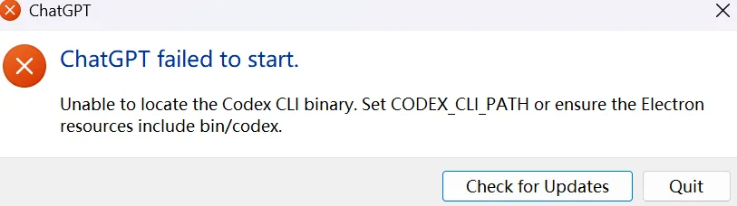

Codex 的 Windows 桌面应用突然打不开时，我第一眼盯上的嫌疑人，是 NVM。



这台电脑里装了 Node.js `24.15.0` 和 `20.20.2` 两个版本，当前又正好启用了其中一个；命令行里还能找到 npm 安装出来的 `codex`。

一边是 Microsoft Store 安装的桌面应用，一边是 NVM 管理的 Node 环境。

这个组合实在很容易让人脑补出一场“版本打架”。

我一开始也这么想。

顺着报错继续往下查以后，两个 Node 版本倒是越来越安静，另外几个东西开始变得可疑：

```text
codex
codex.cmd
codex.ps1
codex.exe
```

故事突然从“版本冲突”，变成了 Windows 传统艺能——

**你说的 `codex`，到底是哪一个 `codex`？**


## 报错已经把范围缩得很小了

当时 Codex 桌面应用还没进入主界面，就直接退出：

```text
ChatGPT failed to start.
Unable to locate the Codex CLI binary. Set CODEX_CLI_PATH or ensure the Electron
resources include bin/codex.
```

往后看第二句，排查范围其实已经比较明确：

```text
Unable to locate the Codex CLI binary.
```

桌面应用启动时需要找到 Codex CLI，再把它作为子进程拉起来。现在它倒在了这一步，所以项目、模型、账号这些上层配置暂时都可以往后排。

报错还直接给了一个入口：

```text
Set CODEX_CLI_PATH
```

如果应用自己找不到 CLI，我们可以明确告诉它文件在哪里。

于是先看看系统目前认出来的 `codex` 都是什么。

## 一个 `codex` 命令，背后站着好几个程序

在 PowerShell 里检查：

```powershell
Get-Command codex -All | Format-Table CommandType, Name, Source
where.exe codex
```

当时排在前面的几个结果都来自 NVM 当前使用的 Node 目录：

```text
E:\Dev\Runtimes\nodejs\codex.ps1
E:\Dev\Runtimes\nodejs\codex.cmd
E:\Dev\Runtimes\nodejs\codex
```

独立安装的原生 CLI 则在另一处：

```text
C:\Users\<用户名>\AppData\Local\Programs\OpenAI\Codex\bin\codex.exe
```

这里有个很容易误导人的地方。

平时我直接在 PowerShell 里运行：

```powershell
codex --version
```

命令完全正常。

看到这里，很容易得出一个结论：

> Codex CLI 明明能跑，桌面应用为什么说找不到？

问题藏在“能跑”这两个字里面。

PowerShell 本身就是 Shell。`.ps1` 它自己会处理，`.cmd` 也有对应的执行方式。平时在终端里使用时，中间隔着包装脚本通常没什么感觉。

桌面应用要创建 CLI 子进程，情况就有区别了。

如果它最终拿到的是原生：

```text
codex.exe
```

可以直接作为 Windows 可执行文件启动。

如果拿到的是：

```text
codex.cmd
```

那就还需要对应的 Shell 参与，不能简单把两者当成同一种文件。

这下之前那个现象就顺眼多了：

> **PowerShell：** 放心，这个 `codex` 我认识，我帮你跑。
>
> **桌面应用：** 我要一个能直接启动的 CLI binary。
>
> **PATH：** 我这里有 `codex.cmd`。
>
> **桌面应用：** ……

所以：

```powershell
codex --version
```

成功，只能说明当前终端能够解析并运行某个名为 `codex` 的入口。

桌面应用最后拿到的是不是那个原生 `codex.exe`，还得继续查。

看起来只差一个扩展名，中间其实隔着一整层启动方式。


## 两个 Node 版本先从嫌疑人名单上往后挪一挪

本机通过 NVM 安装了：

```text
Node.js 24.15.0
Node.js 20.20.2
```

事故恢复后当前启用的是 `24.15.0`。

NVM 平时的工作方式并不是让两个 Node 同时冲出来抢方向盘。电脑里可以装很多版本，某个时刻真正生效的仍然是当前切换出来的那个。

因此，“装了两个 Node”本身还解释不了 Codex Desktop 为什么会找不到 CLI。


不过 NVM 确实让现场复杂了一点。

它管理的 Node 目录进入了 PATH，而 npm 又在那里留下了：

```text
codex
codex.cmd
codex.ps1
```

这意味着，只要某个逻辑依赖 PATH 去寻找裸命令 `codex`，就得额外确认一次最后落到了谁身上。

这里我也就没有继续往“卸 Node → 卸 NVM → 清 npm 全局包 → 重建环境”那条路线冲。

为了修一个桌面应用启动失败，把整个开发环境扬了，多少有点像为了找钥匙先把门拆下来。

万一钥匙最后还在裤兜里，就比较尴尬了。

## 绕过猜谜游戏，看看最终的解决方法

既然自动发现这条路现在有歧义，那就先不给它猜。

我通过官方安装脚本装了一份独立 Codex CLI：

```powershell
powershell -ExecutionPolicy Bypass -c "irm https://chatgpt.com/codex/install.ps1 | iex"
```

然后直接构造原生可执行文件路径：

```powershell
$codexExe = Join-Path $env:LOCALAPPDATA "Programs\OpenAI\Codex\bin\codex.exe"

Test-Path $codexExe
& $codexExe --version
```

当时得到：

```text
True
codex-cli 0.149.1
```

这次验证的对象已经没有歧义：

```text
C:\Users\<用户名>\AppData\Local\Programs\OpenAI\Codex\bin\codex.exe
```

文件存在。

可以直接执行。

版本输出也正常。

接着把这个路径明确交给桌面应用：

```powershell
[Environment]::SetEnvironmentVariable(
    "CODEX_CLI_PATH",
    $codexExe,
    "User"
)

$env:CODEX_CLI_PATH = $codexExe
```

这里设置两次有不同用途。

用户级环境变量：

```powershell
[Environment]::SetEnvironmentVariable(...)
```

会留给以后新启动的进程读取。

当前 PowerShell 会话里的：

```powershell
$env:CODEX_CLI_PATH = $codexExe
```

则方便马上检查和验证。

设置完成以后，Codex 桌面应用恢复启动。

而这时候再运行：

```powershell
where.exe codex
```

前面依然是 E 盘 Node 目录里的 npm shim。

这个结果反而挺重要。

PATH 没有突然改邪归正，NVM 也没消失，那几个同名 `codex` 还老老实实待在原位。

桌面应用只是多了一条明确路线：

```text
CODEX_CLI_PATH
    ↓
C:\Users\<用户名>\AppData\Local\Programs\OpenAI\Codex\bin\codex.exe
```

自动发现继续猜它的。

桌面版这边不陪它玩了。


## 中间还有一次非常安静的“修复成功”

当然，排错过程中也不是每一步都这么顺利。

最开始我曾经写过：

```powershell
[Environment]::SetEnvironmentVariable(
    "CODEX_CLI_PATH",
    $codex,
    "User"
)
```

命令执行得很安静。

没有报错。

没有红字。

也没有任何要出事的迹象。

唯一的问题是：

**当时 `$codex` 还没赋值。**

PowerShell 并不会看着变量名陷入沉思，然后贴心地帮我搜索：

> 嗯……他这里大概想填 Codex 的路径。

它只是非常专业地接受了这个空值。

随后再读取环境变量：

```text
空。
```

一次非常有礼貌的无事发生。

后来我还试图聪明一点：

```powershell
Get-Command codex -CommandType Application
```

但这个办法也不够稳。

PowerShell 里的 `Application` 并不能简单理解成“只返回 `.exe`”。在 Windows 上，`.cmd` 也可能作为可执行命令被识别出来。

所以它还是有机会给我：

```text
codex.cmd
```

这时候场面就有点微妙了。

我们正在解决：

> 自动找到的 `codex` 究竟是谁？

然后决定：

> 再写一个自动寻找 `codex` 的命令来解决它。

多少有点让刚迷路的人负责带路。

最后还是最朴素的办法省心：

```text
明确写出 codex.exe 的路径
↓
Test-Path
↓
直接运行 --version
↓
写入 CODEX_CLI_PATH
```

没有那么“智能”，但至少每一步都知道自己在验证什么。

## 桌面版和命令行，现在算解绑了吗？

从 CLI 启动入口来看，可以先这么理解。

目前在终端里直接输入：

```powershell
codex
```

仍然可能优先进入 NVM/Node 目录里的 npm shim。

Codex 桌面应用则因为：

```text
CODEX_CLI_PATH
```

明确使用：

```text
%LOCALAPPDATA%\Programs\OpenAI\Codex\bin\codex.exe
```

两边不再完全依赖同一条 PATH 解析结果。

以后切换 NVM 当前使用的 Node 版本时，至少桌面应用不用顺便参加一次：

> “今天的 `codex` 又是哪位？”

不过这还不能叫“两套 Codex 完全隔离”。

CLI 启动文件分开，不代表账号、认证、本地配置目录、`~/.codex` 和其他状态都会一起分家。

目前这次排查能够确认的范围，只到：

**命令行和桌面应用选择 CLI 文件的方式已经分开。**

其他共享边界，还得看 Codex 本身的实际实现。


对现在来说已经够用了。

环境看起来是不是“只有一份 Codex”，反倒没那么重要。能稳定启动，先让它好好活着。

## 有一部分事故现场，现在已经还原不了了

恢复以后，我又检查了当前 Microsoft Store 包。

现在机器上的版本是：

```text
OpenAI.Codex 26.820.7780.0
```

包内也能看到：

```text
app\resources\codex
app\resources\codex.exe
```

但这些都是故障恢复以后看到的状态。

事故发生瞬间的商店包版本、文件清单，以及桌面应用实际走过的 CLI 定位路径，我没有完整保存下来。

所以现在只能列出几种可能：

- 当时包内 CLI 文件存在异常；
- CLI 在包里，但启动器没找到正确位置；
- Windows 下某段路径或文件类型处理出了问题；
- 应用更新和环境变量修复都影响了最终结果；
- PATH 里的 npm shim 参与了故障，但并不是全部原因。

这也是为什么我不打算把这次经历写成：

> 已经精准定位 Codex Desktop 某处 Bug。

现阶段能确定的事情其实已经很实用了：

```text
显式指定一个经过验证的原生 codex.exe
↓
桌面应用恢复启动
```

这是一条实际验证过的修复路径。

至于事故发生瞬间产品内部究竟在哪一步出错，现有证据还不够。

所以我暂时保留 `CODEX_CLI_PATH`。

哪天想验证商店版是不是已经能够独立冷启动了，再先记录原值，然后做一次可恢复的隔离测试。

没必要为了满足一点“环境洁癖”，主动把已经正常工作的东西再踹一脚。

## 最后留下两个排障习惯

这次之后，我对版本管理器大概会多一个习惯。

看到 NVM、pyenv、Java 多版本环境时，先别急着数：

> 装了几个版本？

更有用的是看看：

```text
当前真正启用的是谁？
PATH 里还有哪些同名入口？
```

安装数量只是背景。

真正参与执行的那个文件，才在案发现场。

另一个习惯则是区分：

```text
终端能运行这个命令
```

和：

```text
另一个程序能直接启动这个文件
```

Shell 平时替我们兜了太多事情，所以包装脚本存在感很低。直到有一天另一个程序绕过 Shell 直接创建进程，这些区别才突然冒出来。

以后再碰到类似问题，我应该会先跑：

```powershell
Get-Command <命令> -All
where.exe <命令>
```

然后别急着看它叫不叫那个名字。

先看看它到底是什么。

毕竟这次最有迷惑性的地方恰恰就是：

```text
codex
codex.cmd
codex.ps1
codex.exe
```

全都可以理直气壮地告诉你：

> “对，我就是 Codex。”

而 Windows 在旁边点了点头。

---

## 参考资料

- [ChatGPT desktop app for Windows](https://learn.chatgpt.com/docs/windows/windows-app)
- [Codex CLI](https://learn.chatgpt.com/docs/codex/cli)
- Microsoft Learn：PowerShell `Get-Command`
- Node.js Documentation：`child_process` 中关于 Windows `.bat` / `.cmd` 的说明

> 本文记录的是 2026-08-26 一台 Windows 电脑上的实际故障与恢复现场。版本号、安装路径和商店包布局均具有时效性。文中能够确认的是本机当时的故障表现、检查结果和有效修复方式，不能据此推断所有 Codex Windows 环境都存在完全相同的问题。
