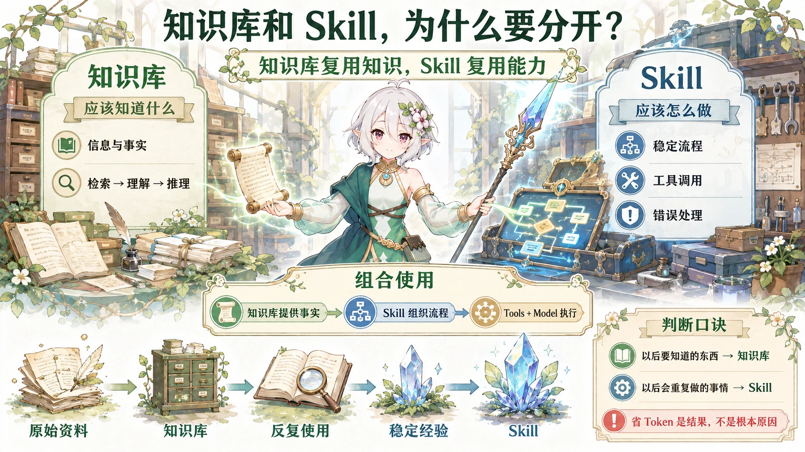

前几天面试的时候，我被问到了一个挺有意思的问题：

> Skill 是为了沉淀可复用能力，个人知识库同样也能沉淀知识。既然两者都能复用，那为什么要用 Skill，而不是直接放进知识库？

当时我的脑子其实已经摸到答案边上了。

比如我隐约觉得：

- Skill 通常更加结构化；

- 可以减少重复上下文；

- 可能更节省 Token；

- 执行起来也更稳定。


但是这些想法在脑子里属于一种“大家都认识，但还没拉群”的状态。

单独看好像都对，真要让我现场组织成一套完整逻辑的时候，就开始：

> 嗯……这个……Skill 它比较……结构化……

经典面试大脑降频现场。

后来重新想了一遍，我发现这件事其实可以压缩成一句非常简单的话：

> **知识库解决的是“我应该知道什么”，Skill 解决的是“我应该怎么做”。**

一下就通了。



---

## 知识库沉淀的是“信息”

个人知识库本质上更像一个可以被检索的大型资料库。

里面可以放：

- 项目文档

- 学习笔记

- API 文档

- 产品资料

- 面试记录

- 技术文章

- 历史决策


当 Agent 遇到问题时，它会根据当前任务去知识库里检索相关内容，再结合模型自己的理解和推理完成任务。

比如知识库里写着：

> 项目提交必须遵循 Conventional Commits，`feat` 表示功能，`fix` 表示修复，`docs` 表示文档修改。

那么 Agent 在准备提交代码的时候，可以先把这段规则找出来，再决定 Commit Message 应该怎么写。

这个时候，知识库提供的是：

> **“这里有一份规则，你参考一下。”**

它告诉 Agent 应该知道哪些信息。

但是至于：

- 先看什么；

- 后看什么；

- 什么时候调用 Git；

- 是否先检查敏感文件；

- 执行失败以后怎么办；


这些事情还是要 Agent 自己现场推理。

有点像你把《Git 提交规范.pdf》发给了一个新人，然后说：

> 按这个来。

至于他最后会不会一边看 PDF 一边 `git add .`，那就是另外一个故事了。


---

## Skill 沉淀的是“做法”

Skill 更像是把一套已经验证过的执行经验，封装成一个可以重复调用的能力模块。

还是 Git 提交这个例子。

一个 Skill 可能不是简单写一句：

> 使用 Conventional Commits。

而是直接把整套流程规定清楚：

1. 读取 Git Diff

2. 判断修改属于功能、修复还是文档

3. 检查是否包含不应提交的敏感文件

4. 生成 Commit Message

5. 执行 Git Add

6. 执行 Commit

7. 检查提交结果


甚至还可以继续附带：

- 工具调用方式

- 参数格式

- 输出规范

- 错误处理

- 示例

- 脚本


这时候它表达的就不只是知识了。

而是：

> **“这件事情，以后按照这个方法做。”**

所以我后来很喜欢这样理解：

> **知识库保存的是过去的内容，Skill 保存的是过去成功的做法。**

前者像资料柜。

后者更像把某个熟练工老师傅的手法，偷偷封印进了一个按钮里。

点一下：

**啪，经验复用了。**


---

## 那为什么不能全部放知识库？

理论上当然可以。

你完全可以把一份非常详细的“Git 提交流程”写进知识库。

然后 Agent 每次提交代码的时候：

```text
搜索知识库
↓
找到操作规范
↓
理解规范
↓
推理执行步骤
↓
判断调用哪些工具
↓
执行
```

问题就在这里。

**它每一次都要重新理解一次。**

如果一个流程本身已经非常成熟，每次执行之前还让模型重新把说明书学习一遍，其实有点像：

> 每次做番茄炒蛋之前，先重新阅读《美食百科之番茄炒蛋操作指南》。

不是不能做。

只是看着就累。

Skill 的意义，就是把这种重复出现的推理过程进一步结构化。

于是流程会更接近：

```text
commit_changes
↓
按照既定流程执行
```

这样确实可能减少上下文和 Token 消耗。

但现在回头看，我当时面试时最大的误区也就在这里：

> **节省 Token 是结果，不是 Skill 存在的根本原因。**

真正关键的是：

**它把原本每次都需要重新推理的“方法”，变成了可以稳定复用的能力。**

随之而来的才是：

- Token 消耗减少

- 执行一致性提高

- 工具调用更加稳定

- 更容易测试

- 更容易维护

- 更方便不同 Agent 复用


也就是说，Skill 不是单纯为了“省字”。

不然我们直接把提示词全部压成火星文就好了。

---

## 那为什么不能全部做成 Skill？

反过来也一样。

假如我的个人知识库里有：

- 几千篇学习笔记

- 几百份项目文档

- 数年的历史记录

- 一堆论文

- 各种不知道什么时候会再翻出来的资料


显然不可能每一条都单独设计一个 Skill。

比如今天我突然问：

> Transformer 为什么需要位置编码？

明天又问：

> 我上个月为什么决定修改这个模块？

后天可能是：

> 我之前到底在哪篇笔记里吐槽过 Codex？

这种问题并没有什么稳定的执行流程。

它们只是需要：

```text
找到相关知识
↓
理解
↓
回答
```

这正是知识库最擅长的事情。

如果硬要把这些全部 Skill 化，大概很快就会变成：

```text
query_transformer_position_encoding()
query_last_month_architecture_decision()
query_where_i_roasted_codex()
query_that_random_thing_i_vaguely_remember()
...
```

Skill 菜单越写越长。

最后 Agent 还没实现 AGI，启动菜单先做成 Windows 控制面板了。

这就属于非常典型的：

> **为了复用而复用，最后复用本身成了新的工作。**

---

## 真正成熟的做法，其实不是二选一

Skill 和知识库并不是竞争关系。

很多时候，它们反而天然适合组合。

比如有一个：

> **“生成项目技术方案” Skill**

它内部可能规定：

```text
读取需求
↓
检索项目知识库
↓
查询历史架构决策
↓
套用技术方案结构
↓
检查冲突
↓
输出 Markdown
```

这里：

**Skill 决定怎么做。**

**知识库提供做这件事所需要的事实和上下文。**

如果再把工具算进去，大概就是：

```text
Skill
  ↓
组织流程
  ↓
Knowledge Base + Tools + Model
```

Skill 更像 Agent 的行为层。

知识库更像 Agent 的长期知识资源。

一个负责：

> 我会怎么干活。

另一个负责：

> 我干活的时候都知道些什么。

这两个东西，本来就不是同一个岗位。

---

## 一个非常简单的判断方法

以后再遇到类似的设计，我大概会先问自己两个问题：

> **这是“我以后可能还需要知道的东西”，还是“我以后还会重复做的事情”？**

如果是前者：

放知识库。

如果是后者，而且已经形成了一套比较稳定的执行套路：

做成 Skill。

当然现实系统不会切得这么绝对。

Skill 经常会调用知识库。

而知识库里的经验，也可能经过反复实践之后，逐渐被提炼成 Skill。

从这个角度看，整个过程甚至有点像知识在慢慢“结晶”：

```text
原始资料
↓
知识库
↓
反复使用
↓
逐渐形成稳定经验
↓
Skill
```


一开始只是：

> “我记得以前好像这么干过。”

后来变成：

> “我发现每次都是这么干。”

最后终于可以：

> “行了，别每次都想一遍了，封成 Skill 吧。”

---

## 那么现在再看那个面试问题

当时我脑子里确实已经有“Skill 更结构化、可能更节省 Token”这个方向了。

但现在回头看，那个回答还是停留在比较表层的工程表现上。

真正把两者区分开的，并不是 Token。

而是它们复用的东西根本不同：

> **知识库复用的是知识。**

> **Skill 复用的是能力。**

知识库是在告诉 Agent：

> **你以前知道过什么。**

Skill 则是在告诉 Agent：

> **你以前已经学会怎么做了，下次别又从头悟道。**

可惜这个答案是在面试结束以后才完全想明白的。

怎么说呢。

非常符合程序员传统艺能：

**Bug 总是在提交之后看懂，面试题总是在走出公司以后会答。**
