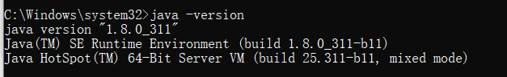
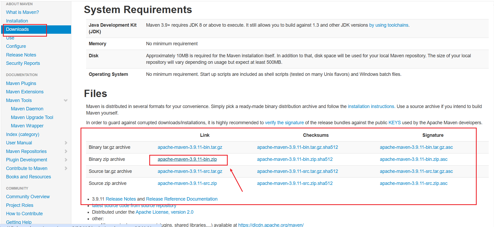
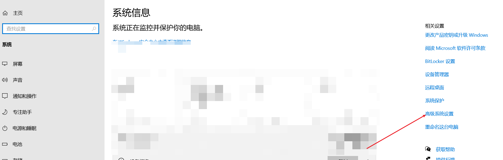
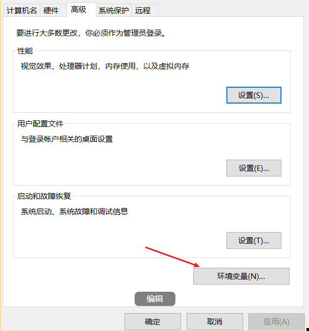
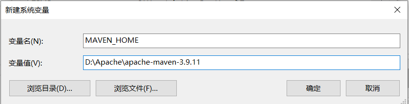
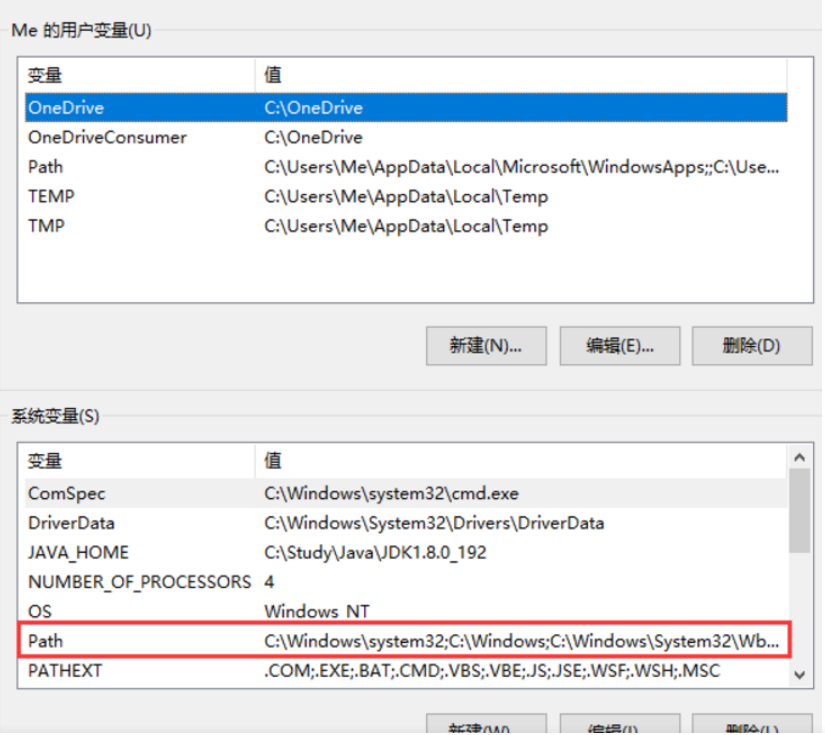
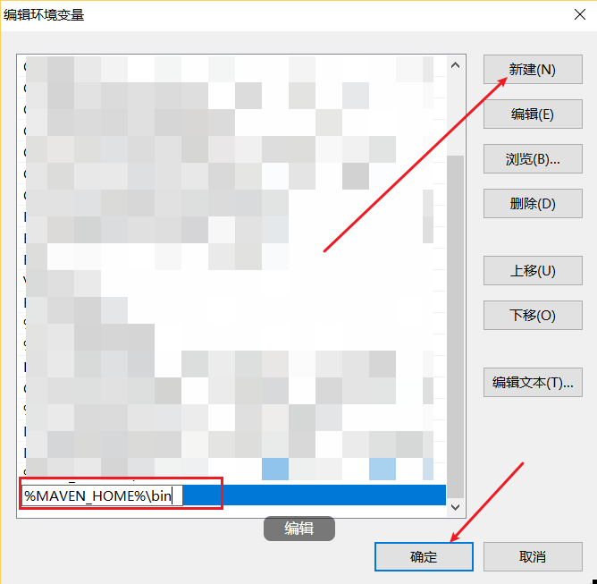

Maven 是 Java 项目的构建工具，可自动化处理依赖管理、项目编译、打包部署等流程，是 Java 开发者的必备技能。本文针对 2025 年最新稳定版 Maven（3.9.11），讲解 Windows 10/11 下的下载、安装、环境配置、镜像优化全流程，并附常见问题排查，适合零基础新手。

## 一、安装前核心准备

### 1. 必装依赖：Java 环境

Maven 基于 Java 开发，必须先安装 JDK 并配置环境变量：

- 推荐 JDK 8 及以上（如 JDK 8、JDK 21，兼容所有 Maven 版本）
- 验证 Java 环境：按 `Win+R` 输入 `cmd` 打开命令行，执行 `java -version`
  - 成功：显示 JDK 版本（如 `java version "1.8.0_311"`）



- 失败：需先安装 JDK 并配置 `JAVA_HOME` 环境变量

JDK 安装与环境配置可参考：[JDK安装以及环境配置](https://blog.csdn.net/qq_51572290/article/details/154535381?spm=1001.2014.3001.5502)

### 2. 硬件与路径要求

- 硬件：至少 1GB 内存，5GB 以上空闲磁盘空间
- 路径规范：后续 Maven 解压目录需 **无中文、无空格**（避免编译报错）

## 二、Maven 下载（官方安全渠道）

推荐从 Apache Maven 官网下载，确保安装包无捆绑、无篡改：

1. 访问官方下载地址：[https://maven.apache.org/download.cgi](https://maven.apache.org/download.cgi)
2. 版本选择：找到「Files」栏目，选择「Binary zip archive」（免安装版，配置灵活，推荐）
3. 下载页面 Files 栏目：



4. 2025 最新稳定版：`apache-maven-3.9.11-bin.zip`
5. 下载无需注册，点击文件名直接开始（若浏览器提示风险，选择「保留」即可）

## 三、Maven 安装与环境变量配置

### 1. 解压安装包

将下载的 ZIP 压缩包解压到指定目录（示例路径）：

- 推荐路径：`D:\Apache\apache-maven-3.9.11`
- 注意：解压后目录结构需完整，核心文件夹 `bin`（可执行文件）、`conf`（配置文件）必须存在

### 2. 配置系统环境变量

配置后可在任意命令行窗口调用 Maven 命令，无需切换到 `bin` 目录：

1. 打开环境变量设置：右键「此电脑」→「属性」→「高级系统设置」→「环境变量」





2. 新建系统变量 `MAVEN_HOME`：
   - 变量名：`MAVEN_HOME`（固定写法，注意大小写）
   - 变量值：粘贴 Maven 解压根目录（示例：`D:\Apache\apache-maven-3.9.11`）



3. 编辑 `Path` 变量：
   - 在「系统变量」中找到 `Path`，点击「编辑」→「新建」
   - 输入：`%MAVEN_HOME%\bin`（通过 `MAVEN_HOME` 关联，后续修改安装路径无需重配）





4. 保存配置：依次点击所有弹窗的「确定」，环境变量生效

### 3. 验证安装是否成功

1. 关闭之前的命令行窗口（环境变量需重启终端生效），重新打开 CMD
2. 执行：`mvn -version`
3. 成功标识：显示 Maven 版本、Java 版本、系统信息，如：

```text
Apache Maven 3.9.11 (xxxxxx)
Maven home: D:\Program Files\Apache\apache-maven-3.9.11
Java version: 1.8.0_391, vendor: Oracle Corporation
```

- 若提示「mvn 不是内部或外部命令」，见下文「常见问题排查」

## 四、关键配置：本地仓库与国内镜像

默认配置下，Maven 从国外中央仓库下载依赖，速度慢且易失败。需修改 `settings.xml`，配置本地仓库和国内镜像。

### 1. 配置本地仓库

本地仓库用于缓存下载的依赖包，避免重复下载：

1. 在 Maven 解压目录下新建 `repository` 文件夹（示例：`D:\\Apache\apache-maven-3.9.11\repository`）
2. 找到配置文件：进入 Maven 解压目录的 `conf` 文件夹，打开 `settings.xml`（记事本、VS Code 等均可）
3. 配置本地仓库路径：
   - 找到 `<localRepository>` 标签（默认被注释）
   - 取消注释并修改路径为新建的 `repository` 文件夹路径，示例：

```xml
<localRepository>D:\Program Files\Apache\apache-maven-3.9.11\repository</localRepository>
```

### 2. 配置国内镜像（阿里云优先）

国内镜像可将依赖下载速度提升 10 倍以上，推荐稳定且资源齐全的阿里云镜像：

1. 找到 `<mirrors>` 标签（默认为空）
2. 在 `<mirrors>` 内添加阿里云镜像配置：

```xml
<mirrors>
    <!-- 阿里云Maven镜像 -->
    <mirror>
        <id>aliyun-maven</id>
        <mirrorOf>central</mirrorOf>
        <name>Aliyun Central Repository</name>
        <url>https://maven.aliyun.com/repository/public</url>
        <blocked>false</blocked>
    </mirror>
    <!-- 备选镜像：华为云（阿里云不可用时切换） -->
    <mirror>
        <id>huaweicloud</id>
        <mirrorOf>central</mirrorOf>
        <url>https://repo.huaweicloud.com/repository/maven/</url>
        <blocked>false</blocked>
    </mirror>
</mirrors>
```

3. 保存 `settings.xml`，配置立即生效

### 配置说明

- `<id>`：镜像唯一标识，自定义即可
- `<mirrorOf>central</mirrorOf>`：表示替代 Maven 官方中央仓库
- `<url>`：镜像服务器地址，阿里云地址已更新为 HTTPS，更安全稳定

## 五、验证配置有效性

1. 打开 CMD，执行以下命令（首次执行会下载必要插件和依赖，耐心等待）：

```bash
mvn clean install -U
```

2. 验证标准：
   - 命令无报错（末尾显示 `BUILD SUCCESS`）
   - 本地仓库 `repository` 文件夹会生成大量依赖包目录
   - 命令行输出中可看到下载地址为 `aliyun.com`，说明镜像配置生效

## 六、IDE 集成配置（以 IDEA 2023 为例）

开发时需在 IDE 中指定本地 Maven，避免使用默认内置版本：

1. 打开 IDEA，进入「File」→「Settings」→「Build, Execution, Deployment」→「Build Tools」→「Maven」
2. 配置三个核心选项：
   - Maven home path：选择本地 Maven 解压目录（示例：`D:\\Apache\apache-maven-3.9.11`）
   - User settings file：选择 `conf` 文件夹下的 `settings.xml`（勾选「Override」启用自定义配置）
   - Local repository：自动读取 `settings.xml` 中的本地仓库路径，无需手动修改
3. 点击「Apply」→「OK」，IDEA 将使用配置好的 Maven 环境

## 七、常见问题排查

### 1. 命令行提示「mvn 不是内部或外部命令」

- 原因：环境变量配置错误或未重启终端
- 解决：
  1. 检查 `MAVEN_HOME` 变量值是否为 Maven 解压根目录（需包含 `bin` 文件夹）
  2. 检查 `Path` 中是否添加 `%MAVEN_HOME%\bin`（注意百分号前后无空格）
  3. 关闭所有 CMD 窗口，重新打开后重试

### 2. 依赖下载失败（提示 Connection timed out）

- 原因：镜像配置错误或网络问题
- 解决：
  1. 检查 `settings.xml` 中镜像的 `<url>` 是否正确（阿里云 HTTPS 地址需准确）
  2. 切换备选镜像（如华为云、腾讯云）
  3. 关闭代理或 VPN，确保网络通畅

### 3. IDEA 中 Maven 配置不生效

- 原因：未勾选「Override」或配置路径错误
- 解决：
  1. 重新进入 IDEA 的 Maven 设置，确认「Override」已勾选
  2. 核对 Maven home path 和 settings.xml 路径是否正确
  3. 点击「Maven」→「Reload Project」刷新配置

## 八、Maven 常用基础命令

配置完成后，可通过以下命令快速操作项目：

- `mvn clean`：清理项目编译生成的 target 目录
- `mvn compile`：编译项目源代码
- `mvn test`：运行项目测试用例
- `mvn package`：将项目打包为 Jar/War 文件（输出到 target 目录）
- `mvn install`：将项目打包并安装到本地仓库（供其他项目依赖）
