# Windows 下 MySQL 8.0 安装教程（详细版）

打开 [MySQL 官网](https://www.mysql.com/downloads/)，按下面的步骤走。

安装 MySQL 后，建议先回顾一下 [关系型数据库的介绍与历史](https://blog.csdn.net/m0_71422677/article/details/135947554?spm=1001.2014.3001.5502) 和 [常见关系型数据库产品介绍](https://blog.csdn.net/m0_71422677/article/details/135978883?spm=1001.2014.3001.5502)，再看正式安装步骤。

## 一、从 MySQL 官网安装

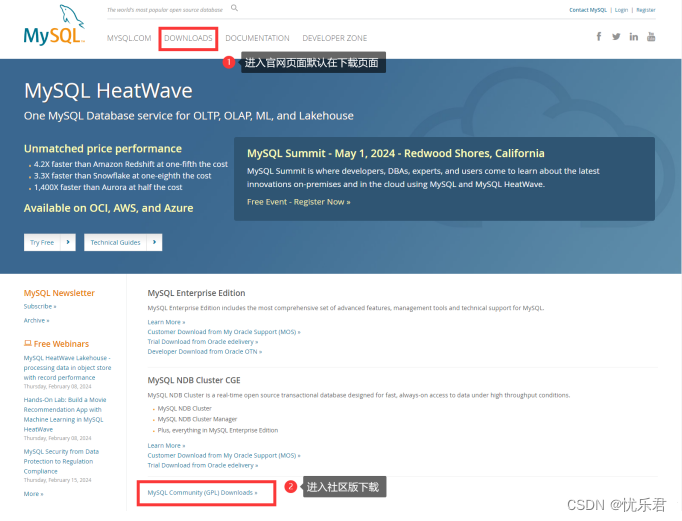

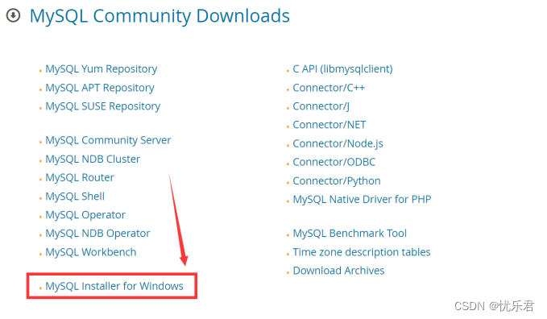

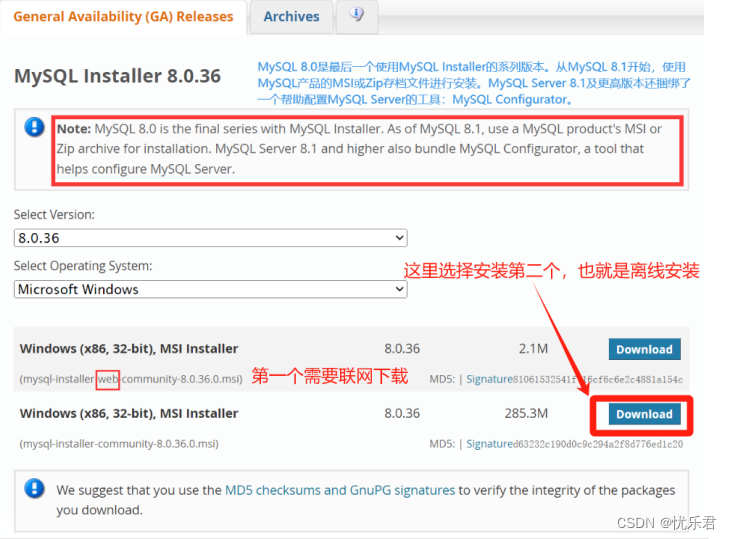

把页面翻译成中文，看着更顺。

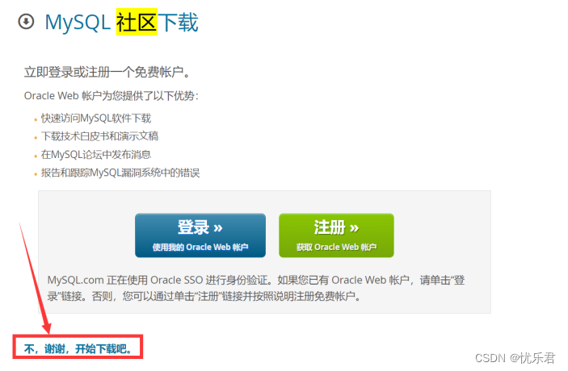

下载并打开安装包，能看到版本是 8.0.36。双击运行（或右键打开），会先安装一个 `mysql-installer` 程序，再由它来安装 MySQL。

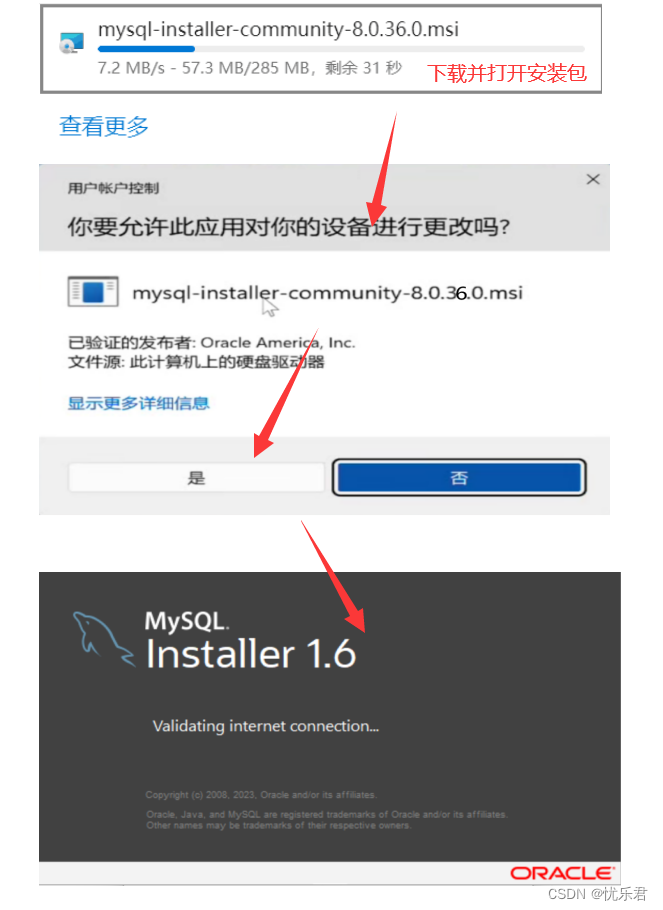

> 如果之前在同一台机器装过 MySQL，安装程序可能检测到现有配置并自动跳过某些步骤，也可能根据环境检测结果自动配置。本例以 8.0.31 的截图演示，与 8.0.36 的安装步骤有少量迭代差异，按自己屏幕上显示的内容对应即可。（第一次装 8.0.36 版本时，很多步骤会因版本迭代被跳过，忽略即可。）

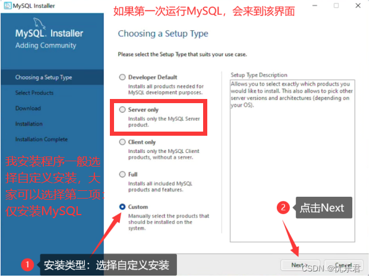

8.0.36 没有以下步骤，说明新版本已经合并掉了，不用理会，后面同理。

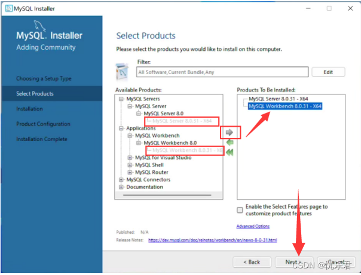

下一步后可能出现以下情况：

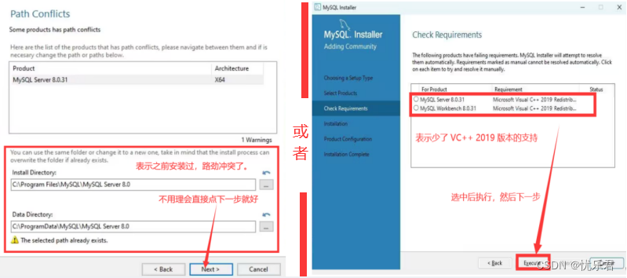

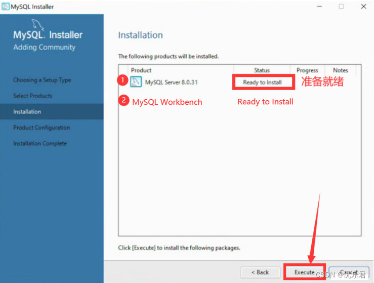

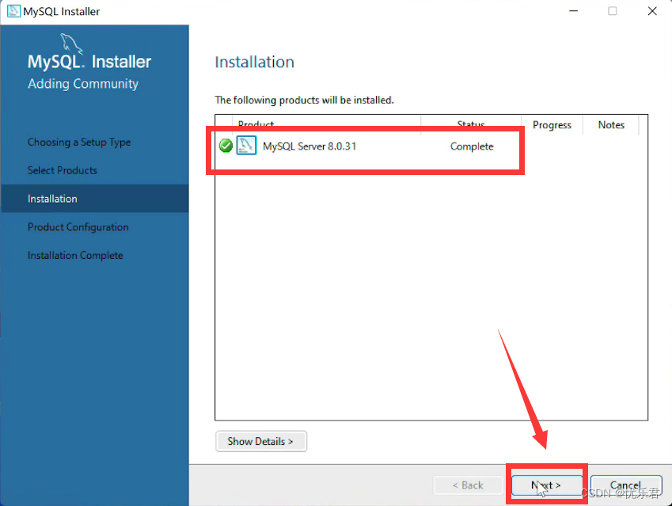

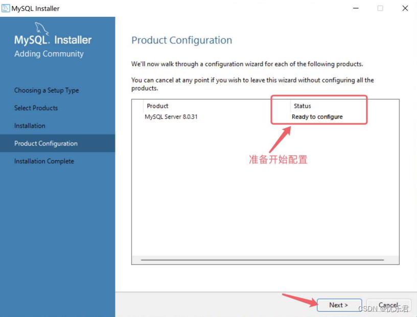

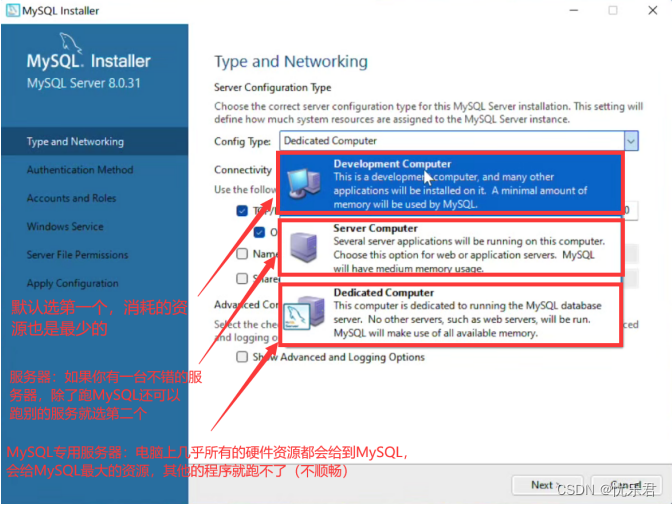

序号 2 可勾可不勾（Windows 防火墙本身不太靠谱），序号 3、4 按自身情况选择。

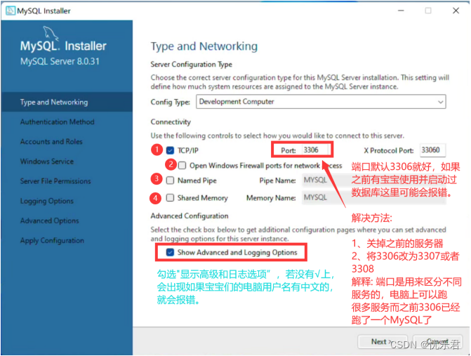

序号 1、2、3、4 解释：

1. 选 **TCP/IP**，即通过网络连接 MySQL，MySQL 启动后是一个网络服务。TCP/IP 协议栈是互联网通信的基础，定义了数据如何在网络中传输与交换，支撑 HTTP、FTP、SMTP 等应用层协议。
2. Windows 防火墙就那样，勾不勾看你喜好。
3 / 4. 本机连 MySQL，用命名管道（Named Pipe）或共享内存（Shared Memory）都可以。Named Pipe 常用于大量数据通信，Shared Memory 用于需要高速传输的进程间通信。前者通过读写文件通信，后者直接共享内存，使用时要分别考虑文件 I/O 开销和数据同步问题。


### 关闭 / 启动 MySQL 服务

**Win + R** 打开「运行」，输入 `services.msc` 回车，进入「服务」管理器，找到 MySQL（显示「正在运行」），右键「停止」即可。安装成功后需要手动启动时也用这个方法。

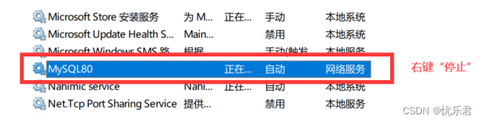

MySQL 推荐使用最新数据库和客户端。MySQL 8 换了加密插件，所以如果选第一种加密方式，很可能导致 Navicat 等旧客户端连不上 MySQL 8。

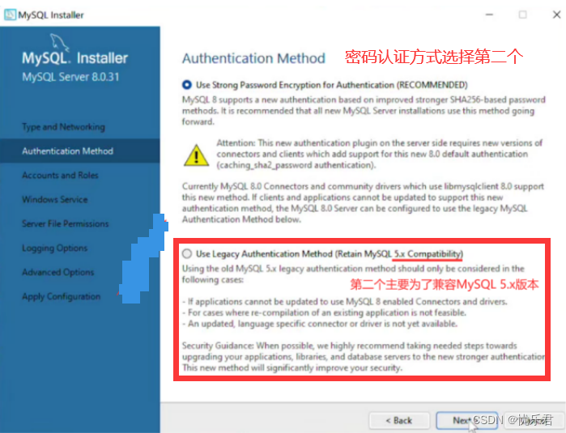

**MySQL 的超级管理员叫 `root`**。初次设置密码建议先用弱口令，记性好的也可以直接设强口令（macOS 要求强口令：大小写 + 数字 + 特殊字符，长度大于 8 位）。

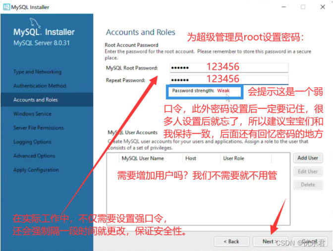

是否开机自启：建议手动启动。需要时 **Win + R** → 输入 `services.msc` → 找到 MySQL → 右键「启动」。

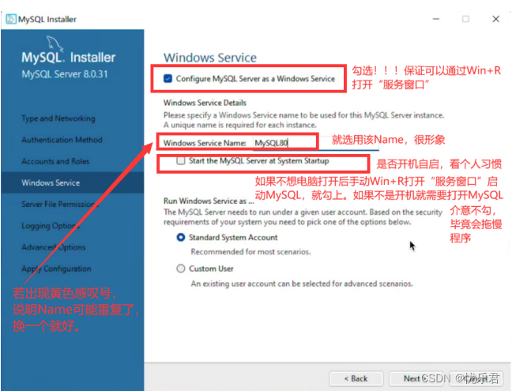

授权对路径的访问权限：

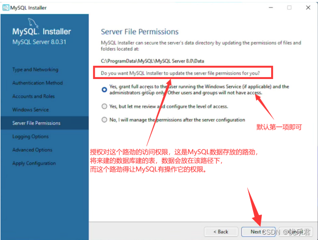

MySQL 服务器的日志配置（运行时会产生各类日志）：

1. **错误日志（Error Log）**：默认用 `<用户名>.err`，名称不要出现中文或特殊字符（下划线、数字、空格等），用纯英文。
2. **通用日志（General Log）**：开启后，MySQL 会记录每个客户端连接的建立、执行的 SQL 语句以及断开连接等事件。
3. **慢查询日志（Slow Query Log）**：记录执行时间超过阈值的查询。在涉及隐私或敏感信息的场景下，开启它可能有信息泄露风险。
4. **二进制日志（Binary Log）**：对数据的增删改都会记录。误删、误改数据时，可通过它恢复。

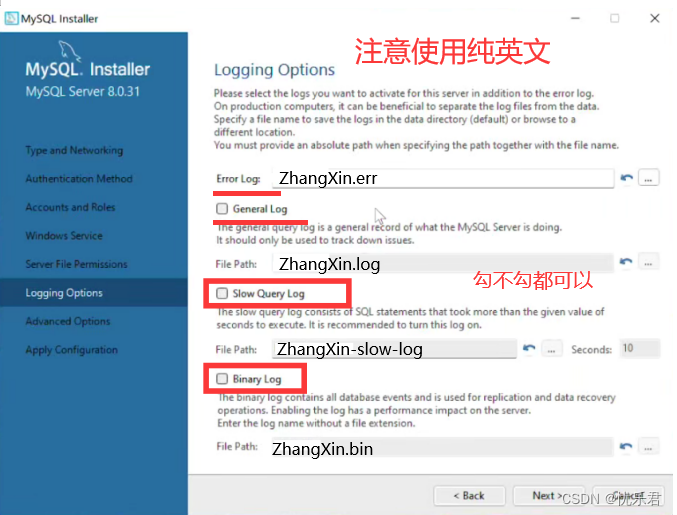

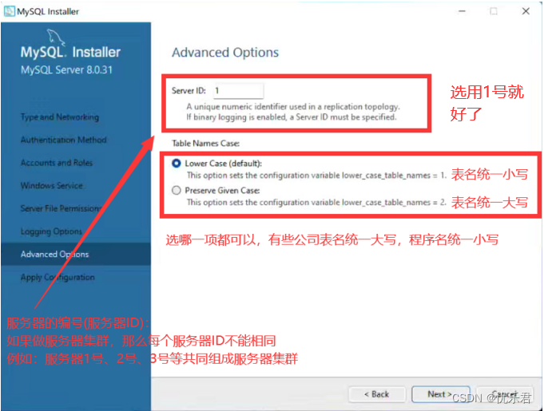

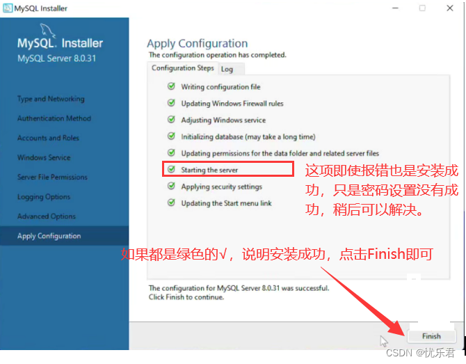

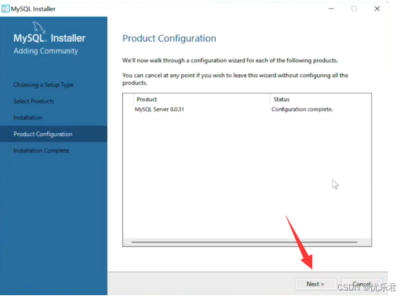

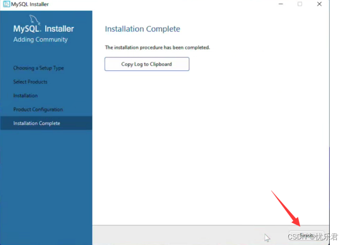

### Starting the server 安装失败的处理

如果卡在 **Starting the server** 失败，多半是之前装过 MySQL 没卸载干净。可以照下面处理：

1. 停在这个页面，不用叉掉重装（叉掉也无妨，处理方式一样）。
2. 「此电脑」右键 → 显示更多选项 → 管理，进入如下页面：

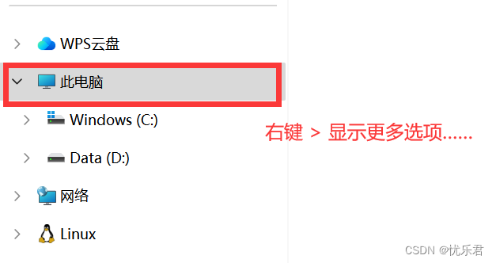

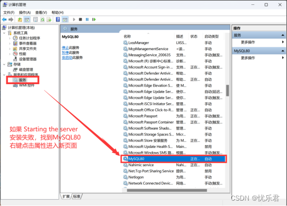

3. 找到 MySQL，右键 → 属性 → 登录，勾选「允许服务与桌面交互」，先「应用」再「确定」。

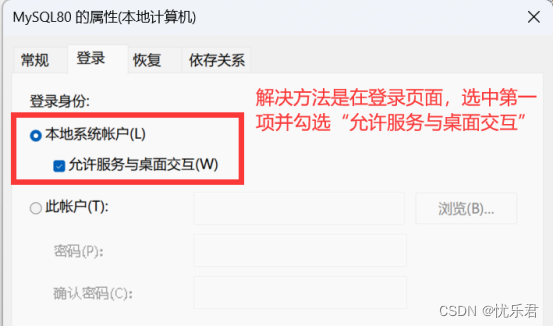

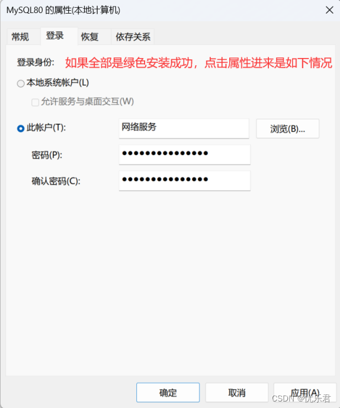

回到这一界面再点一次安装即可。

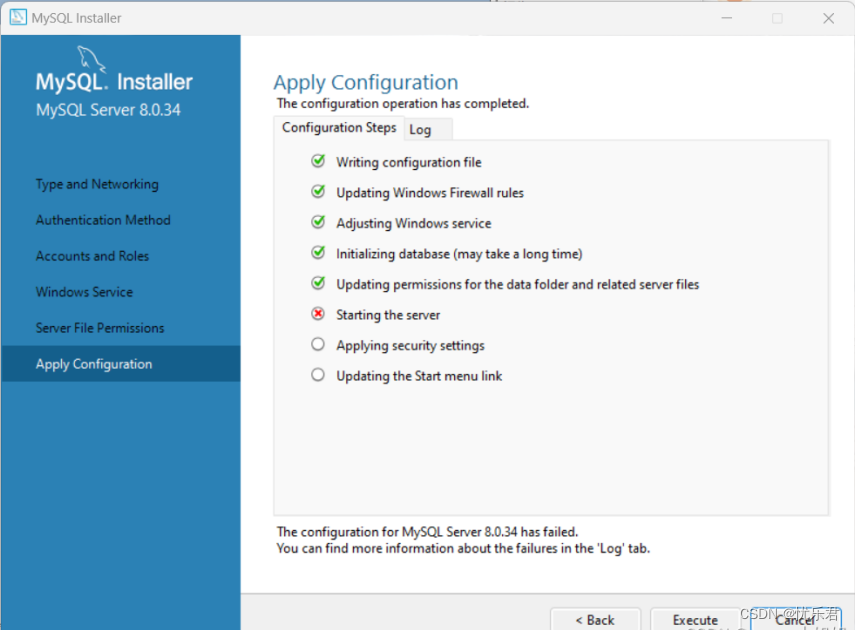

> 也可直接打开「开始菜单」（Win 徽标，通常在屏幕左下角；找不到就按键盘上的 Windows 键，位于 Ctrl 和 Alt 之间），搜索「计算机管理」，展开「服务与应用程序」→「服务」，步骤一样。这个手动启动 MySQL 的方法要记牢。

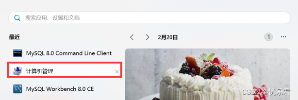

上述过程也用下面这种方法：找到 MySQL 后右键「属性」，后续操作一致。


## 二、两种验证方式查看是否安装成功

### 1. MySQL 控制台验证

开始菜单打开 **MySQL 8.0 Command Line Client**，输入设置的密码，弹出当前 MySQL 服务器状态即成功。

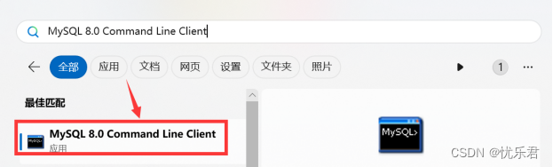

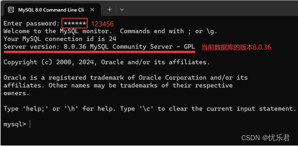

### 2. 命令提示符（cmd）验证

1. 找到安装好的 MySQL 的 `bin` 文件夹路径，默认一般是 `C:\Program Files\MySQL\MySQL Server 8.0\bin`。
2. **Win + R** 输入 `cmd`，在窗口中执行：

   ```text
   cd C:\Program Files\MySQL\MySQL Server 8.0\bin
   mysql -h localhost -u root -p
   ```

   再输入数据库密码，登录成功即可看到信息。

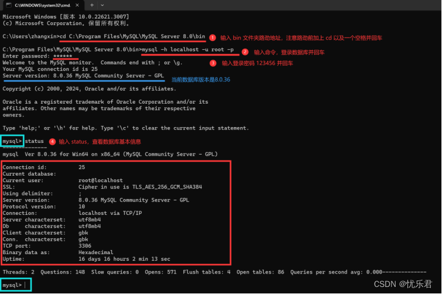

到这里 MySQL 就装好了。安装过程中你常会看到名为 `bin` 的文件夹——它存放可执行程序。本教程用 cmd 验证 MySQL，在 [Python 免费安装教程](https://blog.csdn.net/m0_71422677/article/details/128777778?spm=1001.2014.3001.5502) 里也用 cmd 验证 Python。下一篇会在 [边边角角小知识专栏](https://blog.csdn.net/m0_71422677/article/details/128777778?spm=1001.2014.3001.5502) 分享 `bin` 文件夹的作用和 cmd 的一些小知识。
