## 一、背景

Nginx 是高性能的 Web 与反向代理服务，也是一种轻量级 Web 服务器，可作为独立服务器部署网站，应用广泛，在前后端分离场景下尤其常见。开发时我们常在 Windows 下用 Nginx 作为 Web 服务器。

## 二、安装

### 1、下载 Nginx

推荐两个网站：

- Nginx 官网：[http://nginx.org/](http://nginx.org/)
- Nginx 中文网：[https://nginx.p2hp.com/](https://nginx.p2hp.com/)

### 1.1、Nginx 官网

**去 Nginx 官网下载：** 访问官网，找到 download。

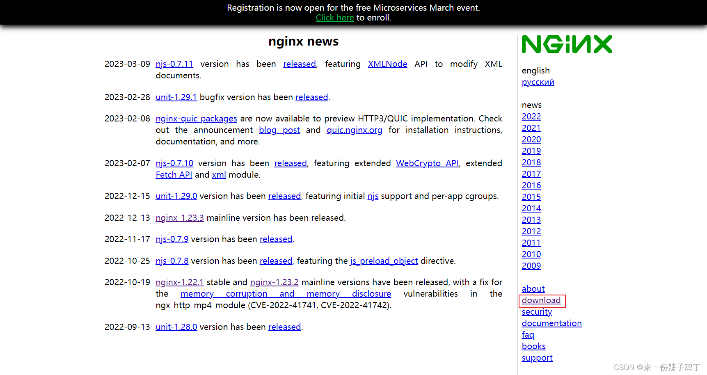

**选择 Nginx 版本：** 在下载界面选择所需版本，找到对应版本下载即可。

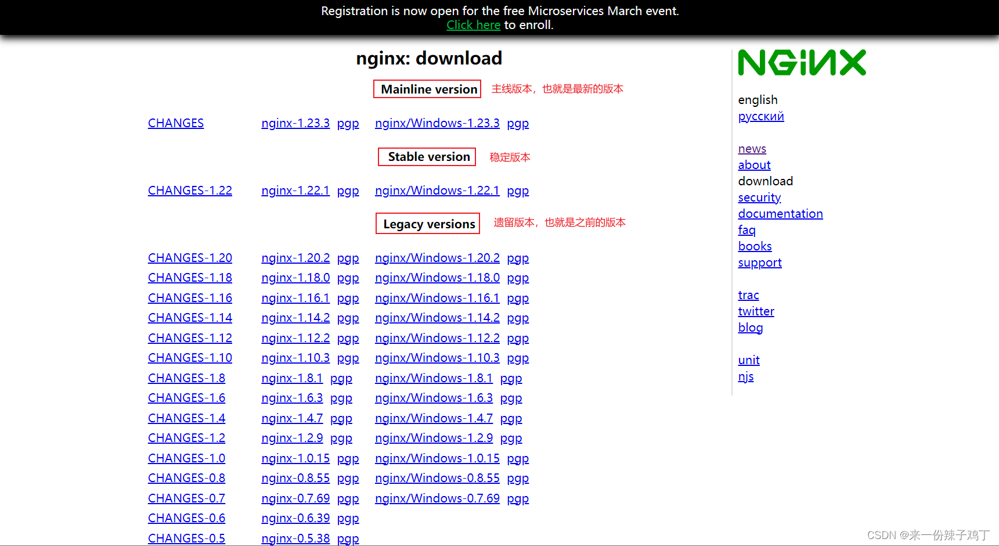

**解压 Nginx：** 下载到本地后直接解压即可。

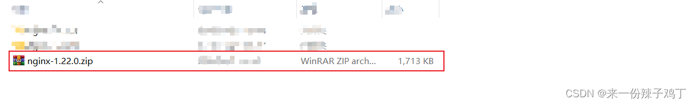

### 1.2、Nginx 中文网

**去 Nginx 中文网下载：** 访问中文网，找到下载 Nginx。

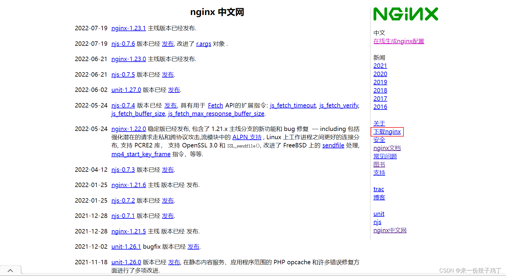

**选择 Nginx 版本：** 在下载界面选择所需版本，找到对应版本下载即可。

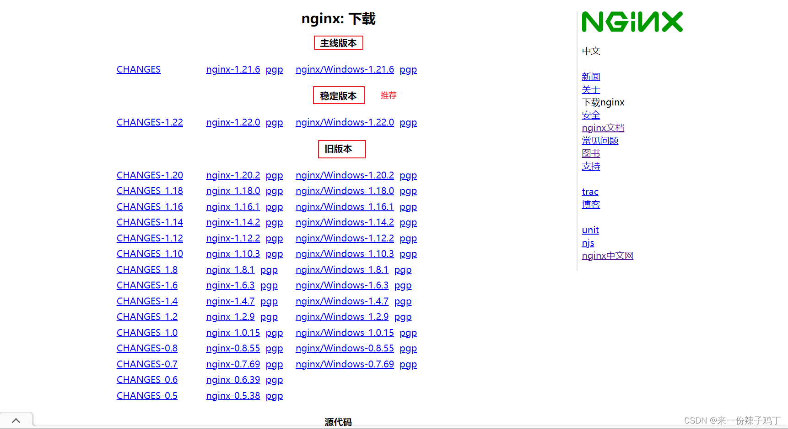

**解压 Nginx：** 下载到本地后直接解压即可。

## 三、Nginx 的使用

### 1、Nginx 基本目录

- **conf**：Nginx 配置文件目录
- **docs**：文档目录
- **html**：静态 html 文件目录
- **logs**：日志目录
- **temp**：临时文件目录

### 2、查看 80 端口是否被占用

Nginx 的配置文件是 **conf** 目录下的 **nginx.conf**。

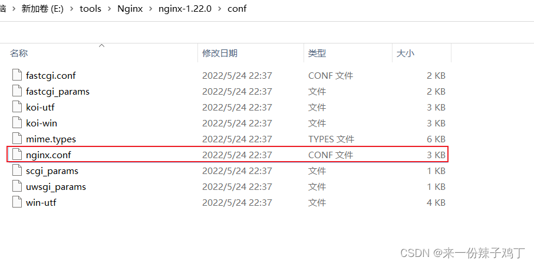

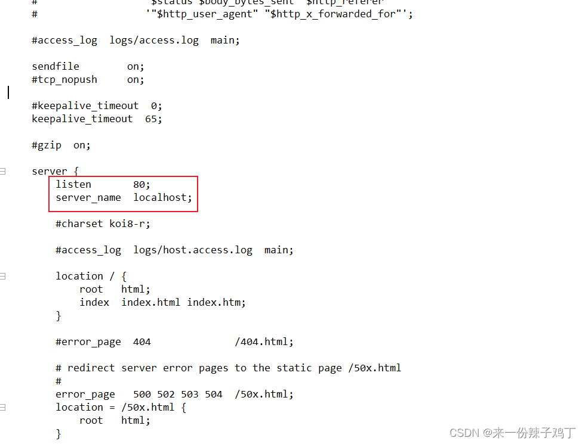

Nginx 默认端口号为 **80**。若 80 端口被占用，需要修改。

#### 2.1、解决方式一：修改 Nginx 端口号

直接修改 **nginx.conf** 配置文件中的端口号：

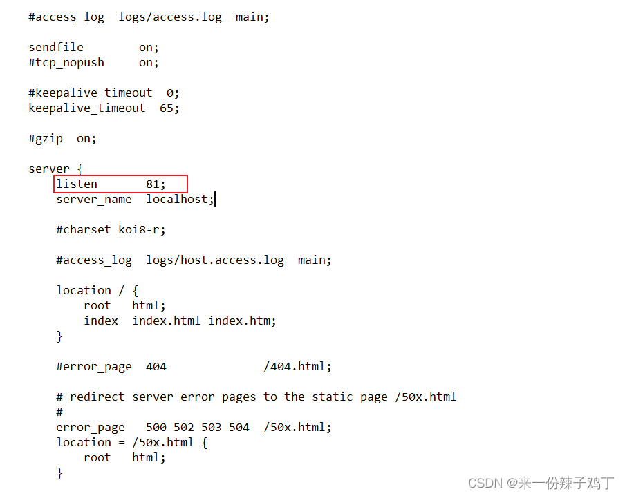

#### 2.2、解决方式二：杀死被占用的端口

按 **Windows 键 + R** 打开运行窗口，输入 **cmd** 打开命令行窗口（小黑窗）：

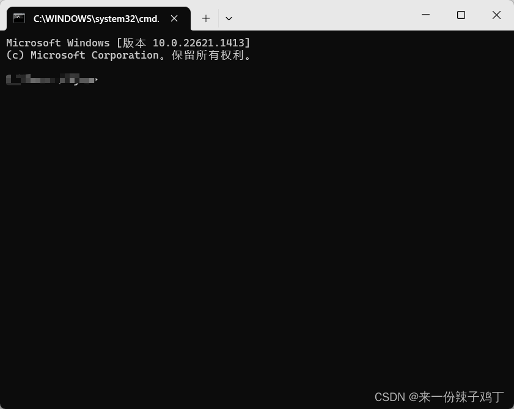

~~netstat -ano~~ （不好使）

~~然后输入 `netstat -ano | findstr "端口号"` 命令，查看此端口号的进程，找到对应 PID~~ （不好使）

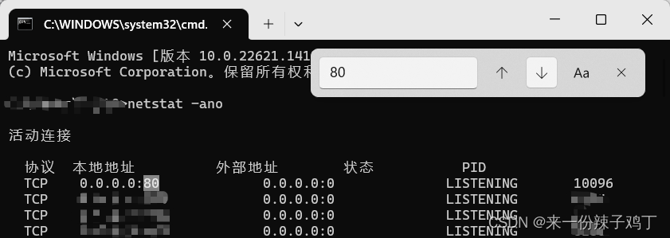

或使用 `tasklist | findstr "进程名称"` 命令查找 PID。我们要找的是 nginx.exe 的 PID，直接输入 `tasklist | findstr "nginx.exe"`：

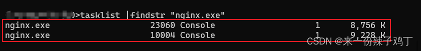

然后输入 `taskkill /f /t /pid pid号` 根据 PID 杀死进程：

或输入 `taskkill /f /t /im "nginx.exe"` 按进程名杀死所有进程。`/f` 表示强制杀死，`/t` 表示进程树：

> 进程名称要输入全称，例如有的需要加 `.exe`！可右键 `.exe` 应用程序，查看属性：

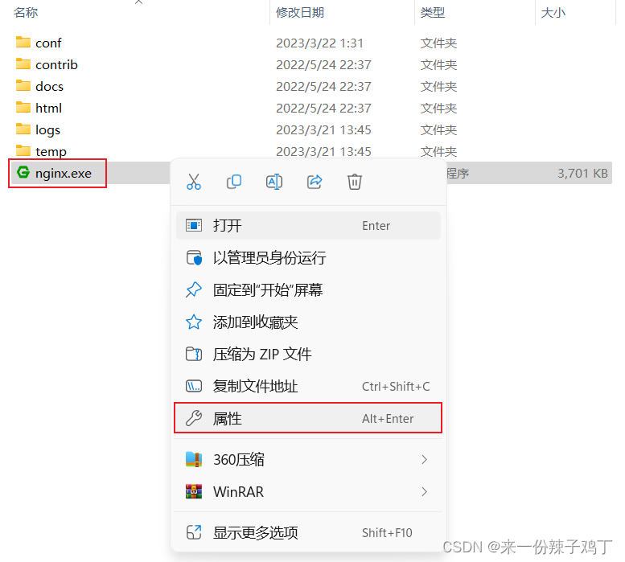

即可看到应用程序的进程名称：

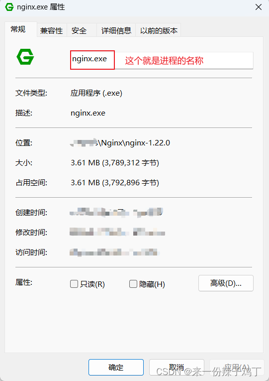

再次输入 `tasklist | findstr "nginx.exe"` 查看进程信息，已无 nginx.exe 进程，说明已成功杀死：

### 3、Nginx 启动方式

#### 3.1、双击 nginx.exe 启动（不推荐）

双击 nginx 目录下的 nginx.exe，一般会有黑色弹窗一闪而过，代表启动成功。

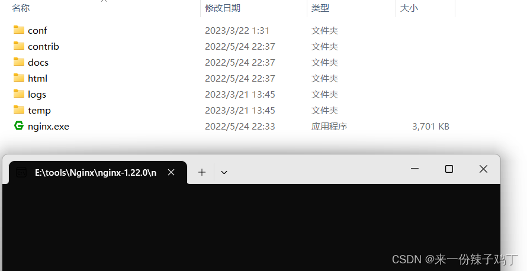

浏览器地址栏输入 **localhost:80** 并回车（80 端口可省略，输入了也不显示）：

能看到该页面即启动成功。

#### 3.2、通过命令启动

在 nginx 安装目录的路径栏中输入 **cmd**：

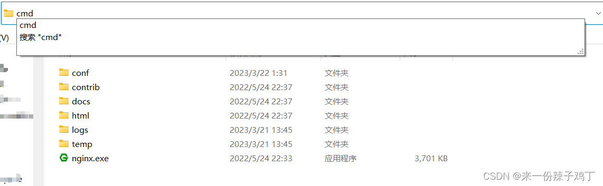

直接输入 **nginx** 或 **start nginx** 并回车即可启动：

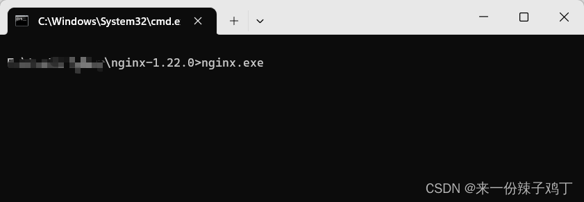

浏览器地址栏输入 **localhost:80** 并回车：

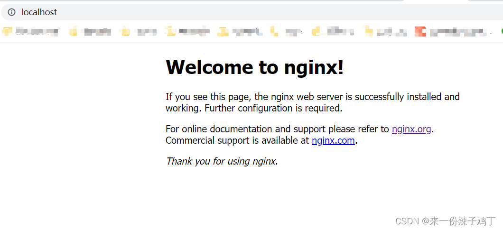

能看到该页面即启动成功。

关闭 Nginx 的命令：`nginx -s stop`
