# Windows 安装 PostgreSQL 18 超详细保姆级教程

> 适用于：Windows 10 / 11
> PostgreSQL 版本：18（同样适用于 15、16、17 等版本）
> 包含内容：PostgreSQL Server、pgAdmin 4、Stack Builder、pgAgent（可选）、pgBouncer（可选），以及初次连接、切换中文、创建 DB / Schema / User 全流程。

PostgreSQL 是一款免费、开源、稳定且支持事务的数据库，在工业自动化、MES、SCADA、设备数据采集、工控软件和企业应用中都很常见。

但在 Windows 上安装步骤较多，新手经常会遇到这些问题：

- 不知道怎么选安装组件
- 不确定哪个密码是数据库密码
- pgAdmin 启动后看不到服务器
- psql 命令不能用
- Stack Builder 里一堆扩展不会选
- Schema 和 Database 分不清
- 权限设置不对导致程序连不上数据库

跟着下面的步骤一步步操作，就能在 Windows 上装好并跑起来 PostgreSQL。无论你是后端开发、桌面软件工程师、工业软件工程师，还是刚开始学 PostgreSQL，都可以把它当一份安装指南。

## 1. 下载 PostgreSQL 安装包

打开官方下载页面：<https://www.postgresql.org/download/>

进入后选择 **Windows → Download the installer**，会跳转到 EDB 下载站点。选择最新版本（如 PostgreSQL 18），再选 **Windows x86-64** 下载。

下载得到的安装程序类似：

```
postgresql-18.x-windows-x64.exe
```

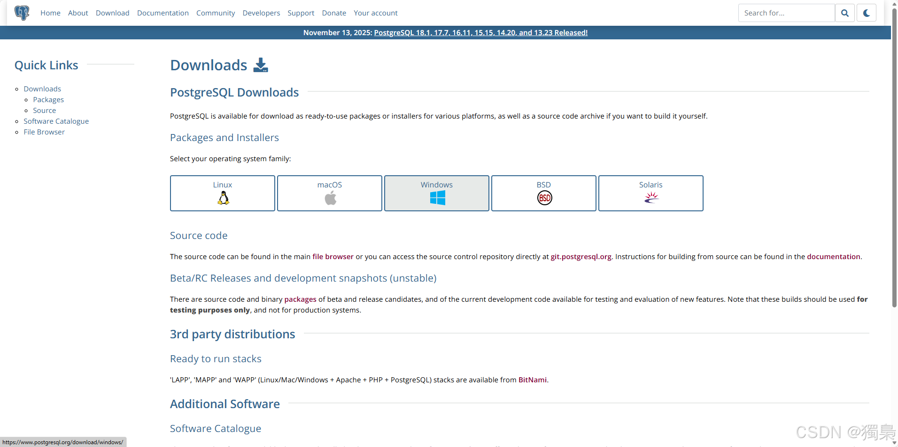

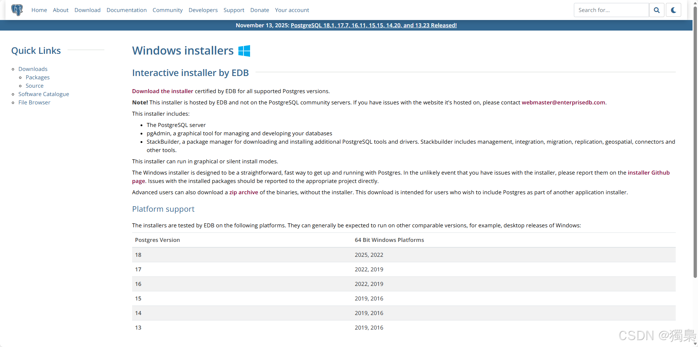

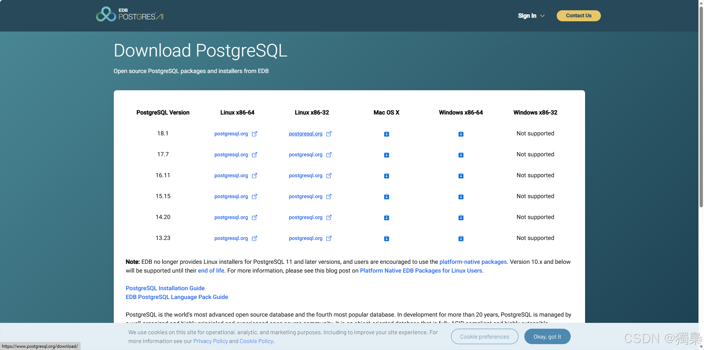

## 2. 运行安装程序

双击安装程序，进入 PostgreSQL 安装向导。

### 第 1 步：欢迎界面

直接点 **Next**。

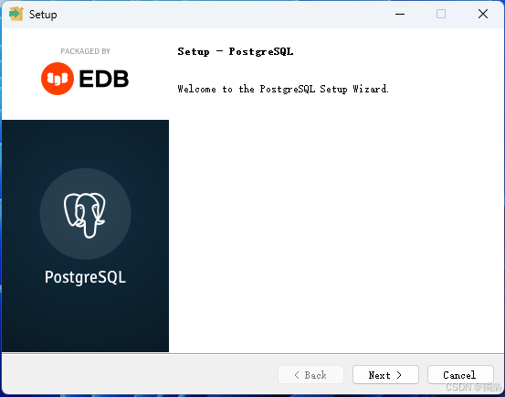

### 第 2 步：选择安装目录

一般保持默认：

```
C:\Program Files\PostgreSQL\18\
```

也可自定义到 D 盘等。

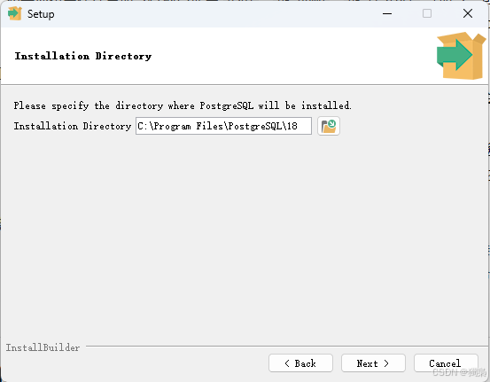

### 第 3 步：选择组件（建议全选）

- **PostgreSQL Server**（必须）
- **pgAdmin 4**（图形管理工具，若已有 Navicat 等可选择不装）
- **Stack Builder**（可选，建议保留，用来装 pgAgent / pgBouncer）
- **Command Line Tools**（命令行工具，建议勾选）

点 **Next**。

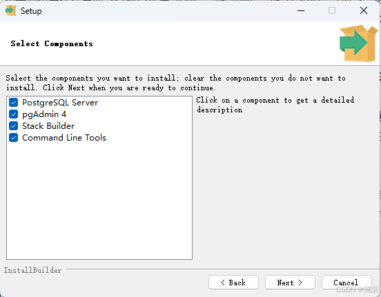

### 第 4 步：选择数据目录

默认即可：

```
C:\Program Files\PostgreSQL\18\data\
```

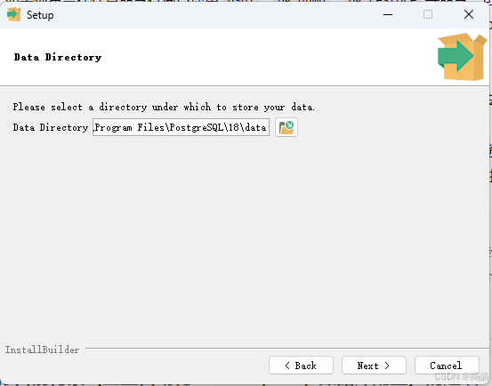

### 第 5 步：设置超级用户密码（非常重要）

这个密码就是 `postgres` 用户的密码，一定要记住（示例里设为 `root`）。

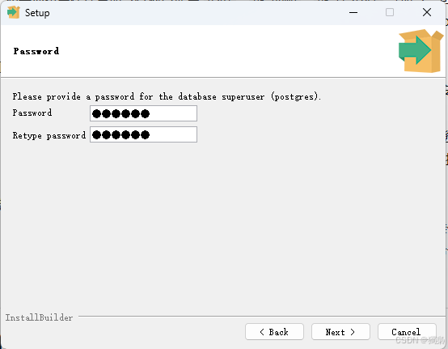

### 第 6 步：设置端口号

PostgreSQL 默认使用：

```
5432
```

建议保持不变。

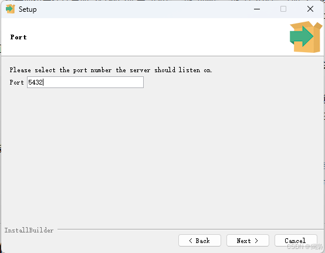

### 第 7 步：选择 Locale

选 **DEFAULT** 即可。

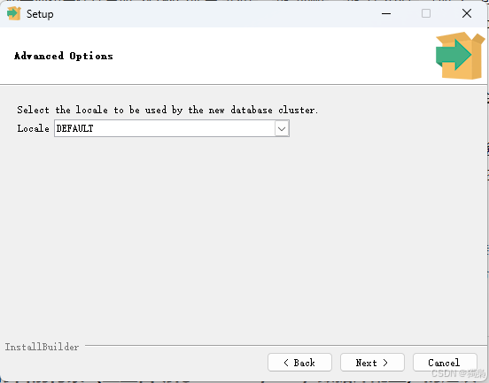

### 第 8 步：安装概要确认

点 **Next**。

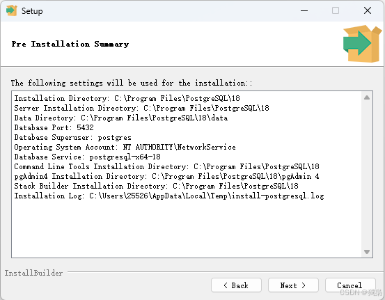

### 第 9 步：开始安装

安装需要几分钟。完成后会询问是否启动 Stack Builder，可保留勾选再点 **Finish**。

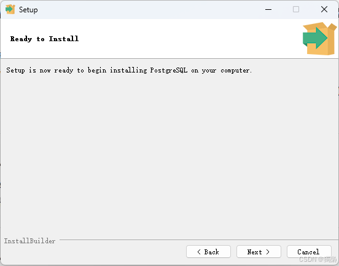

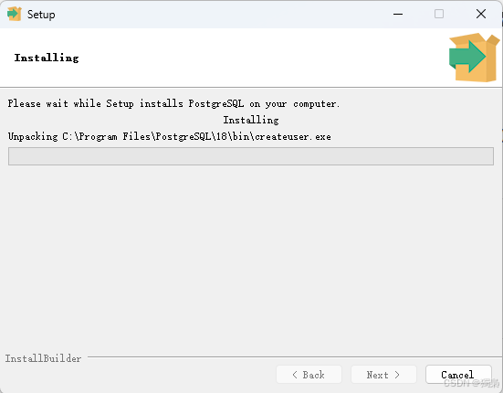

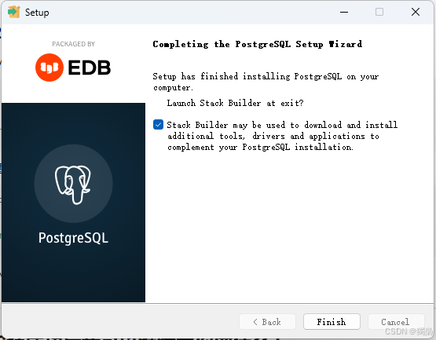

### 测试 PostgreSQL 是否正常工作

打开 CMD 或 PowerShell，输入：

```bash
& "C:\Program Files\PostgreSQL\18\bin\psql.exe" --version
& "C:\Program Files\PostgreSQL\18\bin\psql.exe" -U postgres
```

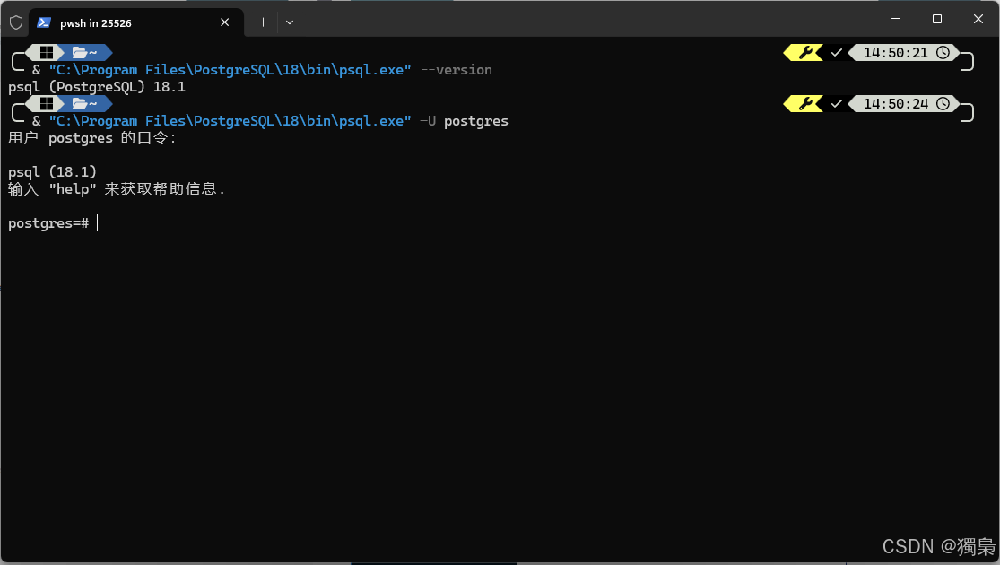

## 3. 使用 Stack Builder（可选）

安装完成后如果勾选了 **Stack Builder**，会自动启动一个附加组件安装器，可用来安装扩展工具（如 pgAgent）、数据库驱动（ODBC / JDBC / Npgsql）、额外数据库 / 扩展（如 PostGIS）等。

> **重点：Stack Builder 里的东西都不是必须装的。** 下面以工业自动化场景（本机开发 + 工控 / 设备数据采集 + C# 连接 PostgreSQL）为例，演示了 pgAgent 的安装，其余组件按需了解即可。

### 3.1 快速选择结论（适合工业自动化）

| 分类 | 是否推荐（本教程场景） | 本教程示例选择 | 说明 |
|:---:|:---:|:---:|:---|
| Add-ons, tools and utilities | 仅 pgAgent 可考虑 | 装了 pgAgent | 只建议装 pgAgent，其它一般不用 |
| Database Drivers | 一般不需要 | 全部不选 | .NET 用 NuGet 安装 Npgsql 即可 |
| Database Server | 不要选 | 不选 | 这是再装其它版本 PostgreSQL，易混乱 |
| Registration-required and trial products | 不建议 | 不选 | 企业版 / 商业组件，需注册或授权 |
| Spatial Extensions（PostGIS） | 工控场景基本不用 | 不选 | 做 GIS / 地图 / 定位才需要 |
| Web Development | 不建议 | 不选 | 给 PHP / Apache 环境用，非 Web 开发可忽略 |

> 普通 C# 桌面 / 工控项目：最多只装一个 pgAgent，其它一律跳过。

### 3.2 Add-ons, tools and utilities

这一类里有几个常见名字：

#### pgAgent（定时任务调度器）

作用类似 SQL Server Agent，或 Windows 计划任务 + SQL 执行器，可以：

- 定时执行 SQL（清理历史数据、写入统计结果）
- 定时备份数据库
- 定时跑脚本（SQL / Bat / Python 等）

如果有「定时执行脚本 / SQL」的需求，推荐安装 pgAgent。本教程已实际安装并使用。

安装 pgAgent 时的关键界面：

1. **Welcome to pgAgent Setup Wizard**：直接 Next。

   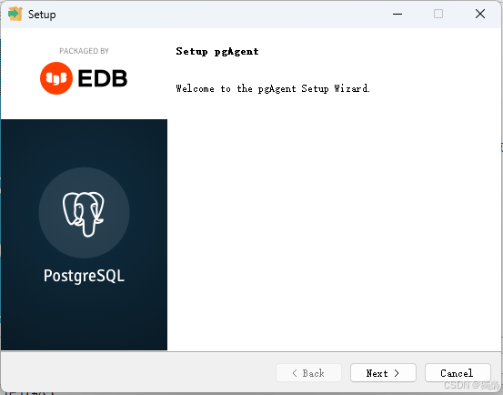

2. **Upgrade Mode（升级模式）**：首次安装保持默认（不要勾 Upgrade）；之前装过可选它来升级。

   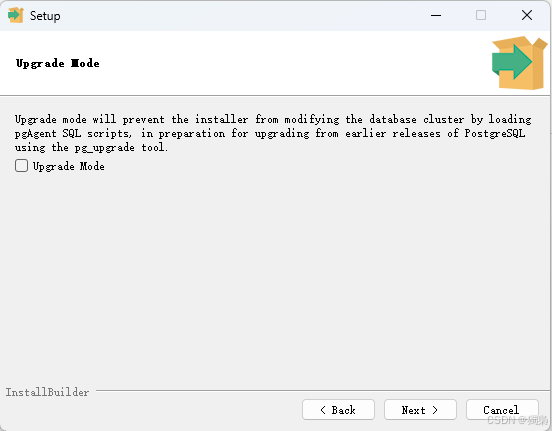

3. **PostgreSQL 连接信息**：

   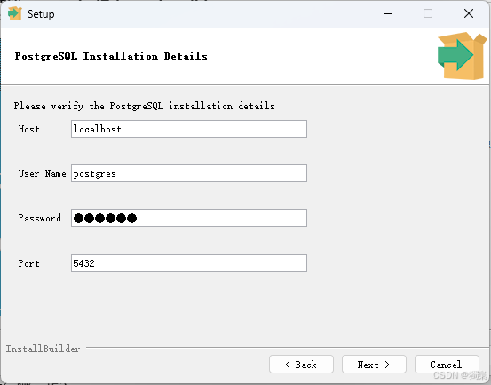

   一般这样填：

   ```text
   Host:     localhost
   User:     postgres
   Password: 你安装 PostgreSQL 时设置的密码
   Port:     5432（默认端口）
   ```

4. **pgAgent Service Account（Windows 服务账号）**：

   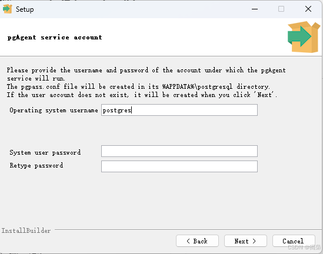

   这里创建的是用于运行 pgAgent 服务的 **Windows 本地账号**，不是 PostgreSQL 密码。密码需满足 Windows 复杂度（大小写 + 数字，最好再加符号）。可参考：

   ```text
   Operating system username: postgres
   System user password:      自己设置一个复杂密码，例如 Pga@2025!
   Retype password:           再输一遍
   ```

   - pgAgent 会在 Windows 里创建一个服务（类似 `pgAgent - PostgreSQL Job Scheduler`），需要此账号运行。
   - 该账号仅用于服务，不影响你日常登录 Windows。

5. **完成安装**：

   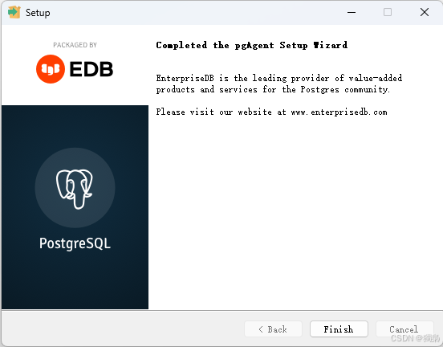

   安装完成后，pgAgent 会在数据库里创建 `pgagent` schema 存放作业配置和日志。之后在 pgAdmin 中能看到：

   ```text
   Servers
     └ PostgreSQL 18
         └ pgAgent Jobs
   ```

#### pgBouncer（连接池工具）

- 这是一个连接池中间件，用于高并发网站 / API，减少与数据库的物理连接开销。
- 本地开发、工业自动化、C# 桌面程序、采集软件通常完全不需要它，让程序直连 PostgreSQL 即可。

> 如果不是做高并发 Web 服务，不要勾选 pgBouncer，以免增加不必要的复杂度。

### 3.3 Database Drivers（数据库驱动）

这一类包括 Npgsql（.NET 驱动）、pgJDBC（Java 驱动）、psqlODBC（ODBC 驱动，32 / 64 位）。

#### Npgsql（C# / .NET 场景）

虽然这里有 Npgsql 选项，但不建议通过 Stack Builder 安装。.NET 的标准做法是在 Visual Studio / Rider 里用 NuGet 安装：

```powershell
Install-Package Npgsql
```

或在 `.csproj` 中引用 `Npgsql` 包。

#### pgJDBC

Java 用，只做 .NET / 工控软件可以忽略。

#### psqlODBC

用于 Excel / BI 工具通过 ODBC 直连 PostgreSQL。一般桌面软件更推荐用专用驱动（如 Npgsql），不必额外装 ODBC。

> 本教程场景下，Database Drivers 这一整类都可以不选。

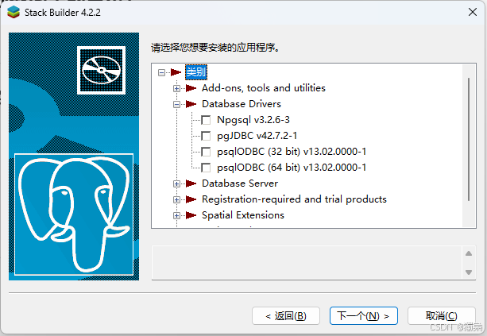

### 3.4 Database Server（数据库服务）

这一类会列出 PostgreSQL v13 ~ v18，作用是 **再次安装不同版本** 的 PostgreSQL，而不是给现有版本加插件。一台机器装多个版本需要不同端口、不同服务名，管理更复杂。

> 正常情况下不要在这里再勾选任何 Database Server。

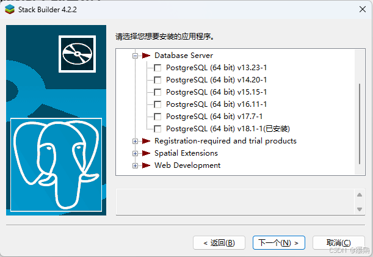

### 3.5 Registration-required and trial products（商业产品）

包括 Migration Toolkit、Enterprise Manager、Replication Server 等 EDB 商业 / 企业级组件，通常需要付费授权或注册试用。个人开发者 / 中小项目 / 工控软件完全用不到。

> 建议全部不选。

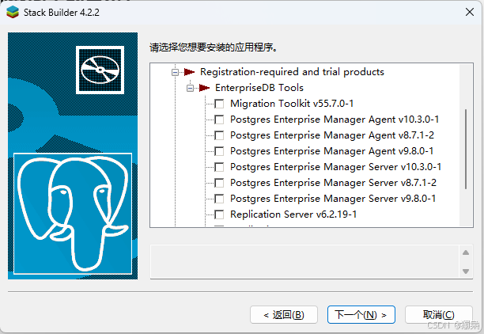

### 3.6 Spatial Extensions（空间扩展）

代表组件是 **PostGIS 3.6**，用于地图数据存储、经纬度 / 坐标计算、空间查询、GPS / 北斗定位、地理围栏等。工业自动化、视觉检测、普通业务系统可以完全不装。

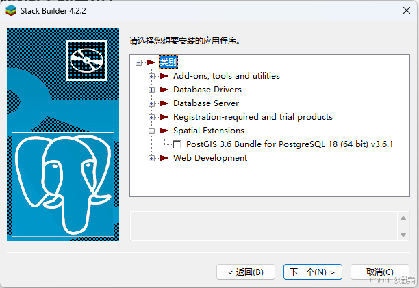

### 3.7 Web Development（Web 开发组件）

典型组件是 **PEM-HTTPD（Apache）**，用于搭建基于 Apache 的 Web 环境。不是做 PHP / Apache 网站、主要用 C# / 桌面 / 工控软件时，这部分可全部忽略。

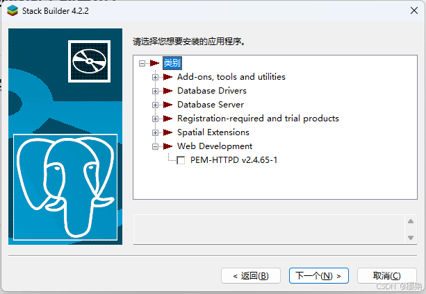

### 3.8 本节小结

- Stack Builder 是「附加组件商店」，不是 PostgreSQL 必需步骤。
- 工业自动化 + C# 场景下：推荐 pgAgent（定时任务）；pgBouncer 高并发时才考虑，通常不必；Database Drivers / Database Server / Registration / Spatial / Web 全部可以不装。
- 安装 pgAgent 时注意：Windows 服务账号密码 ≠ PostgreSQL 数据库密码；密码要符合 Windows 策略（大小写 + 数字）。

## 4. 首次启动 pgAdmin 4

安装完成后，Windows 菜单里能看到：

```text
PostgreSQL 18
  ├ Application Stack Builder
  ├ pgAdmin 4
  ├ SQL Shell (psql)
  ├ Release notes
  ├ Documentation
```

点击 **pgAdmin 4** 启动。

## 5. 连接 PostgreSQL 数据库

pgAdmin 左侧会看到：

```text
Servers
  └ PostgreSQL 18
```

第一次连接会弹出密码输入框，输入安装时设置的 postgres 密码，可勾选 **Save Password**。连接成功后即进入数据库。

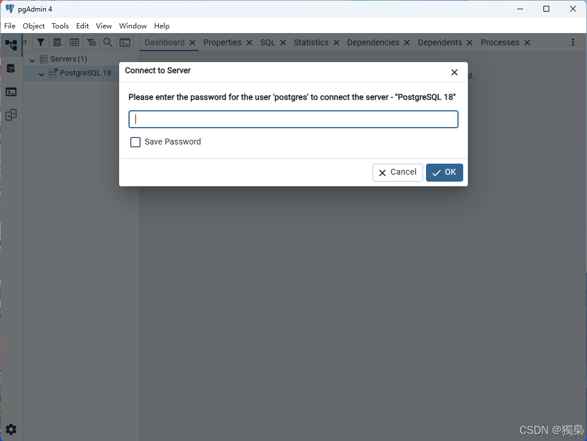

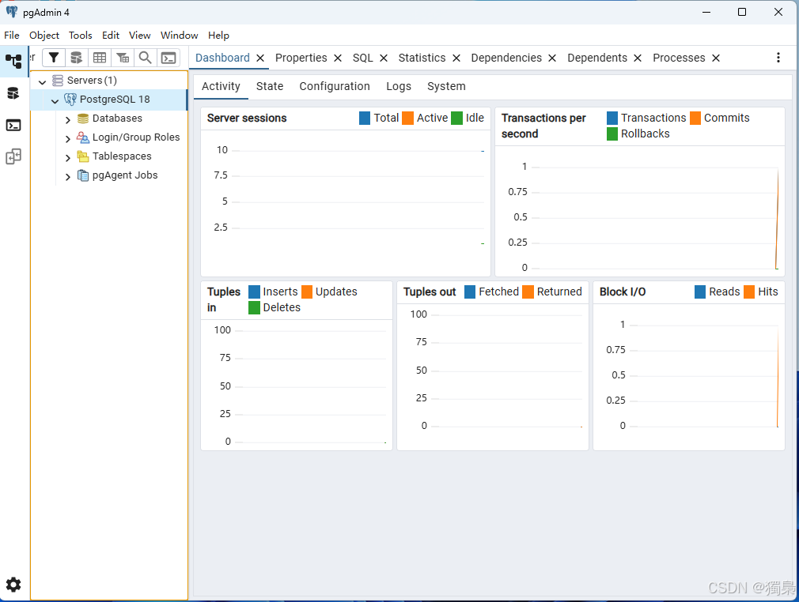

## 6. 把 pgAdmin 4 切换成中文界面

pgAdmin 启动后：

1. 顶部菜单 **File → Preferences**
2. 左侧找到 **Miscellaneous → User Interface**
3. 右侧 Language 选 **Chinese (Simplified)**
4. 保存并重启 pgAdmin，界面即变为中文。

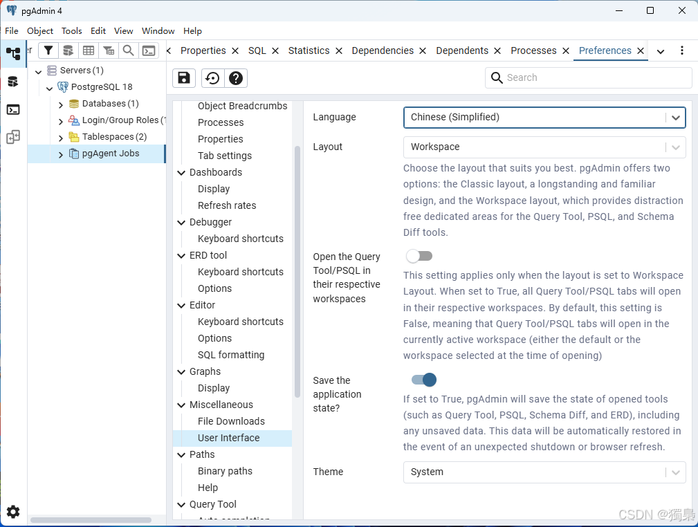

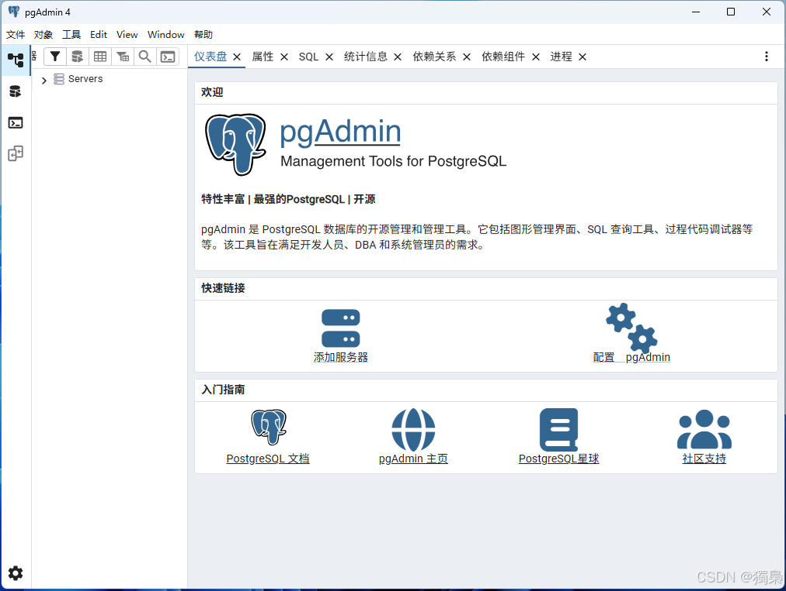

## 7. 创建第一个例子

进入 pgAdmin 后，我们来创建数据库、用户和 Schema，并完成权限分配。很多人刚开始会把 Database、Schema、Table 混在一起，下面按「创建数据库 → 创建用户 → 创建 Schema → 分配权限」的顺序走一遍。

### ① 创建数据库

数据库名：`dh_pecvd_db`

```sql
CREATE DATABASE dh_pecvd_db;
```

### ② 创建用户 Program

```sql
CREATE USER Program WITH PASSWORD '123456';
```

可改为更安全的密码。

### ③ 给用户 Program 权限（很重要）

让 Program 能连接该数据库：

```sql
GRANT CONNECT ON DATABASE dh_pecvd_db TO Program;
```

### ④ 切换到这个数据库

在 pgAdmin 左侧选中数据库，打开查询工具；或用：

```sql
\c dh_pecvd_db
```

### ⑤ 创建 Schema：iorecord

```sql
CREATE SCHEMA iorecord AUTHORIZATION Program;
```

含义：创建 Schema `iorecord`，并把所有者设为 Program（更安全）。

### ⑥ 授权 Program 使用 Schema

如果上一步已经 `AUTHORIZATION Program`，这步可省。若 Schema 不是 Program 创建的，则需：

```sql
GRANT USAGE ON SCHEMA iorecord TO Program;
GRANT CREATE ON SCHEMA iorecord TO Program;
```

### ⑦ 给 Program 权限管理 Schema 中的对象

让 Program 可以增删查改（普通权限，不是超级权限）：

```sql
GRANT ALL PRIVILEGES ON ALL TABLES IN SCHEMA iorecord TO Program;
GRANT ALL PRIVILEGES ON ALL SEQUENCES IN SCHEMA iorecord TO Program;
```

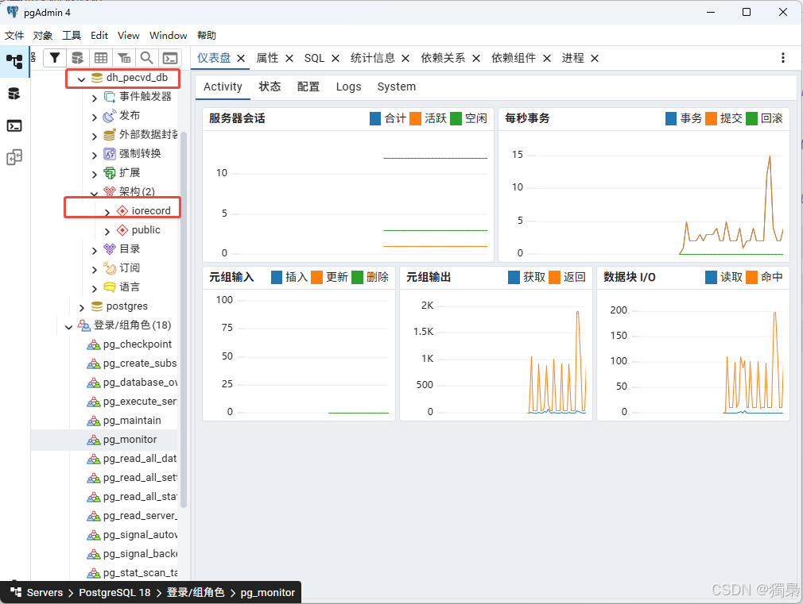

## 8. 验证数据库是否可用

右键你的数据库，打开 **查询工具（Query Tool）**，输入：

```sql
SELECT version();
```

能正常返回 PostgreSQL 版本即表示安装成功。

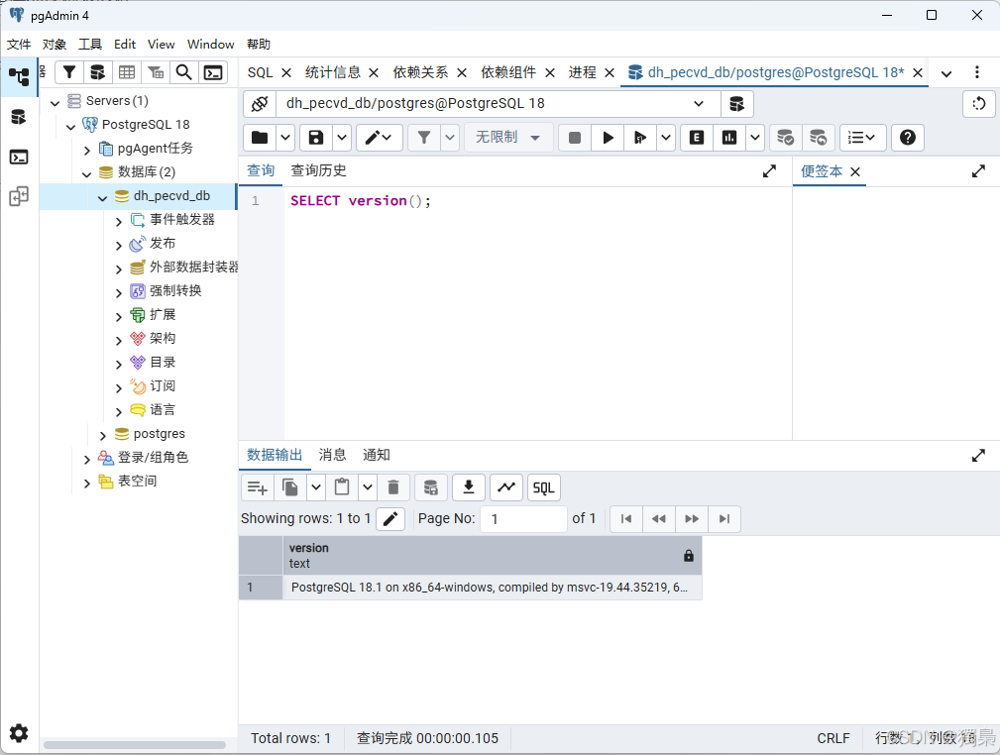

## 9. 创建完后的最终结构

```text
PostgreSQL 服务器
 └── Database：dh_pecvd_db
       └── Schema：iorecord（Program 拥有）
             ├── Tables（机器数据、记录等）
             ├── Views
             ├── Functions
             └── Sequences
用户：
 └── Program（只能访问自己数据库和自己 Schema，更安全）
```

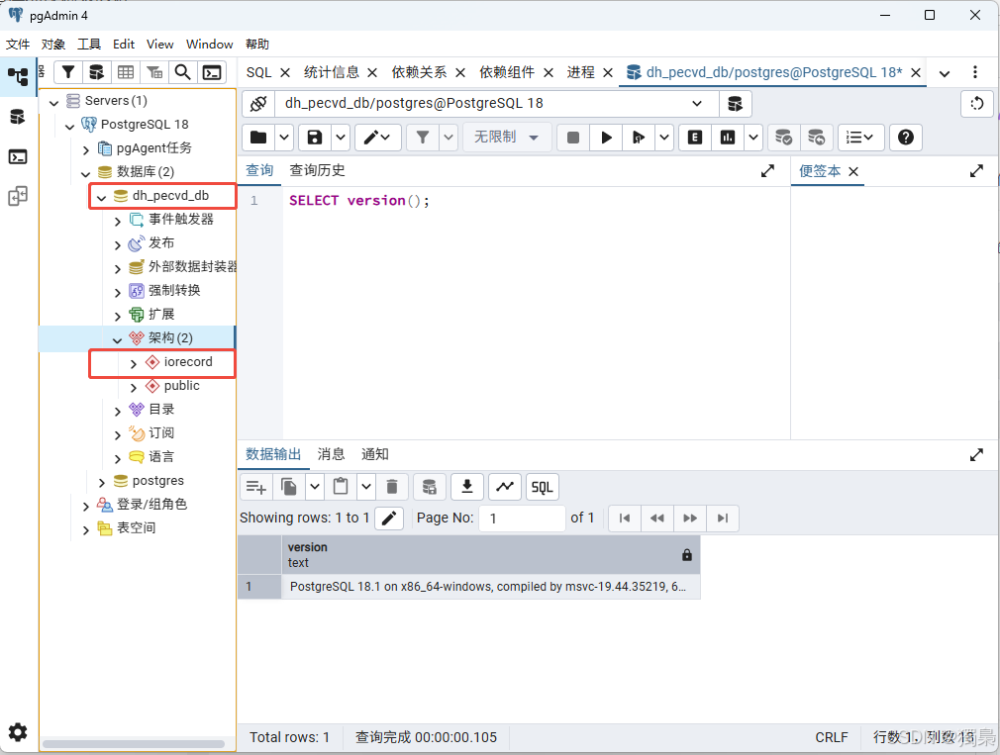

## 总结

到这里，你已经从零完成了 Windows 上 PostgreSQL 18 的安装，并掌握了创建数据库、用户、Schema 与分配权限的基础操作，得到了一个可投入使用的初始化结构：

```text
数据库：dh_pecvd_db
Schema：iorecord（Program 拥有）
用户：Program（最小权限的业务账号）
```

后续可以继续学习建表与 CRUD、备份恢复、查询优化，以及用 C#（Npgsql）连接 PostgreSQL。
