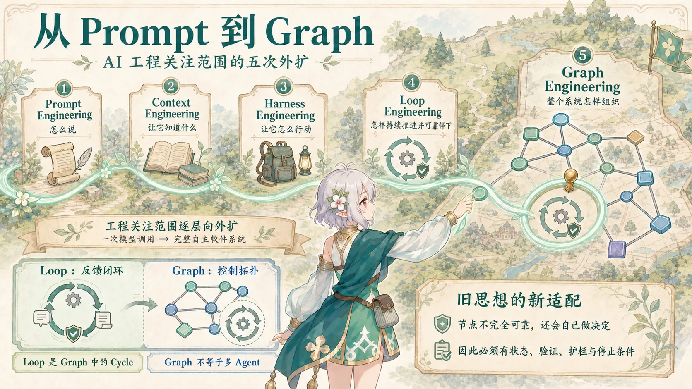
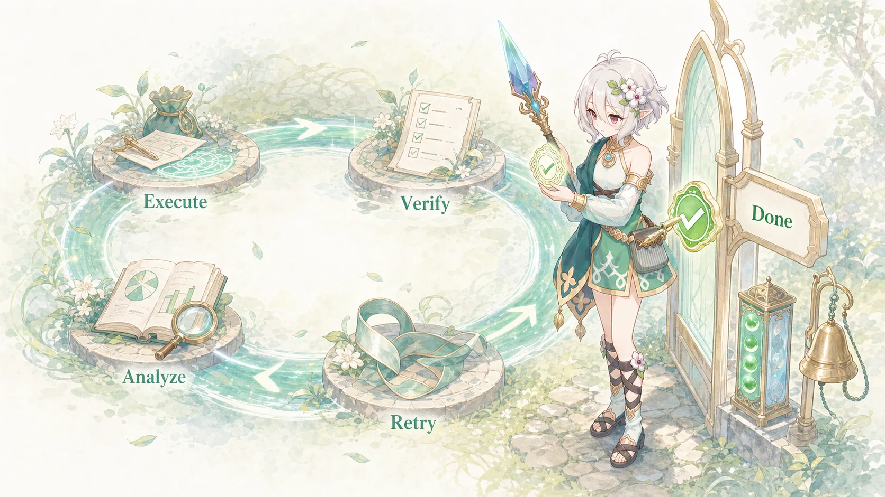

最近刷 AI 圈的时候，我发现事情开始变得有点不对劲。

前几年大家还在聊：

> Prompt Engineering。

后来变成：

> 不不不，Prompt 已经过时了，现在是 Context Engineering。

再后来：

> Context 还不够，你需要 Harness Engineering。

然后 2026 年：

> 别再手动 Prompt Agent 了，未来是 Loop Engineering。

我本来以为差不多该消停了。

结果一转头：

> ✨ Graph Engineering ✨

……

工程师沉默了三秒。

**你们 AI 圈到底还要发明多少个 Engineering？**

更有意思的是，如果把这些闪闪发光的新词一层层拆开，会发现它们并不完全是在瞎造概念。

它们其实记录了一件挺重要的事情：

> **AI 开发的关注点，正在从“怎么和模型说话”，逐渐扩展成“怎么设计一个能够自主工作的完整软件系统”。**



所以今天就来给这些新词做一次考古。

---

## 一、Prompt Engineering：首先，我们研究怎么跟 AI 说人话

这是最古老、也是大家最熟悉的一层。

Prompt Engineering 研究的问题非常直接：

> **我要怎么写指令，模型才更容易理解我的意图？**

比如：

```text
修复这个 Python 函数中的 bug。

要求：
- 不修改公开 API
- 解释问题根因
- 给出最小修改方案
- 最后补充测试
```

角色、任务、约束、示例、输出格式、成功标准……

这些都属于 Prompt Engineering。

OpenAI 至今仍然保留着完整的 Prompt Engineering 指南，其中依然强调明确任务、提供必要上下文、指定输出形式、使用示例等经典方法。换句话说，Prompt Engineering 并没有“死”。

它只是开始显得**不够用了**。

因为当 AI 从一次性的问答工具变成 Agent，一个新的问题出现了：

你可以把 Prompt 写得无比精妙，但如果 Agent 连项目现在发生了什么都不知道……

那它还是会一本正经地胡说八道。

于是大家把视野往外挪了一圈。

---

## 二、Context Engineering：问题不是怎么问，而是让它知道什么

到了 2025 年，**Context Engineering** 开始成为一个高频词。

Anthropic 在 2025 年 9 月发布的《Effective context engineering for AI agents》中，把二者区分得很清楚：

Prompt Engineering 主要关注**如何编写和组织指令**；

Context Engineering 则关注：

> **在模型推理的这一刻，到底应该让哪些信息进入它的上下文。**

这就完全不是“Prompt 写长一点”那么简单了。

一个现代 Coding Agent 面前可能同时存在：

```text
用户需求
系统指令
AGENTS.md
当前代码
Git Diff
历史对话
Memory
RAG 检索结果
错误日志
测试结果
工具返回值
……
```

真正的问题变成了：

> **这里面哪些东西，现在值得让模型看？**

于是 Context Engineering 开始研究：

```text
Retrieval
Context Selection
Memory
Compaction
Summarization
Context Isolation
Tool Result Management
```

甚至 Anthropic 现在会主动清理旧的 Tool Result、压缩历史上下文，或者让 Agent 按需读取 Memory，而不是把所有东西一次性塞进 Context Window。

这背后的逻辑其实很好理解：

**Context Window 很大，不代表垃圾桶也应该很大。**

给模型一百万 Token 的无关信息，并不会自动召唤出超级智能。

有时候只会召唤出一个：

> “我看了很多，但不知道重点在哪里。”

2025 年的一篇 Context Engineering 系统综述甚至整理了超过 1400 篇相关研究，并把这套东西归纳为 Context 的检索与生成、处理、管理，以及进一步组成的 RAG、Memory、Tool-integrated reasoning 和 Multi-Agent Systems。

所以到这里，Prompt Engineering 已经变成了更大问题中的一部分。

Prompt 关注：

> **怎么说。**

Context 关注：

> **让它知道什么。**

---

## 三、Harness Engineering：脑子有了，现在给它装上手脚

再往后，Coding Agent 又遇到了一个很现实的问题。

假设现在：

```text
Prompt：很好
Context：很好
模型：也很聪明
```

但是 Agent：

```text
不能读文件
不能执行 Shell
不能跑测试
不能看 Git Diff
不能访问浏览器
不能修改代码
```

那它依然只是一个非常聪明的聊天机器人。

这时候就轮到 **Harness** 出场了。

Harness 这个词本身有“挽具、控制装置”的意思，在 Agent 语境里，可以把它理解成：

> **围绕模型搭建的那套执行环境、工具、规则和反馈机制。**

例如：

```text
            Model
              │
     ┌────────┼────────┐
     ↓        ↓        ↓
   Shell    Files    Browser
     ↓        ↓        ↓
   Tests     Git     Network

   Sandbox
   Permissions
   Memory
   Logging
   Verification
```

Anthropic 在 2025 年已经开始公开讨论如何为长时间运行的 Agent 设计有效 Harness；OpenAI 则在 2026 年 2 月直接发表了一篇名为《Harness engineering: leveraging Codex in an agent-first world》的工程实践文章。

OpenAI 那篇文章里有一句话特别能说明这次变化：

当 Agent 承担越来越多编码工作时，人类工程师的工作开始转向：

> **设计环境、明确意图、构建反馈回路。**

也就是说，我们以前觉得：

```text
模型强 = Agent 强
```

后来发现其实更接近：

```text
Agent 能力
=
Model
× Context
× Tools
× Environment
× Feedback
× Guardrails
```

这也是为什么同一个模型塞进不同 Coding Agent，实际体验可能完全不是一回事。

模型只是发动机。

Harness 才是围绕发动机造出来的整辆车。


于是现在那些看起来零零碎碎的东西：

```text
AGENTS.md
Skills
MCP
Shell
Playwright
Git
Tests
Lint
Sandbox
权限规则
日志
状态管理
```

突然有了一个非常时髦的新名字：

**Harness Engineering。**

工程师：

> 原来我折腾半天开发环境是在做前沿 AI 研究？

AI 圈：

> 是的，而且最好改一下 LinkedIn 简介。

---

## 四、Loop Engineering：等等，为什么一直是我在催 Agent？

然后事情继续发展。

现在 Agent 已经：

- 知道自己要干什么；
    
- 有正确的 Context；
    
- 能读代码；
    
- 能修改文件；
    
- 能运行测试。
    

看起来万事俱备。

然后实际使用：

```text
我：修一下这个 Bug。

Agent：修好了。

我：测试了吗？

Agent：没有。

我：那跑测试。

Agent：有两个测试失败。

我：那继续修啊。

Agent：好的，修好了。

我：再测啊！

Agent：……
```

你突然发现一件很恐怖的事情：

**真正的 Agent Loop 好像是我自己。**

我：

```python
while not agent_really_done:
    prompt(agent)
```

QAQ

于是 2026 年 6 月，Google Cloud 的 Addy Osmani 写了一篇非常直白的文章：

《Loop Engineering》。

他的概括也非常直白：

> Loop Engineering，就是不再让你自己充当那个不断 Prompt Agent 的人，而是去设计一个能够自动 Prompt Agent 的系统。

一个最简单的 Coding Loop 可以长这样：

```text
理解任务
   ↓
执行
   ↓
验证
   ↓
完成了吗？
 ↙       ↘
否        是
↓         ↓
分析      Done
↓
重新执行
└────────↗
```

这时候需要设计的东西就变成了：

```text
Goal
Feedback
Evaluator
Retry
Memory
Stop Condition
Escalation
Budget
Human Intervention
```

其中我觉得最重要的可能不是“怎么循环”。

而是：

> **什么时候必须停。**



否则你很容易得到这样一个 Agent：

```text
Agent：
任务完成了！

Agent：
不过我顺便发现一个代码异味。

Agent：
既然都看到了，我帮你重构一下吧。

Agent：
重构以后依赖有点旧。

Agent：
不如一起升级？

Agent：
升级以后测试框架也……
```

而你的 Token：

```text
100%
 ↓
73%
 ↓
31%
 ↓
4%
 ↓
寄
```

Loop Engineering 目前仍然是一个非常新的行业术语，而不是已经形成稳定理论体系的传统学科。不过它已经开始进入研究讨论。

2026 年 6 月底的一篇预印本《Stop Hand-Holding Your Coding Agent》尝试把一个外部 Agent Loop 形式化为包含：

**Trigger、Goal、Verification、Stopping Rule 和 Memory**

的可复用 Loop Specification。

这其实已经开始从：

> “让 Agent 自己一直干”

转向一个更严肃的问题：

> **怎么构造一个能够长期运行、会验证、不会无限跑偏的自主执行闭环？**

---

## 五、Graph Engineering：一个 Loop 不够，那就开始画图

然后来到 2026 年 7 月。

就在大家刚学会 Loop Engineering 没多久的时候……

新的词出现了。

**Graph Engineering。**

LangChain 在 2026 年 7 月 22 日发布：

《3 Years of Graph Engineering with LangGraph》。

甚至文章开头自己就来了句：

> Buzzwords aside...

翻译一下大概就是：

> **“先别管我们是不是又造了个 buzzword。”**

很好。

至少他们是有自知之明的。

Graph Engineering 关心的问题是：

> **如果系统里已经不只是一次调用，也不只是一个简单循环，那么所有 Agent、工具、验证器和确定性程序之间应该怎么连接？**

比如：

```text
                  ┌→ 前端分析 ───┐
需求 → Planner ───┼→ 后端分析 ───┼→ Reviewer
                  └→ 数据库分析 ─┘
                                      ↓
                                    Tests
                                      ↓
                               ┌──────┴──────┐
                             Failed        Passed
                               ↓              ↓
                             Fixer           Done
                               │
                               └──────────────┘
```

现在我们拥有了：

```text
Node
Edge
State
Branch
Parallel
Merge
Condition
Cycle
Human Gate
```

看到这里，一个传统软件工程师大概已经坐不住了。

> 等一下。

> Node？

> Edge？

> State？

> Conditional Transition？

> **你这个是不是叫状态机？**

AI 圈：

> 不。

> ✨ Graph Engineering ✨

工程师：

> Workflow Engine？

AI 圈：

> 你怎么这么没有仪式感。

---

## 六、Graph Engineering 不等于“多 Agent”

这里有一个很容易被营销文章讲歪的地方。

很多人会把它简单理解成：

```text
Loop Engineering = 一个 Agent

Graph Engineering = 多个 Agent
```

方便理解，但并不准确。

因为一张 Graph 完全可以只有一个 LLM Agent：

```text
LLM
 ↓
生成代码
 ↓
Lint
 ↓
Unit Test
 ↓
条件判断
 ↓
LLM 修复
```

这里：

- Lint 是普通程序；
    
- Test Runner 是普通程序；
    
- Router 是确定性逻辑；
    
- 只有两个节点需要模型。
    

但它依然是一张完整的执行图。

LangGraph 本身也明确允许把 deterministic workflow 和 agentic behavior 混合起来，而不是要求“一个 Node 就必须对应一个 Agent”。

2026 年 7 月底甚至已经出现一篇专门讨论 **Prompt Graph Engineering 到底需要满足哪些条件** 的预印本。

其中一个很重要的区分就是：

> Graph 不一定是在组织“Agent”，也可以是在组织更细粒度的 Prompt / Model invocation。

所以更稳妥的理解应该是：

> **Graph Engineering 关注的是 Agentic System 的结构、状态与控制流拓扑。**

而不是简单的：

> 多 Agent Engineering。

---

## 七、所以 Loop 和 Graph 到底是什么关系？

这两个概念离得很近。

从图论角度来说：

```text
A → B → C
    ↑   ↓
    └───┘
```

这本来就是一个 Graph。

而 Loop，本质上就是 Graph 中存在一个 Cycle。

区别更多在于**工程关注点**。

Loop Engineering 问的是：

> 一个任务应该怎样不断“执行 → 验证 → 修正 → 再执行”，直到满足终止条件？

Graph Engineering 问的是：

> 整个系统里有哪些节点？谁先执行？谁后执行？什么时候分支？什么时候并行？失败以后回到哪里？状态由谁保存？

所以更准确地说：

```text
Loop Engineering
更关注反馈循环

Graph Engineering
更关注控制拓扑
```

而不是：

```text
Loop 过时了
↓
Graph 取代 Loop
```

一个复杂 Graph 里面完全可能同时存在很多个 Loop。


---

## 八、把五个词塞进同一个 Coding Agent，就不玄学了

假设现在我要 Agent：

> **修复登录按钮偶尔点击无响应的问题。**

### Prompt Engineering

告诉它：

```text
修复登录按钮无响应的问题。
不要修改现有 API。
保持 UI 行为不变。
修复后解释根因。
```

解决：

> **我该怎么说。**

---

### Context Engineering

让系统自动找到：

```text
Login.tsx
auth.ts
相关 Git Commit
错误日志
Playwright Test
AGENTS.md
```

解决：

> **它现在应该知道什么。**

---

### Harness Engineering

给它：

```text
filesystem
shell
git
pnpm
Playwright
browser
test runner
sandbox
```

解决：

> **它能够怎么行动。**

---

### Loop Engineering

规定：

```text
复现
↓
定位
↓
修改
↓
测试
↓
失败？
├─ 是 → 分析 → 再修改
└─ 否 → Regression Test → Done
```

解决：

> **它怎样持续推进直到真正完成。**

---

### Graph Engineering

再把整个流程扩展为：

```text
Bug Report
    ↓
  Triage
    ↓
 Reproduce
    ↓
Implementation
 ↙          ↘
Tests      Review
 ↘          ↙
 Aggregator
     ↓
   Pass?
  ↙    ↘
 No     Yes
 ↓       ↓
Fix     Done
```

解决：

> **整个工作系统应该怎么组织。**

这样一看，其实五个词一点都不神秘。

---

## 九、AI 圈真的只是在重新发明软件工程吗？

吐槽归吐槽。

如果强行给它们找传统软件工程里的亲戚，大概可以写成：

|AI 新词|看起来很像|
|---|---|
|Prompt Engineering|Instruction / Interface Design|
|Context Engineering|Information / State Management|
|Harness Engineering|Runtime / Tooling / Platform|
|Loop Engineering|Feedback / Control Loop|
|Graph Engineering|Workflow / State Machine / Orchestration|

然后工程师看完：

> 所以你们忙活四年，重新发明了状态机？

也不能完全这么说。

因为 LLM 确实带来了一些传统系统里没那么突出的麻烦：

```text
输出具有概率性
会幻觉
Context 有限
Token 有成本
工具调用可能失败
模型可能错误判断“任务已完成”
同样输入不保证同样结果
Agent 还能自主决定下一步做什么
```

所以过去那些 Workflow、State Machine、Feedback Loop 的思想，现在需要重新适配一个：

> **内部节点并不完全可靠，而且还会自己做决定的系统。**

这部分确实是新的工程问题。

只是……

AI 圈显然非常喜欢给它们重新取名字。

---

## 十、真正发生的事情：AI 工程的瓶颈正在不断向外移动

把这几年的变化连起来看，其实会得到一条很漂亮的路线。


最开始：

```text
模型不会按我的意思回答
```

于是：

> Prompt Engineering

后来：

```text
模型不知道足够的信息
```

于是：

> Context Engineering

再后来：

```text
模型知道，但不能真正操作环境
```

于是：

> Harness Engineering

然后：

```text
Agent 会干活，但每一步都要我催
```

于是：

> Loop Engineering

最后：

```text
一个 Agent 会自己干了，
但越来越复杂的任务到底怎么组织？
```

于是：

> Graph Engineering

所以这些 Buzzword 真正记录的，其实不是：

> **上一代 Engineering 被淘汰了。**

而是：

> **我们的工程关注范围正在越来越大。**

从：

```text
一次模型调用
```

一路扩大成：

```text
一个完整的自主软件系统
```

这可能才是 Prompt、Context、Harness、Loop、Graph 背后真正值得关注的趋势。

---

## 写在最后

所以下一次再看到：

> **Prompt Engineering is DEAD！**

我觉得已经可以非常淡定地翻译成：

> “我们最近开始关注 Prompt 外面的另一个工程问题了。”

Prompt 没死。

Context 也不会死。

Harness、Loop、Graph 更不是谁把谁替代了。

只是当模型越来越强，我们开始发现：

**真正困难的事情，逐渐不再是“怎么让模型回答一次问题”。**

而是：

> **怎么让一群并不完全可靠、但拥有一定自主能力的智能节点，在一个真实的软件环境里长期、稳定、可验证地把事情做完。**

到这里，AI 开发已经越来越不像：

> 调一个模型 API。

而越来越像：

> **构建一个复杂软件系统，只不过其中有些节点碰巧会思考。**

至于 Graph Engineering 后面是什么？

我本来想开玩笑说：

> 再过两个月不会来个 Attention Engineering 吧？

结果查资料的时候发现……

2026 年 7 月已经真的有人写了。

论文标题里直接开始讨论从：

> Loop Engineering → Graph Engineering → Attention Engineering。

……

行。

当我没说。

**AI 圈，你开心就好。**

---

## 参考资料

以下资料以厂商官方工程文章和论文 / 预印本为主。由于 Harness、Loop、Graph Engineering 都仍处在快速发展的阶段，其中部分名称目前更适合作为**业界工程术语**理解，而非已经形成统一定义的正式学科。

1. **OpenAI — Prompt engineering**  
    [https://developers.openai.com/api/docs/guides/prompt-engineering](https://developers.openai.com/api/docs/guides/prompt-engineering)  
    OpenAI 官方 Prompt Engineering 指南。
    
2. **Anthropic — Effective context engineering for AI agents**  
    [https://www.anthropic.com/engineering/effective-context-engineering-for-ai-agents](https://www.anthropic.com/engineering/effective-context-engineering-for-ai-agents)  
    Anthropic 对 Prompt Engineering 与 Context Engineering 边界的系统说明，2025-09-29。
    
3. **Mei et al. — A Survey of Context Engineering for Large Language Models**  
    [https://arxiv.org/abs/2507.13334](https://arxiv.org/abs/2507.13334)  
    Context Engineering 系统综述，整理并分类大量相关研究。
    
4. **Anthropic — Effective harnesses for long-running agents**  
    [https://www.anthropic.com/engineering/effective-harnesses-for-long-running-agents](https://www.anthropic.com/engineering/effective-harnesses-for-long-running-agents)  
    关于长时间 Agent Harness 设计的工程实践，2025-11-26。
    
5. **OpenAI — Harness engineering: leveraging Codex in an agent-first world**  
    [https://openai.com/index/harness-engineering/](https://openai.com/index/harness-engineering/)  
    OpenAI 关于 Codex 与 Agent-first 软件工程实践的核心文章，2026-02-11。
    
6. **OpenAI — Unlocking the Codex harness**  
    [https://openai.com/index/unlocking-the-codex-harness/](https://openai.com/index/unlocking-the-codex-harness/)  
    更具体介绍 Codex Harness、Agent Loop 与外围运行系统之间的关系。
    
7. **Addy Osmani — Loop Engineering**  
    [https://addyosmani.com/blog/loop-engineering/](https://addyosmani.com/blog/loop-engineering/)  
    2026 年 Loop Engineering 讨论中影响较大的一篇工程文章，2026-06-07。
    
8. **Macedo — Stop Hand-Holding Your Coding Agent: Engineering the Loops that Replace Step-by-Step Prompting**  
    [https://arxiv.org/abs/2607.00038](https://arxiv.org/abs/2607.00038)  
    尝试形式化 Loop Engineering 和 Loop Specification 的预印本。
    
9. **LangChain — 3 Years of Graph Engineering with LangGraph**  
    [https://www.langchain.com/blog/3-years-of-graph-engineering-with-langgraph](https://www.langchain.com/blog/3-years-of-graph-engineering-with-langgraph)  
    LangChain 对 Graph Engineering 这一名称及其工程意义的公开讨论，2026-07-22。
    
10. **Macedo — What makes prompts a graph: necessary and sufficient conditions for prompt graph engineering**  
    [https://arxiv.org/abs/2607.27578](https://arxiv.org/abs/2607.27578)  
    尝试进一步界定 Prompt Graph Engineering 与普通 Agent Orchestration 区别的预印本，2026-07-30。
    
11. **Adaptive Goal-aware Attention Orchestration for Multi-Agent Graph Systems**  
    [https://arxiv.org/html/2607.23678v1](https://arxiv.org/html/2607.23678v1)  
    一篇把 Loop → Graph → Attention Engineering 作为 Agent 系统演进视角讨论的近期预印本。这个方向仍然非常新，适合作为延伸阅读而非行业共识。
