# VMware Workstation 不支持 CPU 虚拟化的解决方案

> 来源：[VMware Workstation不支持CPU虚拟化的解决方案 | 张先生的深夜课堂](https://www.ethanzhang.xyz/2025/04/18/VMware%20Workstation%E4%B8%8D%E6%94%AF%E6%8C%81CPU%E8%99%9A%E6%8B%9F%E5%8C%96%E7%9A%84%E8%A7%A3%E5%86%B3%E6%96%B9%E6%A1%88/)
>
> 原文发表于 2025-04-18，更新于 2025-04-19。

## 1. 问题提出

在部署 EVE-NG 实验平台等场景下，需要在 VMware Workstation 的虚拟机设置中启用嵌套虚拟化功能，也就是勾选：

- 虚拟化 Intel VT-x/EPT
- AMD-V/RVI

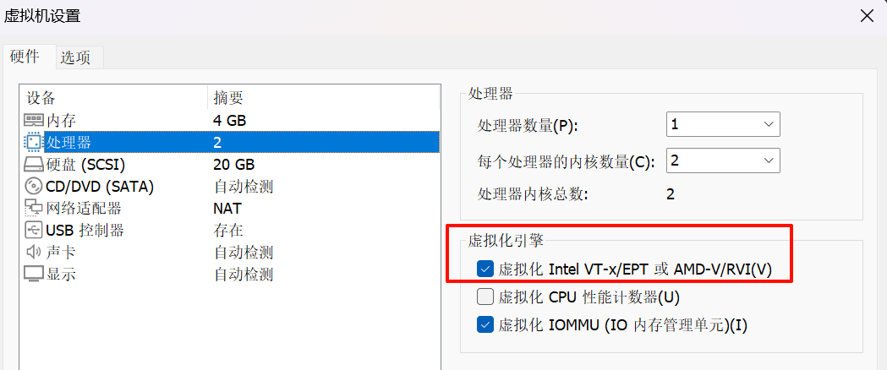

启用后，启动虚拟机操作系统时可能会提示：

> 此平台不支持虚拟化的 Intel VT-x/EP

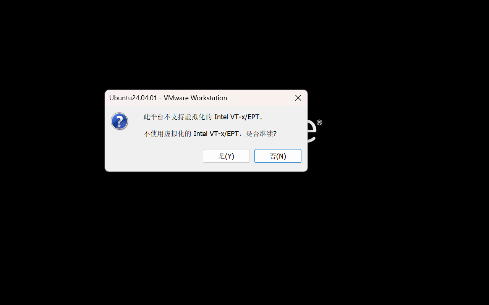

除 BIOS 中需要启用 CPU 虚拟化之外，很多问题卡在 Windows 软件层面。

常见但未必能真正解决问题的方法包括：

1. 打开“启用或关闭 Windows 功能”，删除 `Virtual Machine Platform` 组件。
2. 禁用 Hyper-V 相关服务。
3. 关闭内核隔离功能。
4. 关闭 VBS。

原文的核心目标是完整分析问题，并给出硬件和软件两个层面的解决办法。

## 2. 问题分析

虚拟化嵌套指在虚拟机内部再运行一个 Hypervisor，从而在虚拟机中继续创建虚拟机，也就是“虚拟机中的虚拟机”。

常见使用场景：

1. 在虚拟机中运行 Hypervisor，例如 VMware 嵌套 ESXi、KVM 嵌套 QEMU，方便开发和测试虚拟化软件。
2. 在虚拟机中搭建完整的 EVE-NG 虚拟化实验环境。

实现嵌套虚拟化的基础是 CPU 虚拟化功能。

Intel VT-x/EPT 和 AMD-V/RVI 是两类主流硬件辅助虚拟化技术，通过 CPU 和内存管理单元扩展提升虚拟化性能和隔离能力。

因此，CPU 虚拟化需要在两个层面启用：

- 硬件层面：BIOS 中启用 CPU 虚拟化。
- 软件层面：Windows 不能独占或阻断 VMware 所需的虚拟化能力。

原文认为，Windows 11 的“基于虚拟化的安全性（VBS）”会独占硬件虚拟化资源，并禁用嵌套虚拟化；同时，WSL2 与 VMware Workstation 的 CPU 虚拟化之间也可能存在不兼容。

解决关键是关闭“基于虚拟化的安全性（VBS）”。

## 3. 解决步骤

### 3.1 硬件层面

进入 BIOS，在高级设置或 CPU 设置相关区域中查找类似选项：

- `Virtualization Technology`
- `Intel VT-x`
- `AMD-V`
- `SVM`

将相关选项设置为“启用”或 `Enabled`。

一般情况下，CPU 虚拟化技术在 BIOS 中默认开启。

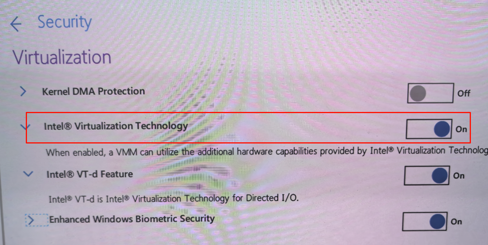

进入 Windows 后，可以通过任务管理器验证硬件虚拟化是否已经开启。

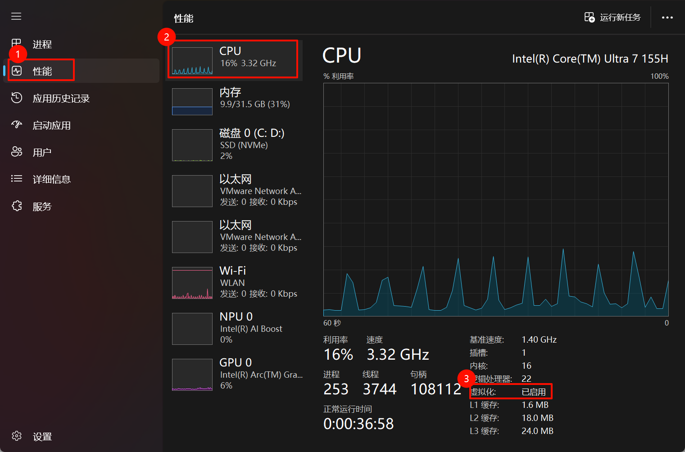

### 3.2 软件层面

#### 3.2.1 结论

原文经过反复试验后给出的结论如下：

| 序号 | 系统功能 | 操作要求 |
| --- | --- | --- |
| 1 | 基于虚拟化的安全性 | 必须关闭 |
| 2 | 内核隔离 / 内存完整性 | 必须关闭 |
| 3 | Virtual Machine Platform 组件 | 必须删除 |
| 4 | HV 主机服务、Hyper-V 主机计算服务 | 无需关闭 |

#### 3.2.2 关闭内核隔离

操作路径：

1. 打开 Windows“设置”。
2. 进入“隐私和安全性”。
3. 打开“Windows 安全中心”。
4. 进入“设备安全性”。
5. 点击“内核隔离详细信息”。
6. 关闭“内存完整性”。
7. 重启计算机。

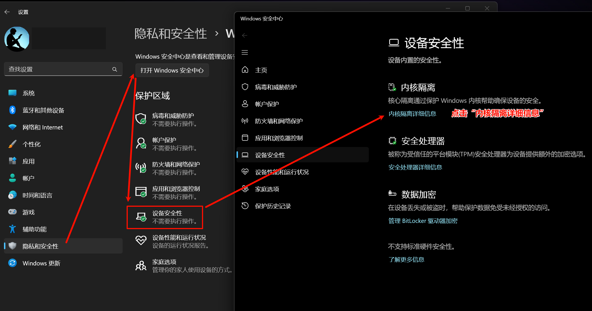

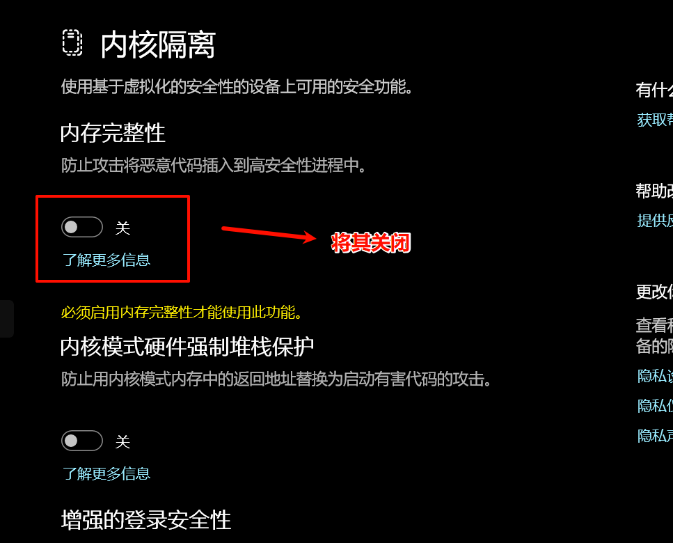
#### 3.2.3 关闭基于虚拟化的安全性

Windows 11 在硬件满足要求时，默认可能开启“基于虚拟化的安全性（Virtualization-Based Security, VBS）”。

VBS 是 Windows 10/11 和 Windows Server 2016 以后引入的安全架构，依赖 Intel VT-x/EPT 或 AMD-V/RVI 创建隔离执行环境。

可通过 `Win + R` 打开“运行”，输入以下命令查看系统信息：

```powershell
msinfo32
```

如果“基于虚拟化的安全性”显示为“正在运行”，说明 VBS 正在启用。

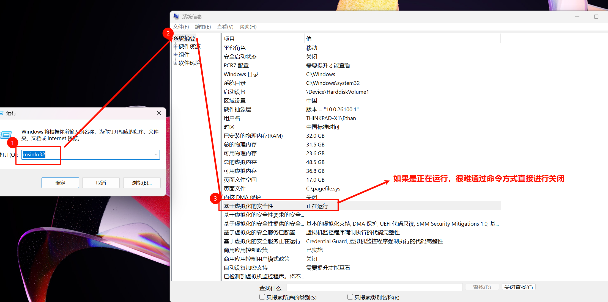

原文指出，组策略或普通命令行方式未必能实际关闭 VBS，因此使用微软官方工具：

[`Device Guard and Credential Guard hardware readiness tool`](https://www.microsoft.com/en-us/download/details.aspx?id=53337&msockid=17c4aa1943b869ca2a31bf2c42ba6886)

原文使用的是 3.6 版本。

##### 步骤 1：以管理员身份运行 PowerShell

执行：

```powershell
Set-ExecutionPolicy RemoteSigned -Scope CurrentUser
```

如果报错，通常是因为没有用管理员权限运行 PowerShell。

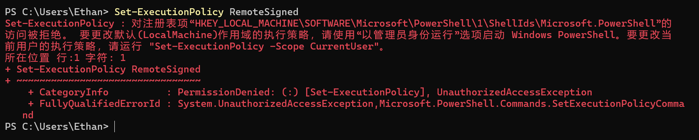

系统询问是否更改执行策略时，选择 `Y`。

##### 步骤 2：运行禁用脚本

在工具目录中执行：

```powershell
./DG_Readiness_Tool_v3.6.ps1 -Disable
```

执行过程中可能出现类似输出：

```text
Readiness Tool Version 3.4 Release.
Tool to check if your device is capable to run Device Guard and Credential Guard.
Disabling Device Guard and Credential Guard
Deleting RegKeys to disable DG/CG
错误: 系统找不到指定的注册表项或值。
Disabling Hyper-V and IOMMU
Disabling Hyper-V failed please check the log file
Please reboot the machine, for settings to be applied.
```

如果提示无法加载 `.ps1` 文件，原因通常是 Windows PowerShell 默认禁止运行脚本，需要先执行：

```powershell
Set-ExecutionPolicy RemoteSigned
```

##### 步骤 3：验证关闭状态

执行：

```powershell
./DG_Readiness_Tool_v3.6.ps1 -Ready
```

如果看到以下状态，表示 `HVCI` 和 `Credential Guard` 已被禁用：

```text
Credential-Guard is not running.
HVCI is not running.
Config-CI is enabled and running. (Enforced mode)
Not all services are running.
```

补充说明：

- `Credential Guard` 是 VBS 上层应用，用于保护凭证。
- `HVCI` 与 `Credential Guard` 平行，用于保护内核代码完整性。

##### 步骤 4：重启并确认禁用

重启电脑后，系统会提示用户确认禁用 `Credential Guard`。

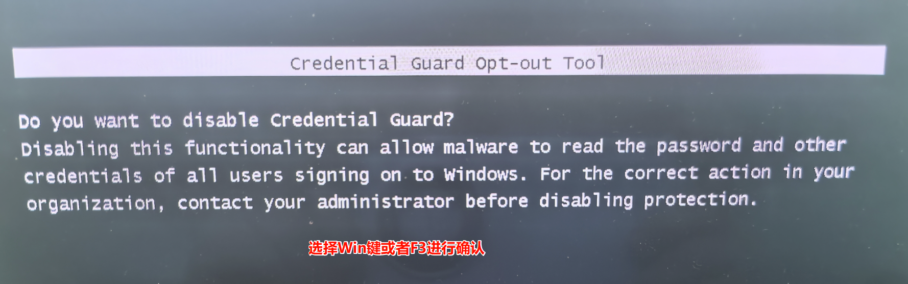

选择 Windows 键或 F3 键确认后，系统提示禁用成功。

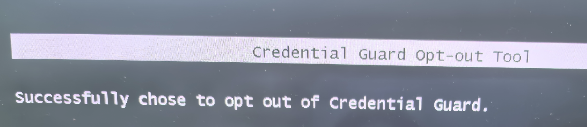

随后系统会提示确认禁用 `Virtualization Based Security`。

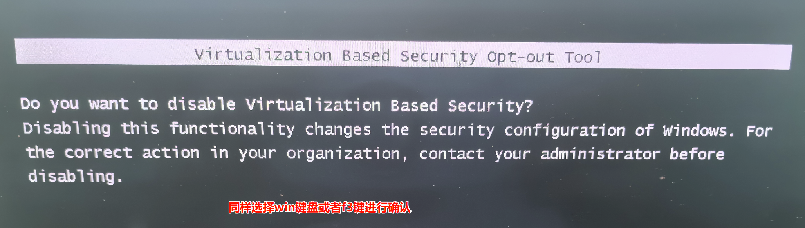

再次选择 Windows 键或 F3 键确认后，系统提示禁用成功。

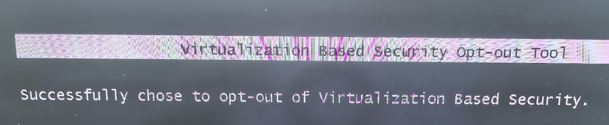

完成后会自动进入操作系统。

注意：关闭 `Credential Guard` 后，原操作系统中的指纹等相关凭证可能无法继续使用，用户需要使用 PIN 码登录系统。

再次运行：

```powershell
msinfo32
```

此时“基于虚拟化的安全性”应显示为“未启用”。

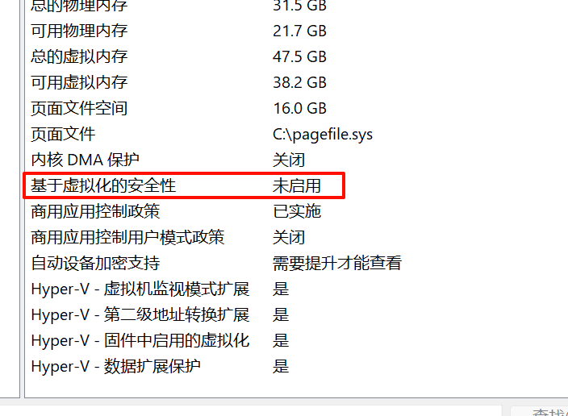

#### 3.2.4 删除 Virtual Machine Platform 组件

`Virtual Machine Platform`（VMP）是 Windows 11 中用于支持系统级虚拟化的核心组件。

操作路径：

1. 打开控制面板。
2. 进入“程序”。
3. 打开“启用或关闭 Windows 功能”。
4. 取消勾选并删除 `Virtual Machine Platform`。
5. 重启电脑。

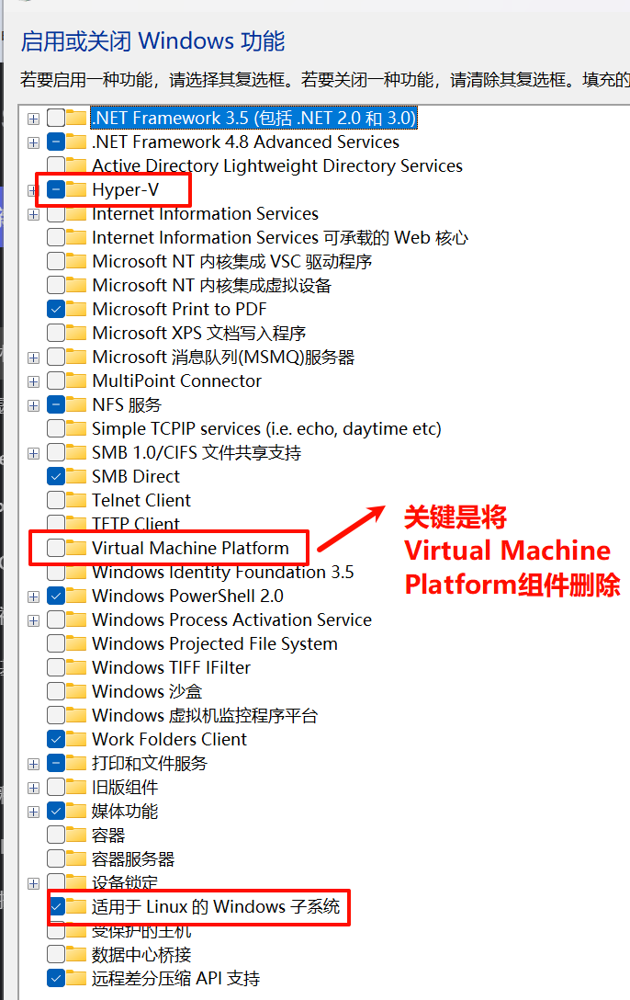

原文说明：

- `适用于 Linux 的 Windows 子系统` 依赖 `Virtual Machine Platform`。
- WSL 本身不一定直接与 VMware Workstation 的 CPU 虚拟化冲突。

#### 3.2.5 Windows 虚拟化组件的联系和区别

| 组件      | 说明                                                                    |
| ------- | --------------------------------------------------------------------- |
| Hyper-V | 完整虚拟化平台，可运行多个独立操作系统，例如 Windows 或 Linux 虚拟机；企业版用户可使用 Hyper-V 管理器创建虚拟机。 |
| VMP     | Hyper-V 的子集，提供 WSL2、Windows Sandbox 等所需的底层虚拟化支持，但不提供完整虚拟机管理功能。        |
| WSL2    | 基于 VMP / Hyper-V 的轻量级 Linux 运行环境，不是完整虚拟机。                             |

原文结论是：VMware Workstation 不支持 CPU 虚拟化的问题与 VMP 产生冲突有关。

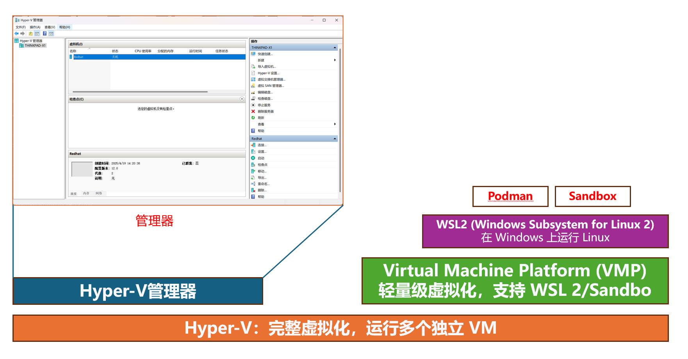

## 4. 快速检查清单

1. BIOS 中确认 CPU 虚拟化已启用。
2. Windows 任务管理器中确认“虚拟化”已启用。
3. 关闭 Windows 安全中心里的“内核隔离 / 内存完整性”。
4. 使用微软 `Device Guard and Credential Guard hardware readiness tool` 关闭 VBS。
5. 重启后按提示确认禁用 `Credential Guard` 和 `Virtualization Based Security`。
6. 使用 `msinfo32` 确认“基于虚拟化的安全性”为“未启用”。
7. 删除 `Virtual Machine Platform` 组件并重启。
8. 回到 VMware Workstation，重新启用虚拟机设置中的嵌套虚拟化选项并启动虚拟机。
