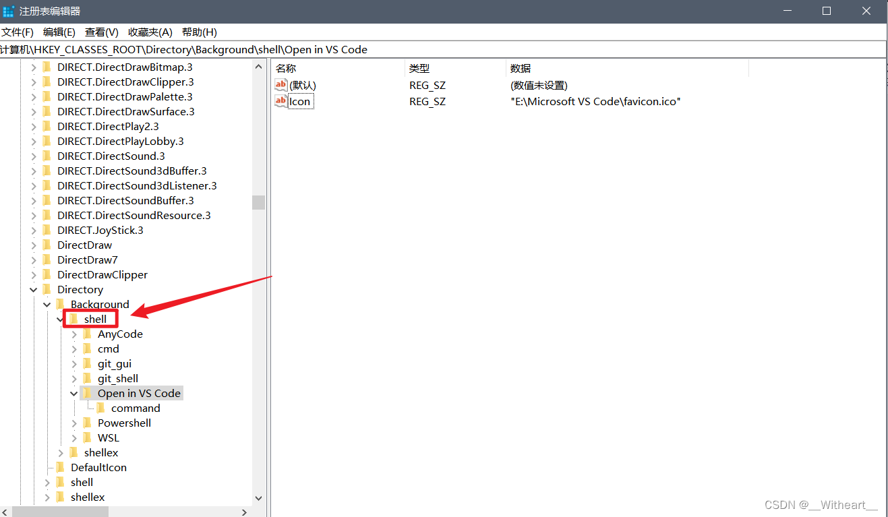
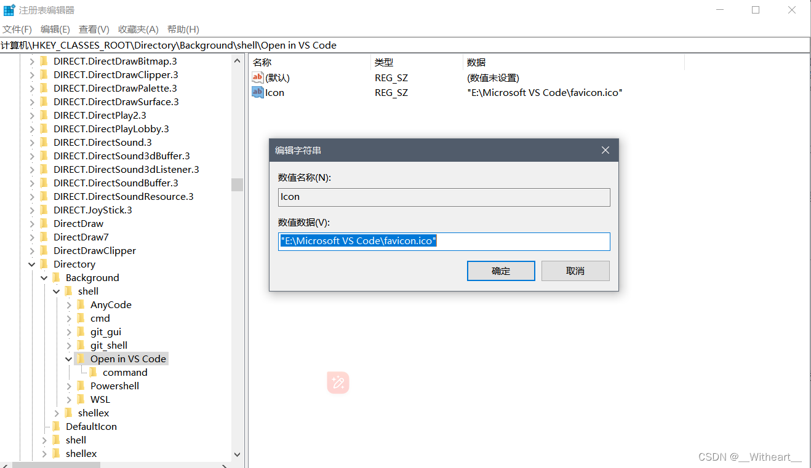
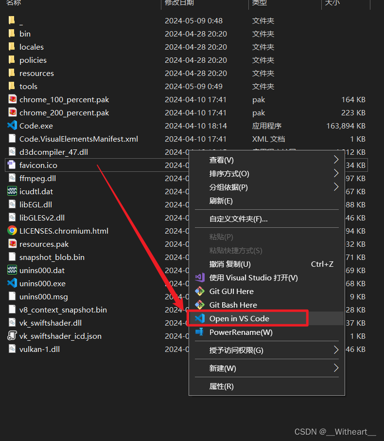

# 超简单！把“在 VSCode 中打开”添加到右键菜单

按照以下步骤操作：

1. 打开注册表编辑器：按下 `Win + R` 打开运行对话框，输入 `regedit` 并按下 Enter。

2. 导航到注册表项 `HKEY_CLASSES_ROOT\Directory\Background\shell`。

    

3. 创建新子项：右键单击 `shell`，选择“新建” -> “项”，将其命名为 `Open in VS Code`（这就是最终显示在右键菜单中的名称）。

4. 配置新项的命令：在 `Open in VS Code` 项下，右键单击选择“新建” -> “项”，命名为 `command`。双击“默认”值，将其数据设置为 VS Code 可执行文件的路径，例如：

    ```c
    "C:\Program Files\Microsoft VS Code\Code.exe" "%V"
    ```

    其中 `%V` 是变量，代表当前右键单击的路径。

5. 添加图标（到此已完成，不想加图标可跳过）：

    - 在 VS Code 安装目录下寻找图标文件，通常为 `favicon.ico`。
    - 在 `Open in VS Code` 项下，创建一个名为 `Icon` 的**新字符串值**（注意别加错位置）。
    - 双击 `Icon` 值，将数值数据设置为图标文件路径，例如 `E:\Microsoft VS Code\favicon.ico`。

    

现在右键单击文件夹或桌面空白处时，应该会看到“在 VS Code 中打开”选项。



## 一键注册表文件

也可将下面内容保存为 `.reg` 文件直接运行，等效于上面的手动操作（请先把路径改成你自己的 VS Code 安装路径）：

```text
Windows Registry Editor Version 5.00

; 使用前请填写下面两个位置：
; 1. Icon 的数值：VS Code 图标路径，例如 C:\\Program Files\\Microsoft VS Code\\Code.exe
; 2. command 默认值中第一个空字符串：VS Code 的 Code.exe 路径
;
; 填写后的 command 示例：
; @="\"C:\\Program Files\\Microsoft VS Code\\Code.exe\" \"%V\""

[HKEY_CLASSES_ROOT\Directory\Background\shell\OpenWithVSCode]
@="使用 VS Code 打开"
"Icon"="D:\\VSCode-win32-x64-1.92.1\\Code.exe"

[HKEY_CLASSES_ROOT\Directory\Background\shell\OpenWithVSCode\command]
@="\"D:\\VSCode-win32-x64-1.92.1\\Code.exe\" \"%V\""
```

> [!NOTE]
> 文中的 `D:\VSCode-win32-x64-1.92.1\Code.exe` 是个人配置示例，使用前请替换为你的实际安装路径。
