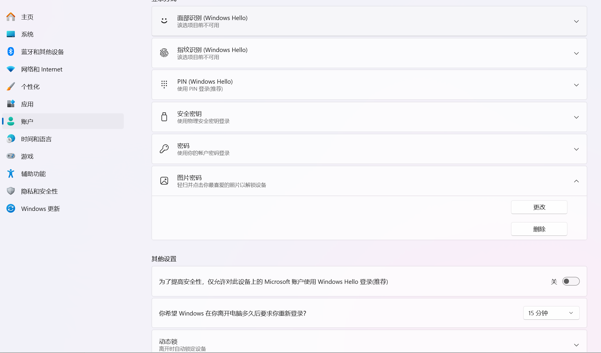
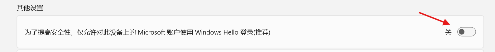
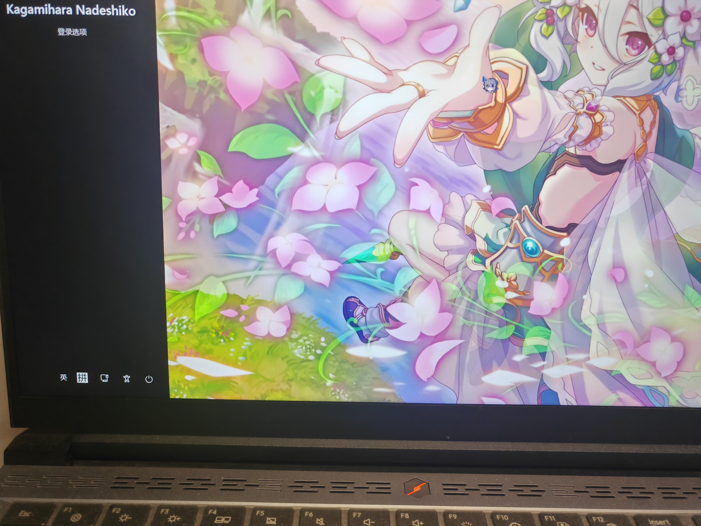
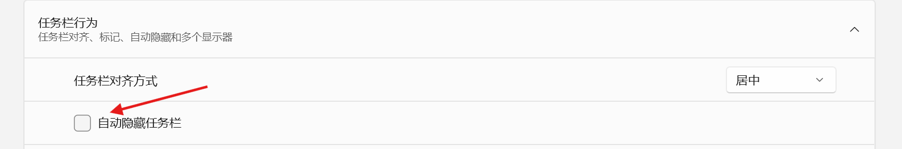

如果看不见这个选项的话关闭如下选项就好了

---

在实际使用时在锁屏界面会发现左侧出现黑边问题

设置->个性化->任务栏行为->自动隐藏任务栏打开(猜测是比例问题,微软的💩山代码发力)

启用后重新设置一遍图片锁屏,确认恢复后再关闭这个选项就好了

但题主实际测试一下发现问题依然没有解决,可能是笔记本比例的问题?

这里给出另一种解决方法

~~换一个左侧纯黑的壁纸(滑稽)~~

---

>一些可能有用的芝士🧀:
> - C:\ProgramData\Microsoft\Windows\SystemData\S-xx一大堆数字\ReadOnly(锁屏壁纸缓存路径,可能会出现权限问题)
> - C:\Windows\Web\Screen(系统默认壁纸存放路径)
> - C:\Users\Administrator\AppData\Local\Packages\Microsoft.Windows.ContentDeliveryManager_cw5n1h2txyewy\LocalState\Assets(系统锁屏壁纸存放路径)

