# “WindowsApps文件夹拒绝访问”解决方案

> 原创 已于 2022-04-11 17:57:48 修改 · 10w+ 阅读 · 89 · 187 · 本内容遵循CC 4.0 BY-SA版权协议 版权声明：本文为博主原创文章，遵循 CC 4.0 BY-SA 版权协议，转载请附上原文出处链接和本声明。
> 文章链接：https://blog.csdn.net/Syc1102g/article/details/124101230

## "WindowsApps文件夹拒绝访问"解决方案

> 这类文件夹拒绝访问的问题是由于文件权限问题导致的。

### 解决步骤

#### 1.右键–> `属性` –> `安全`  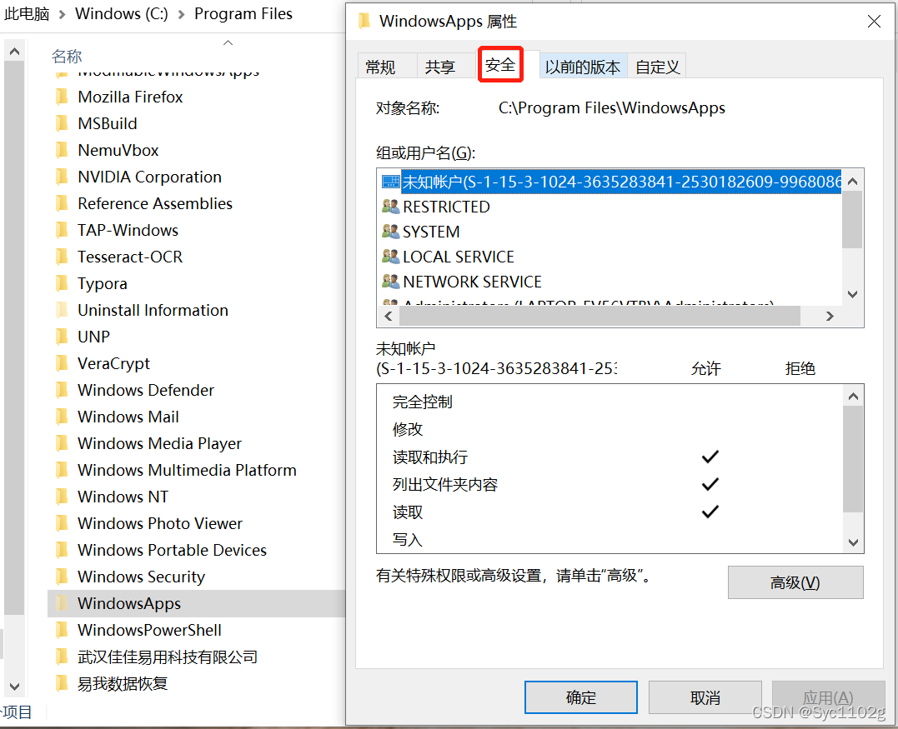

#### 2.选择 `高级` –> `所有者` 后面选择 `更改` 

 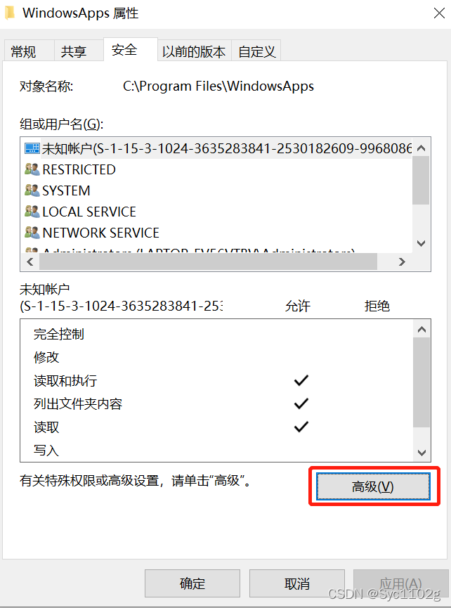

第一次打开是这样的：
 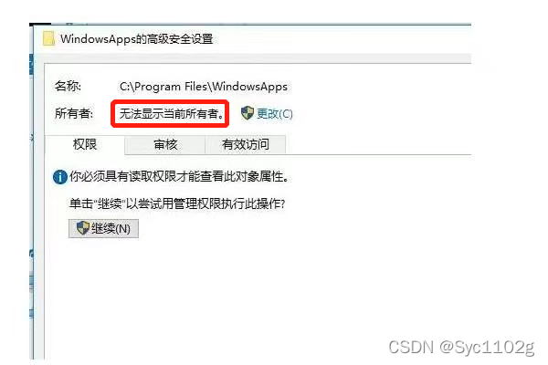

我的已经改过就显示了 `文件所有者信息` 
 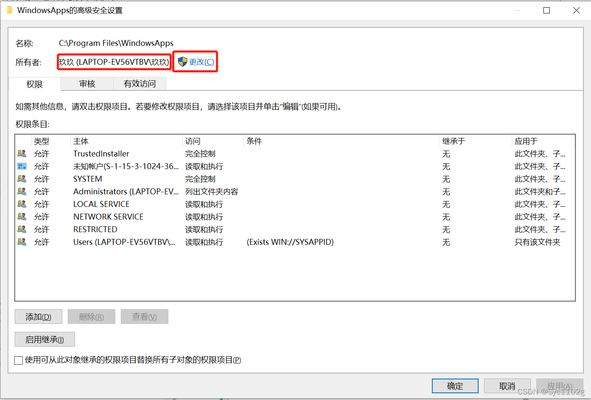

#### 3.填入对象名称，更改文件夹所有者

**在’输入要选择的对象名称’下方 `输入你电脑此时使用的用户名` –> `确定`** 
 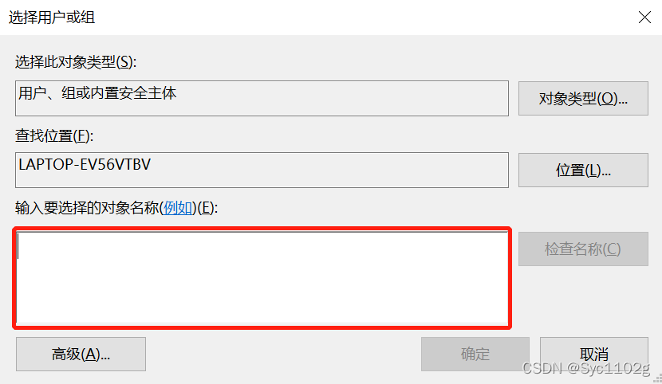

**填入用户名后可以点击 `检查名称` 来检验输入的对象是否有效，检测成功后点击 `确定`** 
 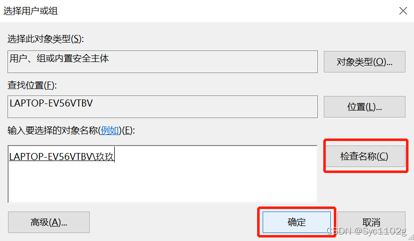

#### 4.子文件夹也更改所有者

**弹出的窗口内勾选 `替换子容器和对象的所有者` –> `确定`** 
 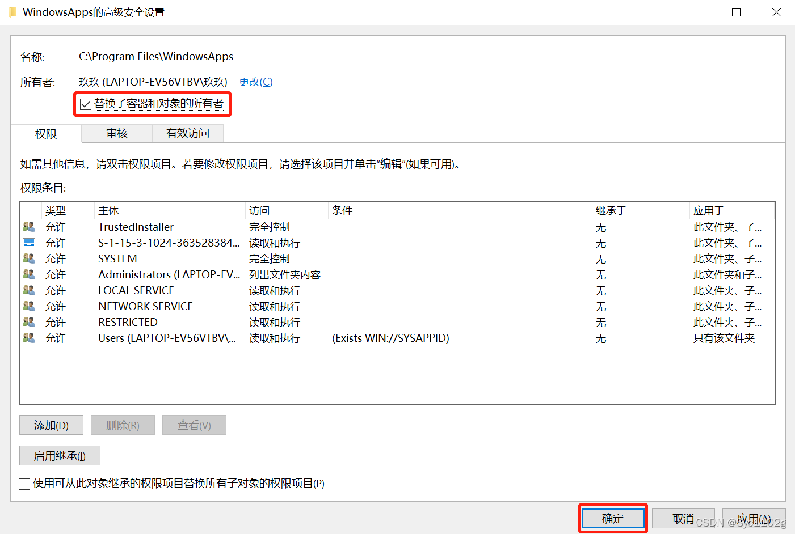

等待文件夹更改所有者，更改完成后自动关闭此界面
 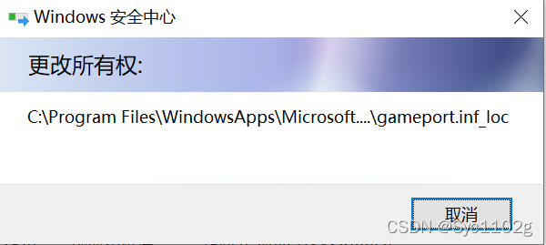

确定，完成~
 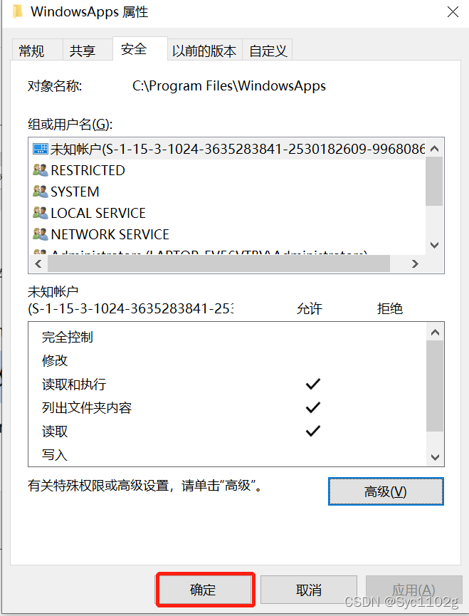

##### 5.还原权限设置

**同样在此界面，选中 `当前文件夹所有者一行` –> `删除` –> `确定`** 
即可还原权限。
虽然文件所有者还是你的用户，但是用户对象已被删除，相对于文件不属于任何对象
 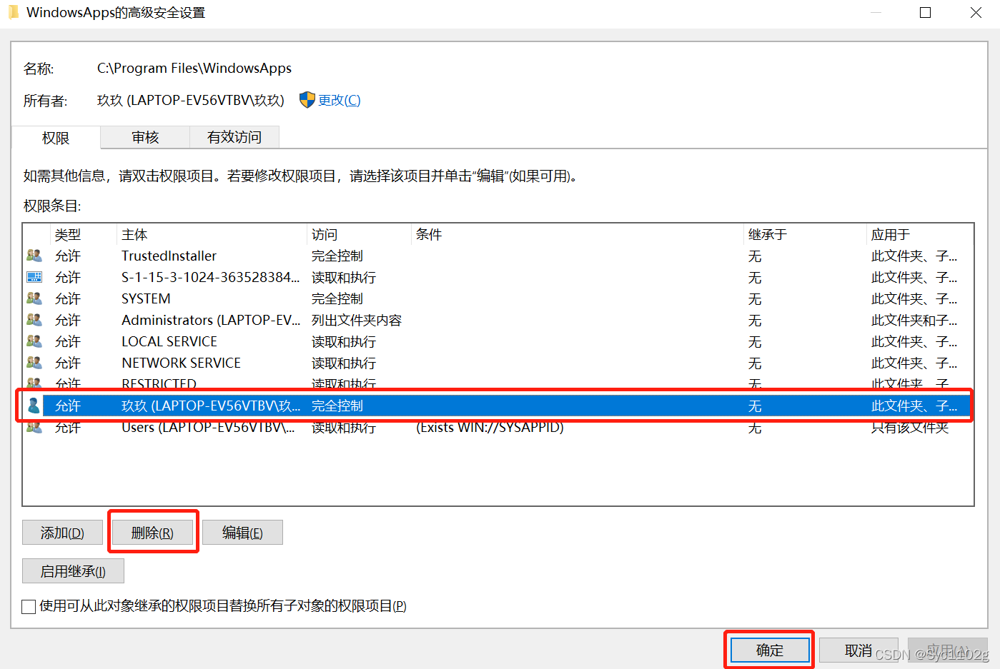

同样跳出此界面，等待处理完毕即可
 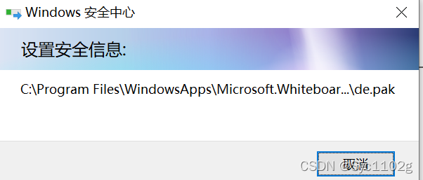

此时再次尝试打开文件夹，已无权限
 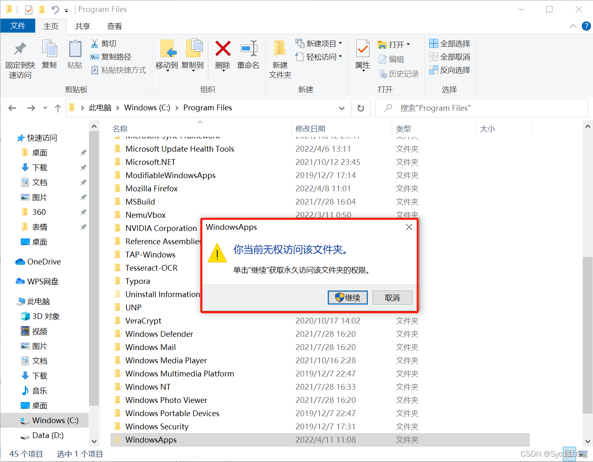

